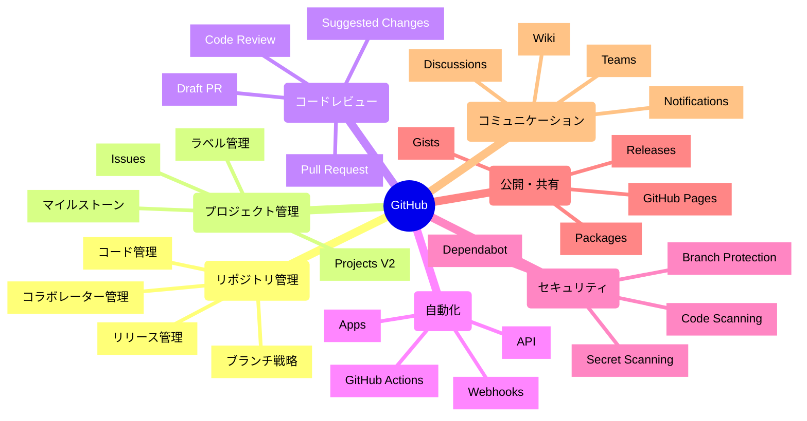

# 📖 GitHub完全活用ガイド

> 外部ツールに依存せず、GitHub一つで開発業務を完結させるための網羅的解説書

## 🎯 このガイドの目的

- **GitHub機能の全体像を把握**し、どの場面でどの機能を使うかを理解
- **外部ツール（Jira、Jenkins、Confluence等）を使わずに開発を完結**させる方法を習得
- **実務ですぐに使える設定例とベストプラクティス**を提供
- **コスト削減と開発効率向上**を同時に実現

---

## 📚 目次

### 第1章: [GitHub機能全体マップ](#第1章-github機能全体マップ)
### 第2章: [リポジトリ管理の完全活用](#第2章-リポジトリ管理の完全活用)
### 第3章: [Issues - プロジェクト管理の核](#第3章-issues---プロジェクト管理の核)
### 第4章: [Pull Request - コードレビューとコラボレーション](#第4章-pull-request---コードレビューとコラボレーション)
### 第5章: [GitHub Projects - タスク・プロジェクト管理](#第5章-github-projects---タスクプロジェクト管理)
### 第6章: [GitHub Actions - CI/CD自動化](#第6章-github-actions---cicd自動化)
### 第7章: [セキュリティ機能 - 品質・安全性の確保](#第7章-セキュリティ機能---品質安全性の確保)
### 第8章: [GitHub Pages - ドキュメント・サイト公開](#第8章-github-pages---ドキュメントサイト公開)
### 第9章: [外部ツール代替戦略](#第9章-外部ツール代替戦略)
### 第10章: [実務ケーススタディ](#第10章-実務ケーススタディ)

---

## 第1章: GitHub機能全体マップ

### 🗺️ GitHub機能の全体像



### 📊 機能重要度マトリックス

| 機能 | 重要度 | 習得難易度 | 外部ツール代替度 | 実装優先度 |
|------|--------|------------|------------------|------------|
| **Issues** | ⭐⭐⭐⭐⭐ | ⭐⭐ | 95% | 🔥 最優先 |
| **Pull Request** | ⭐⭐⭐⭐⭐ | ⭐⭐⭐ | 90% | 🔥 最優先 |
| **GitHub Actions** | ⭐⭐⭐⭐⭐ | ⭐⭐⭐⭐ | 100% | 🔥 最優先 |
| **Projects V2** | ⭐⭐⭐⭐ | ⭐⭐⭐ | 85% | 🔶 高 |
| **Branch Protection** | ⭐⭐⭐⭐ | ⭐⭐ | 80% | 🔶 高 |
| **GitHub Pages** | ⭐⭐⭐ | ⭐⭐ | 70% | 🔷 中 |
| **Code Scanning** | ⭐⭐⭐⭐ | ⭐⭐⭐ | 90% | 🔷 中 |
| **Discussions** | ⭐⭐⭐ | ⭐ | 60% | ⚪ 低 |

---

## 第2章: リポジトリ管理の完全活用

### 🏗️ リポジトリ構造のベストプラクティス

#### 推奨ディレクトリ構造
```
your-project/
├── .github/
│   ├── workflows/          # GitHub Actions
│   ├── ISSUE_TEMPLATE/     # Issueテンプレート
│   ├── PULL_REQUEST_TEMPLATE.md
│   ├── CODEOWNERS          # コードレビュー担当者
│   ├── SECURITY.md         # セキュリティポリシー
│   └── FUNDING.yml         # スポンサー設定
├── docs/                   # ドキュメント
├── src/                    # ソースコード
├── tests/                  # テストコード
├── .gitignore
├── README.md
├── LICENSE
└── CHANGELOG.md
```

### 🌳 ブランチ戦略の実装

#### GitHub Flow（推奨）
```bash
# 1. mainブランチから新機能ブランチを作成
git checkout main
git pull origin main
git checkout -b feature/user-authentication

# 2. 開発・コミット
git add .
git commit -m "feat(auth): add login functionality"

# 3. プッシュしてPull Request作成
git push origin feature/user-authentication
gh pr create --title "Add user authentication" --body "Implements login/logout functionality"

# 4. レビュー後、mainにマージ
# （GitHub Web UIまたは gh pr merge）

# 5. ローカルブランチクリーンアップ
git checkout main
git pull origin main
git branch -d feature/user-authentication
```

#### Git Flow（複雑なプロジェクト用）
```bash
# 開発ブランチの維持
git checkout -b develop

# フィーチャーブランチ
git checkout -b feature/payment-system develop

# リリースブランチ
git checkout -b release/v1.0.0 develop

# ホットフィックス
git checkout -b hotfix/security-fix main
```

### 🏷️ タグ・リリース管理

#### セマンティックバージョニング
```bash
# メジャー版更新（破壊的変更）
git tag -a v2.0.0 -m "Version 2.0.0 - API breaking changes"

# マイナー版更新（新機能追加）
git tag -a v1.1.0 -m "Version 1.1.0 - New authentication system"

# パッチ版更新（バグ修正）
git tag -a v1.0.1 -m "Version 1.0.1 - Security fixes"

# リモートにプッシュ
git push origin --tags
```

#### 自動リリースノート設定
```yaml
# .github/release.yml
changelog:
  exclude:
    labels:
      - ignore-for-release
      - dependencies
  categories:
    - title: 🚨 Breaking Changes
      labels:
        - breaking-change
        - major
    - title: 🎉 New Features
      labels:
        - enhancement
        - feature
    - title: 🐛 Bug Fixes
      labels:
        - bug
        - fix
    - title: 📚 Documentation
      labels:
        - documentation
    - title: 🔧 Maintenance
      labels:
        - maintenance
        - chore
```

---

## 第3章: Issues - プロジェクト管理の核

### 🎫 Issues活用の全体戦略

#### Jiraの完全代替を実現するIssue運用
```markdown
# Issue種別をラベルで分類
🐛 bug          - バグ報告
✨ enhancement  - 新機能要望
📚 documentation - ドキュメント
❓ question     - 質問・サポート
🔧 maintenance  - メンテナンス

# 優先度管理
🔴 priority:critical  - 緊急（即座に対応）
🟠 priority:high      - 高（1週間以内）
🟡 priority:medium    - 中（2週間以内）
🟢 priority:low       - 低（1ヶ月以内）

# ステータス管理
📋 status:new         - 新規作成
👀 status:triaged     - トリアージ済み
🔄 status:in-progress - 作業中
⏸️ status:blocked     - ブロック中
✅ status:resolved    - 解決済み
```

#### 実用的なIssueテンプレート

**バグ報告用**
```yaml
# .github/ISSUE_TEMPLATE/bug_report.yml
name: 🐛 バグ報告
description: バグを報告してください
title: "[BUG] "
labels: ["bug", "needs-triage"]
assignees: []
body:
  - type: markdown
    attributes:
      value: |
        バグ報告ありがとうございます。以下の情報を詳しく入力してください。

  - type: textarea
    id: bug-description
    attributes:
      label: 🐛 バグの詳細
      description: 何が起こっているか詳しく説明してください
      placeholder: |
        例: ログインボタンをクリックしても、ページが遷移しない
    validations:
      required: true

  - type: textarea
    id: steps-to-reproduce
    attributes:
      label: 🔄 再現手順
      description: バグを再現する手順を順番に記載してください
      placeholder: |
        1. ホームページにアクセス
        2. "ログイン"ボタンをクリック
        3. メールアドレスとパスワードを入力
        4. "ログイン"ボタンをクリック
        5. エラーが発生
    validations:
      required: true

  - type: textarea
    id: expected-behavior
    attributes:
      label: ✅ 期待される動作
      description: 本来はどうなるべきかを説明してください
      placeholder: ログイン後、ダッシュボードページに遷移する
    validations:
      required: true

  - type: textarea
    id: environment
    attributes:
      label: 🖥️ 環境情報
      description: 環境に関する詳細情報
      placeholder: |
        - OS: macOS 13.0
        - ブラウザ: Chrome 108.0
        - アプリバージョン: v1.2.3
        - その他: 
    validations:
      required: true

  - type: textarea
    id: additional-context
    attributes:
      label: 📋 追加情報
      description: スクリーンショット、ログ、その他関連情報
      placeholder: エラーメッセージ、スクリーンショットなど

  - type: checkboxes
    id: terms
    attributes:
      label: ✅ 確認事項
      options:
        - label: 同様のIssueが既に報告されていないことを確認しました
          required: true
        - label: 最新バージョンで問題が発生することを確認しました
          required: true
```

#### 高度なIssue管理機能

**自動ラベリング**
```yaml
# .github/workflows/label-issues.yml
name: Auto Label Issues
on:
  issues:
    types: [opened]

jobs:
  label:
    runs-on: ubuntu-latest
    steps:
      - name: Label based on title
        uses: actions/github-script@v6
        with:
          script: |
            const title = context.payload.issue.title.toLowerCase();
            const labels = [];
            
            if (title.includes('bug') || title.includes('error')) {
              labels.push('bug');
            }
            if (title.includes('feature') || title.includes('add')) {
              labels.push('enhancement');
            }
            if (title.includes('security')) {
              labels.push('security', 'priority:high');
            }
            if (title.includes('performance')) {
              labels.push('performance');
            }
            
            if (labels.length > 0) {
              await github.rest.issues.addLabels({
                owner: context.repo.owner,
                repo: context.repo.repo,
                issue_number: context.payload.issue.number,
                labels: labels
              });
            }
```

---

## 第4章: Pull Request - コードレビューとコラボレーション

### 🔄 Pull Requestワークフローの最適化

#### 効果的なPRテンプレート
```markdown
# .github/pull_request_template.md
## 📋 変更内容の要約

<!-- このPRで何を変更したかを簡潔に説明してください -->

## 🎯 関連Issue

Fixes #(issue番号)
Closes #(issue番号)
Related to #(issue番号)

## 🔄 変更の種類

- [ ] 🐛 バグ修正
- [ ] ✨ 新機能
- [ ] 💥 破壊的変更
- [ ] 📚 ドキュメント更新
- [ ] 🎨 コードスタイル改善（機能に影響なし）
- [ ] ♻️ リファクタリング
- [ ] ⚡ パフォーマンス改善
- [ ] ✅ テスト追加・修正
- [ ] 🔧 ビルドシステム・設定変更

## 🧪 テスト方法

<!-- この変更をどのようにテストしたか説明してください -->

- [ ] 単体テスト追加・実行
- [ ] 統合テスト追加・実行
- [ ] 手動テスト実行
- [ ] 既存テストがすべて通ることを確認

### テスト手順
1. 
2. 
3. 

## 📸 スクリーンショット（UI変更の場合）

<!-- UIに変更がある場合、before/afterのスクリーンショットを添付 -->

| Before | After |
|--------|-------|
|        |       |

## ✅ チェックリスト

- [ ] コードが自己文書化されており、理解しやすい
- [ ] 適切なコメントが追加されている
- [ ] ドキュメントが更新されている
- [ ] テストが追加・更新されている
- [ ] 破壊的変更がある場合、CHANGELOGに記載されている
- [ ] セキュリティの観点で問題がない

## 📝 追加メモ

<!-- その他、レビュアーが知っておくべき情報があれば記載 -->
```

#### Code Review のベストプラクティス

**レビュー観点チェックリスト**
```markdown
### 🔍 機能性
- [ ] 要件を満たしているか
- [ ] エッジケースが考慮されているか
- [ ] エラーハンドリングが適切か

### 🏗️ アーキテクチャ
- [ ] 設計方針に沿っているか
- [ ] 適切な責務分離がされているか
- [ ] 再利用性が考慮されているか

### 🎯 パフォーマンス
- [ ] 不要な処理がないか
- [ ] メモリ使用量は適切か
- [ ] データベースクエリは最適化されているか

### 🔒 セキュリティ
- [ ] 入力値検証が適切か
- [ ] 権限チェックがされているか
- [ ] 機密情報が漏洩しないか

### 🧹 保守性
- [ ] コードが読みやすいか
- [ ] 適切な命名がされているか
- [ ] コメントが適切か

### ✅ テスト
- [ ] テストカバレッジは十分か
- [ ] テストケースは適切か
- [ ] CIが通っているか
```

#### Advanced PR機能の活用

**Draft PRの活用**
```bash
# 作業中のコードでフィードバックを得る
gh pr create --draft --title "WIP: ユーザー認証機能" --body "作業中のコードです。アプローチについてフィードバックをお願いします"

# レビュー準備完了時
gh pr ready  # DraftからReadyに変更
```

**Suggested Changes機能**
```markdown
# レビューコメントで具体的な修正案を提示
```suggestion
// 修正前のコード
const user = users.find(u => u.id === userId);

// 修正後のコード
const user = users.find(u => u.id === userId) ?? null;
```

---

## 第5章: GitHub Projects - タスク・プロジェクト管理

### 📊 GitHub Projects V2 の完全活用

#### Jira代替としてのProjects設定

**プロジェクトボード構成例**
```markdown
## ボード設定

### 📋 ビュー設定
1. **カンバンビュー** - 日常的な作業管理
   - Todo | In Progress | In Review | Done

2. **スプリントビュー** - 時間軸での管理
   - 週別 | 月別のスプリント

3. **ロードマップビュー** - 長期計画
   - 四半期別のマイルストーン

4. **優先度ビュー** - 優先度順の作業
   - Critical | High | Medium | Low

### 🏷️ カスタムフィールド設定
- **Status**: Single select (Todo, In Progress, Review, Done)
- **Priority**: Single select (Critical, High, Medium, Low)
- **Size**: Number (ストーリーポイント)
- **Epic**: Text (関連するエピック)
- **Sprint**: Text (スプリント名)
- **Assignee**: People (担当者)
- **Labels**: Multiple select (技術分野)
```

#### プロジェクト自動化の設定

**Issues の自動追加**
```yaml
# プロジェクト自動化ルール設定例

# 新しいIssueを自動でプロジェクトに追加
when: Issue created
then: Add to project "Development Board"
      Set Status to "Todo"
      Set Priority based on labels

# PRがマージされたらIssueを完了に
when: Pull request merged
then: Find linked issues
      Set Status to "Done"
      Add comment "Completed in PR #XXX"

# 高優先度のIssueに自動アサイン
when: Issue labeled "priority:high"
then: Assign to @tech-lead
      Set Status to "Todo"
      Add to "High Priority" view
```

### 📈 進捗管理とレポート

#### ダッシュボード作成
```markdown
### 📊 KPI ダッシュボード

#### チーム生産性指標
- **Velocity**: 週/月あたりの完了ストーリーポイント
- **Cycle Time**: IssueからPRマージまでの平均時間
- **Throughput**: 完了したIssue数/期間
- **WIP**: 同時進行中のタスク数

#### 品質指標
- **Defect Rate**: 本番バグ数/リリース
- **Code Review Time**: PR作成からマージまでの時間
- **Test Coverage**: テストカバレッジ率
- **Technical Debt**: 未解決の技術的課題数

#### チーム健全性
- **Burnout Index**: 個人の作業量バランス
- **Knowledge Sharing**: ペアプロ・レビュー参加率
- **Documentation**: ドキュメント更新頻度
```

---

## 第6章: GitHub Actions - CI/CD自動化

### ⚙️ Jenkins完全代替のワークフロー

#### 基本CI/CDパイプライン
```yaml
# .github/workflows/ci-cd.yml
name: CI/CD Pipeline

on:
  push:
    branches: [ main, develop ]
  pull_request:
    branches: [ main ]

env:
  NODE_VERSION: '18'
  PYTHON_VERSION: '3.11'

jobs:
  # 1. コード品質チェック
  code-quality:
    runs-on: ubuntu-latest
    steps:
      - uses: actions/checkout@v4
      
      - name: Setup Node.js
        uses: actions/setup-node@v4
        with:
          node-version: ${{ env.NODE_VERSION }}
          cache: 'npm'
      
      - name: Install dependencies
        run: npm ci
      
      - name: Lint
        run: npm run lint
      
      - name: Type check
        run: npm run type-check
      
      - name: Format check
        run: npm run format:check

  # 2. テスト実行
  test:
    runs-on: ubuntu-latest
    strategy:
      matrix:
        node-version: [16, 18, 20]
    steps:
      - uses: actions/checkout@v4
      
      - name: Setup Node.js ${{ matrix.node-version }}
        uses: actions/setup-node@v4
        with:
          node-version: ${{ matrix.node-version }}
          cache: 'npm'
      
      - name: Install dependencies
        run: npm ci
      
      - name: Run tests
        run: npm run test:coverage
      
      - name: Upload coverage to Codecov
        uses: codecov/codecov-action@v3
        with:
          file: ./coverage/lcov.info

  # 3. セキュリティスキャン
  security:
    runs-on: ubuntu-latest
    steps:
      - uses: actions/checkout@v4
      
      - name: Run security audit
        run: npm audit --audit-level moderate
      
      - name: Run CodeQL Analysis
        uses: github/codeql-action/analyze@v2
        with:
          languages: javascript

  # 4. ビルド
  build:
    runs-on: ubuntu-latest
    needs: [code-quality, test, security]
    steps:
      - uses: actions/checkout@v4
      
      - name: Setup Node.js
        uses: actions/setup-node@v4
        with:
          node-version: ${{ env.NODE_VERSION }}
          cache: 'npm'
      
      - name: Install dependencies
        run: npm ci
      
      - name: Build
        run: npm run build
      
      - name: Upload build artifacts
        uses: actions/upload-artifact@v3
        with:
          name: build-files
          path: dist/

  # 5. デプロイ（mainブランチのみ）
  deploy:
    runs-on: ubuntu-latest
    needs: build
    if: github.ref == 'refs/heads/main'
    environment: production
    steps:
      - uses: actions/checkout@v4
      
      - name: Download build artifacts
        uses: actions/download-artifact@v3
        with:
          name: build-files
          path: dist/
      
      - name: Deploy to production
        run: |
          # デプロイスクリプト実行
          echo "Deploying to production..."
          # 実際のデプロイコマンド
      
      - name: Notify deployment
        uses: 8398a7/action-slack@v3
        with:
          status: ${{ job.status }}
          text: "Production deployment completed"
        env:
          SLACK_WEBHOOK_URL: ${{ secrets.SLACK_WEBHOOK }}
```

#### 高度な自動化パターン

**自動バージョニング**
```yaml
# .github/workflows/auto-version.yml
name: Auto Version and Release

on:
  push:
    branches: [ main ]

jobs:
  version-and-release:
    runs-on: ubuntu-latest
    steps:
      - uses: actions/checkout@v4
        with:
          fetch-depth: 0
          token: ${{ secrets.GITHUB_TOKEN }}
      
      - name: Setup Node.js
        uses: actions/setup-node@v4
        with:
          node-version: '18'
      
      - name: Determine version bump
        id: version
        run: |
          # コミットメッセージから版数を決定
          if [[ "${{ github.event.head_commit.message }}" =~ ^feat(\(.+\))?!: ]]; then
            echo "bump=major" >> $GITHUB_OUTPUT
          elif [[ "${{ github.event.head_commit.message }}" =~ ^feat(\(.+\))?: ]]; then
            echo "bump=minor" >> $GITHUB_OUTPUT
          else
            echo "bump=patch" >> $GITHUB_OUTPUT
          fi
      
      - name: Bump version
        run: npm version ${{ steps.version.outputs.bump }}
      
      - name: Push changes
        run: |
          git push origin main
          git push origin --tags
      
      - name: Create release
        uses: actions/create-release@v1
        env:
          GITHUB_TOKEN: ${{ secrets.GITHUB_TOKEN }}
        with:
          tag_name: ${{ steps.version.outputs.new_tag }}
          release_name: Release ${{ steps.version.outputs.new_tag }}
          draft: false
          prerelease: false
```

**依存関係自動更新**
```yaml
# .github/workflows/dependency-update.yml
name: Dependency Update

on:
  schedule:
    - cron: '0 9 * * 1'  # 毎週月曜日 9:00

jobs:
  update-dependencies:
    runs-on: ubuntu-latest
    steps:
      - uses: actions/checkout@v4
      
      - name: Setup Node.js
        uses: actions/setup-node@v4
        with:
          node-version: '18'
      
      - name: Update dependencies
        run: |
          npx npm-check-updates -u
          npm install
      
      - name: Run tests
        run: npm test
      
      - name: Create Pull Request
        uses: peter-evans/create-pull-request@v5
        with:
          token: ${{ secrets.GITHUB_TOKEN }}
          commit-message: 'chore: update dependencies'
          title: '🔄 Weekly dependency update'
          body: |
            自動的に依存関係を更新しました。
            
            - テストが正常に通ることを確認済み
            - 破壊的変更がないかレビューをお願いします
          branch: update-dependencies
          delete-branch: true
```

---

## 第7章: セキュリティ機能 - 品質・安全性の確保

### 🔒 SonarQube代替のセキュリティ体制

#### GitHub Advanced Security の活用

**Dependabot設定**
```yaml
# .github/dependabot.yml
version: 2
updates:
  # npm依存関係の監視
  - package-ecosystem: "npm"
    directory: "/"
    schedule:
      interval: "weekly"
      day: "monday"
      time: "09:00"
    open-pull-requests-limit: 10
    reviewers:
      - "security-team"
    assignees:
      - "tech-lead"
    commit-message:
      prefix: "chore"
      include: "scope"
    labels:
      - "dependencies"
      - "security"

  # Docker依存関係の監視
  - package-ecosystem: "docker"
    directory: "/"
    schedule:
      interval: "weekly"

  # GitHub Actions依存関係の監視
  - package-ecosystem: "github-actions"
    directory: "/.github/workflows"
    schedule:
      interval: "monthly"
```

**Code Scanning設定**
```yaml
# .github/workflows/security-scan.yml
name: Security Scanning

on:
  push:
    branches: [ main, develop ]
  pull_request:
    branches: [ main ]
  schedule:
    - cron: '0 6 * * 1'

jobs:
  codeql:
    name: CodeQL Analysis
    runs-on: ubuntu-latest
    permissions:
      actions: read
      contents: read
      security-events: write

    strategy:
      matrix:
        language: [ 'javascript', 'typescript', 'python' ]

    steps:
      - name: Checkout repository
        uses: actions/checkout@v4

      - name: Initialize CodeQL
        uses: github/codeql-action/init@v2
        with:
          languages: ${{ matrix.language }}
          config-file: ./.github/codeql/codeql-config.yml

      - name: Autobuild
        uses: github/codeql-action/autobuild@v2

      - name: Perform CodeQL Analysis
        uses: github/codeql-action/analyze@v2

  secret-scan:
    name: Secret Scanning
    runs-on: ubuntu-latest
    steps:
      - uses: actions/checkout@v4
        with:
          fetch-depth: 0

      - name: GitLeaks Scan
        uses: gitleaks/gitleaks-action@v2
        env:
          GITHUB_TOKEN: ${{ secrets.GITHUB_TOKEN }}

  dependency-check:
    name: Dependency Vulnerability Check
    runs-on: ubuntu-latest
    steps:
      - uses: actions/checkout@v4

      - name: Setup Node.js
        uses: actions/setup-node@v4
        with:
          node-version: '18'

      - name: Install dependencies
        run: npm ci

      - name: Audit dependencies
        run: |
          npm audit --audit-level moderate
          npm audit --json > audit-results.json

      - name: Upload audit results
        uses: actions/upload-artifact@v3
        with:
          name: audit-results
          path: audit-results.json
```

#### Branch Protection Rules

**高度な保護設定**
```bash
# GitHub CLI でbranch protection設定
gh api repos/:owner/:repo/branches/main/protection \
  --method PUT \
  --field required_status_checks='{"strict":true,"contexts":["ci/test","ci/lint","ci/security"]}' \
  --field enforce_admins=true \
  --field required_pull_request_reviews='{"required_approving_review_count":2,"dismiss_stale_reviews":true,"require_code_owner_reviews":true,"require_last_push_approval":true}' \
  --field restrictions=null \
  --field required_linear_history=true \
  --field allow_force_pushes=false \
  --field allow_deletions=false \
  --field required_conversation_resolution=true
```

---

## 第8章: GitHub Pages - ドキュメント・サイト公開

### 📖 Confluence代替のドキュメント戦略

#### 自動ドキュメント生成・公開

**ドキュメントサイト自動生成**
```yaml
# .github/workflows/docs.yml
name: Documentation

on:
  push:
    branches: [ main ]
    paths:
      - 'docs/**'
      - 'src/**'
      - '*.md'

jobs:
  build-and-deploy:
    runs-on: ubuntu-latest
    permissions:
      contents: read
      pages: write
      id-token: write

    steps:
      - uses: actions/checkout@v4

      - name: Setup Node.js
        uses: actions/setup-node@v4
        with:
          node-version: '18'

      - name: Install dependencies
        run: npm ci

      - name: Generate API documentation
        run: |
          # JSDoc またはTypedocでAPI文書生成
          npm run docs:api

      - name: Build documentation site
        run: |
          # VuePress, Docusaurus, or MkDocsでサイトビルド
          npm run docs:build

      - name: Setup Pages
        uses: actions/configure-pages@v3

      - name: Upload artifact
        uses: actions/upload-pages-artifact@v2
        with:
          path: './docs/.vitepress/dist'

      - name: Deploy to GitHub Pages
        id: deployment
        uses: actions/deploy-pages@v2
```

#### 多言語ドキュメント対応
```yaml
# ドキュメント構造例
docs/
├── .vitepress/
│   ├── config.js
│   └── theme/
├── en/
│   ├── guide/
│   ├── api/
│   └── examples/
├── ja/
│   ├── guide/
│   ├── api/
│   └── examples/
└── README.md
```

---

## 第9章: 外部ツール代替戦略

### 🔄 移行戦略マトリックス

#### 主要ツールの段階的移行

| 移行段階 | 対象ツール | GitHub代替機能 | 実装期間 | 注意点 |
|----------|------------|----------------|----------|--------|
| **Phase 1** | Jira | Issues + Projects V2 | 2-4週間 | カスタムフィールドの再設計が必要 |
| **Phase 2** | Jenkins | GitHub Actions | 3-6週間 | 既存パイプラインの段階的移行 |
| **Phase 3** | Confluence | GitHub Pages + Wiki | 2-3週間 | コンテンツ移行とURL再設計 |
| **Phase 4** | SonarQube | Advanced Security | 1-2週間 | セキュリティポリシーの調整 |
| **Phase 5** | Slack (開発) | Discussions + Webhooks | 1週間 | 通知ルールの再設定 |

#### Jira → GitHub Issues 移行詳細

**データ移行スクリプト例**
```python
# jira_to_github_migration.py
import requests
import json
from datetime import datetime

class JiraToGitHubMigrator:
    def __init__(self, jira_url, jira_auth, github_token, github_repo):
        self.jira_url = jira_url
        self.jira_auth = jira_auth
        self.github_token = github_token
        self.github_repo = github_repo
        
    def migrate_issues(self):
        # Jira IssuesをGitHub Issuesに移行
        jira_issues = self.fetch_jira_issues()
        
        for jira_issue in jira_issues:
            github_issue = self.convert_issue(jira_issue)
            self.create_github_issue(github_issue)
            
    def convert_issue(self, jira_issue):
        # Jira形式からGitHub形式に変換
        return {
            'title': jira_issue['fields']['summary'],
            'body': self.convert_description(jira_issue['fields']['description']),
            'labels': self.map_labels(jira_issue['fields']),
            'assignees': self.map_assignees(jira_issue['fields']['assignee']),
            'milestone': self.map_milestone(jira_issue['fields']['fixVersions'])
        }
    
    def map_labels(self, fields):
        # JiraラベルをGitHubラベルにマッピング
        label_mapping = {
            'Bug': 'bug',
            'Task': 'enhancement',
            'Story': 'feature',
            'Epic': 'epic',
            'High': 'priority:high',
            'Medium': 'priority:medium',
            'Low': 'priority:low'
        }
        
        labels = []
        if fields.get('issuetype'):
            labels.append(label_mapping.get(fields['issuetype']['name'], 'other'))
        
        if fields.get('priority'):
            labels.append(label_mapping.get(fields['priority']['name'], 'priority:medium'))
            
        return labels
```

#### コスト比較分析

**年間コスト比較（100人チーム想定）**
```markdown
### 従来の外部ツール構成
- Jira: $7,000/年 (100ユーザー)
- Jenkins: $15,000/年 (自社運用コスト)
- Confluence: $5,000/年 (100ユーザー)
- SonarQube: $10,000/年 (Enterprise)
- Slack: $8,000/年 (Pro plan)
**合計: $45,000/年**

### GitHub統合構成
- GitHub Enterprise: $21,000/年 (100ユーザー)
- Actions minutes: $2,000/年 (追加分)
- Advanced Security: $5,000/年 (100ユーザー)
- Storage: $500/年
**合計: $28,500/年**

**年間削減額: $16,500 (37%削減)**
```

---

## 第10章: 実務ケーススタディ

### 📝 実際の開発フローパターン

#### ケース1: スタートアップの迅速な開発

**チーム構成**: 5名（フルスタック）
**要件**: 迅速なプロダクト開発、最小限のツール、コスト削減

```markdown
### 採用したGitHub構成

1. **リポジトリ戦略**
   - モノリポ構成（フロント・バック統合）
   - GitHub Flow採用
   - main ブランチのみ保護

2. **Issue管理**
   - 簡素化されたラベル体系（bug, feature, urgent のみ）
   - 週次スプリントをマイルストーンで管理
   - 全員がすべてのIssueを見る文化

3. **自動化**
   - 基本的なCI（lint, test, build）
   - 自動デプロイ（Vercel連携）
   - 依存関係の週次自動更新

### 成果
- 外部ツール費用: 月額$0 → 年間$60,000削減
- セットアップ時間: 1日で完了
- 開発サイクル: 2週間 → 1週間に短縮
```

#### ケース2: エンタープライズの段階的移行

**チーム構成**: 50名（複数チーム）
**要件**: 既存ツールからの段階的移行、ガバナンス重視

```markdown
### 移行ステップ

#### Phase 1: Jira → GitHub Issues (3ヶ月)
1. **準備期間** (1ヶ月)
   - ラベル体系の設計
   - Issueテンプレートの作成
   - 移行ツールの開発

2. **パイロット運用** (1ヶ月)
   - 1チームでの試験運用
   - フィードバック収集と改善
   - トレーニング資料作成

3. **全社展開** (1ヶ月)
   - 全チームへの段階的移行
   - データ移行の実行
   - サポート体制の確立

#### Phase 2: Jenkins → GitHub Actions (4ヶ月)
1. **アセスメント** (1ヶ月)
   - 既存パイプラインの棚卸し
   - Actions移行計画策定
   - セキュリティ要件の確認

2. **移行実装** (2ヶ月)
   - 段階的なワークフロー移行
   - 並行運用による検証
   - パフォーマンス最適化

3. **切り替え完了** (1ヶ月)
   - 旧システムの停止
   - 監視・アラートの移行
   - 運用手順の更新

### 成果
- 年間運用コスト: 40%削減
- デプロイ頻度: 週1回 → 日次に向上
- 障害対応時間: 50%短縮
```

#### ケース3: オープンソースプロジェクト

**プロジェクト規模**: コントリビューター100名
**要件**: グローバル協業、透明性、コミュニティ形成

```markdown
### GitHub機能フル活用構成

1. **コミュニティ管理**
   - Discussions でQ&A、提案、雑談
   - Issue/PRテンプレートで貢献ハードルを下げる
   - CODEOWNERSで責任分散

2. **開発プロセス**
   - 詳細なコントリビューションガイド
   - 多段階のレビュープロセス
   - 自動化された品質チェック

3. **プロジェクト管理**
   - 公開ロードマップ（Projects）
   - マイルストーンベースのリリース計画
   - 透明な意思決定プロセス

### 特徴的な設定
- **Sponsor機能**: 資金調達とサステナビリティ
- **Security Policy**: 脆弱性報告の仕組み
- **Actions Marketplace**: 再利用可能なワークフロー公開
- **Pages**: ドキュメント・ブログ・ショーケース

### 成果
- コントリビューター数: 3倍増加
- Issue解決率: 85%向上
- リリース頻度: 月次 → 週次
```

---

## 🔧 付録: 実装チェックリスト

### Phase 1: 基礎設定（1週間）

```markdown
#### リポジトリ設定
- [ ] .github/ディレクトリ作成
- [ ] README.md充実
- [ ] .gitignore設定
- [ ] LICENSE追加
- [ ] SECURITY.md作成

#### Issue管理
- [ ] ラベル体系設計・作成
- [ ] Issueテンプレート作成
- [ ] マイルストーン設定
- [ ] 初期Issueの作成

#### ブランチ戦略
- [ ] ブランチ保護ルール設定
- [ ] develop/mainブランチ構成
- [ ] マージポリシー決定
```

### Phase 2: 自動化導入（2週間）

```markdown
#### GitHub Actions
- [ ] 基本CIワークフロー
- [ ] 自動テスト実行
- [ ] コード品質チェック
- [ ] セキュリティスキャン

#### Pull Request
- [ ] PRテンプレート作成
- [ ] レビューアサイン自動化
- [ ] ステータスチェック設定
- [ ] 自動マージ設定
```

### Phase 3: 高度な機能（3週間）

```markdown
#### Projects活用
- [ ] プロジェクトボード作成
- [ ] カスタムフィールド設定
- [ ] 自動化ルール設定
- [ ] ダッシュボード構築

#### セキュリティ強化
- [ ] Dependabot設定
- [ ] Secret scanning有効化
- [ ] Advanced Security設定
- [ ] 監査ログ設定

#### ドキュメント・公開
- [ ] GitHub Pages設定
- [ ] 自動ドキュメント生成
- [ ] Wiki整備
- [ ] Discussions設定
```

---

## 🎯 まとめ

この完全ガイドにより、**GitHub一つで完結する開発環境**を構築できます：

### 🔥 即座に得られる効果
- **コスト削減**: 年間数万〜数十万円の削減
- **学習コスト削減**: 統一されたプラットフォームで習得時間短縮
- **開発効率向上**: シームレスな連携による生産性向上

### 📈 中長期的な価値
- **スケーラビリティ**: チーム拡大への対応力
- **保守性**: 一元管理による運用負荷削減
- **イノベーション**: 最新機能への迅速なアクセス

### 🚀 成功への鍵
1. **段階的導入**: 一度にすべてを変えず、段階的に移行
2. **チーム教育**: 十分なトレーニングとサポート体制
3. **継続的改善**: 定期的な見直しと最適化

**GitHub機能をフル活用し、外部ツールに依存しない効率的な開発環境を構築しましょう！**