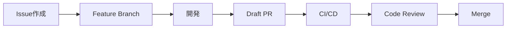

# GitHub Research Tool

> GitHub機能を網羅的に理解し、開発プロセスを最適化するための研究・学習プロジェクト

## 🎯 プロジェクトの目的

このプロジェクトは、外部ツールに依存せずGitHubの機能だけで開発に関わるすべてのタスクを実行できるようになることを目指しています。GitHub機能の深い理解を通じて、より効率的な開発フローを構築します。

## 📋 目標

- **GitHub機能の網羅的理解** - すべての機能とその使い方を体系的に学習
- **ケーススタディの作成** - 実際の開発場面での機能活用方法を文書化
- **外部ツール代替案の提供** - 一般的な外部ツールをGitHub機能で置き換える方法を提案
- **基本から高度な使い方まで** - 初心者から上級者まで対応できる知識体系の構築
- **AI駆動並列開発の実装** - GitHub機能を活用した次世代の開発手法の確立

## 🗂️ GitHub機能カテゴリ

### 1. リポジトリ管理
- **基本機能**
  - Repository作成・クローン・フォーク
  - Branch管理（作成、マージ、削除）
  - Commit履歴とタグ管理
  - Release管理

### 2. コラボレーション機能
- **Pull Request**
  - コードレビュー機能
  - サジェスト機能
  - Draft PR
  - PR テンプレート
- **Issues**
  - Issue テンプレート
  - ラベル管理
  - マイルストーン
  - Project との連携

### 3. プロジェクト管理
- **GitHub Projects**
  - カンバンボード
  - ロードマップビュー
  - 自動化ワークフロー
  - チームプランニング
- **Insights**
  - Contributors分析
  - Traffic分析
  - Dependency graph

### 4. CI/CD・自動化
- **GitHub Actions**
  - ワークフロー作成
  - 再利用可能ワークフロー
  - マトリックスビルド
  - シークレット管理
- **GitHub Apps & Webhooks**
  - 自動化トリガー
  - 外部連携

### 5. セキュリティ機能
- **Security**
  - Dependabot
  - Secret scanning
  - Code scanning
  - Security policies
- **Branch protection**
  - 保護ルール設定
  - Required reviews
  - Status checks

### 6. ドキュメント・Wiki
- **GitHub Pages**
  - 静的サイトホスティング
  - カスタムドメイン
- **Wiki**
  - プロジェクトドキュメント
  - 共同編集

### 7. コード品質
- **Code Review**
  - Codeowners
  - Review assignments
  - Suggested changes
- **Codespaces**
  - クラウド開発環境
  - Dev containers

### 8. コミュニケーション
- **Discussions**
  - Q&A フォーラム
  - アナウンスメント
  - アイデア共有
- **コメント機能**
  - インラインコメント
  - Issue/PRコメント

## 📚 ケーススタディ

### ケース1: 新機能開発フロー

**使用する機能**: Issues, Branches, Pull Requests, Actions, Review

### ケース2: バグ修正プロセス
1. **Issue報告** - バグテンプレートを使用
2. **自動ラベリング** - GitHub Actionsで優先度設定
3. **ホットフィックス** - 緊急度に応じたブランチ戦略
4. **自動テスト** - CIでの回帰テスト

### ケース3: リリース管理
- **マイルストーン設定** - バージョン計画
- **自動チェンジログ** - PRラベルから生成
- **リリースドラフト** - Actions で自動作成
- **デプロイメント** - 環境別の自動デプロイ

## 🔄 外部ツール代替マップ

| 外部ツール | GitHub機能で代替 | 備考 |
|-----------|-----------------|------|
| Jira | GitHub Projects + Issues | カンバン、スプリント管理可能 |
| Jenkins | GitHub Actions | CI/CD完全対応 |
| Confluence | GitHub Wiki + Pages | ドキュメント管理 |
| Slack (開発通知) | GitHub Notifications + Webhooks | 通知カスタマイズ可能 |
| SonarQube | Code scanning + Actions | 品質分析自動化 |
| Docker Hub | GitHub Container Registry | コンテナイメージ管理 |
| npm/pip | GitHub Packages | パッケージレジストリ |
| Trello | GitHub Projects | タスク管理・可視化 |
| CircleCI | GitHub Actions | 並列ビルド・複雑なワークフロー対応 |
| GitLab | GitHub (フル機能) | 統合開発プラットフォーム |

## 🚀 AI駆動並列開発の実装

### 並列開発を支援するGitHub機能
1. **複数Draft PR** - 並行して複数の実装案を試行
2. **GitHub Copilot** - AIペアプログラミング
3. **自動化されたテスト** - 並列実装の品質保証
4. **Codespacesの複数インスタンス** - 独立した開発環境
5. **Projects の自動化** - AIによるタスク振り分け

### 実装パターン
```yaml
# .github/workflows/ai-parallel-dev.yml
name: AI Parallel Development
on:
  issue:
    types: [opened, labeled]
jobs:
  create-branches:
    runs-on: ubuntu-latest
    steps:
      - name: 複数の実装ブランチを作成
      - name: 各ブランチでDraft PRを作成
      - name: AI分析結果をPRに追加
```

## 🎓 学習リソース

### 基本編
- [x] Git基本コマンド
- [x] ブランチ戦略
- [x] PRの作り方
- [ ] Issue管理

### 中級編
- [ ] GitHub Actions入門
- [ ] Projects活用法
- [ ] セキュリティ設定
- [ ] API活用

### 上級編
- [ ] 複雑なワークフロー設計
- [ ] カスタムApp開発
- [ ] 大規模プロジェクト管理
- [ ] パフォーマンス最適化

## 🔧 プロジェクト構成

```
github-research-tool/
├── README.md
├── docs/
│   ├── features/          # 機能別詳細ドキュメント
│   ├── case-studies/      # ケーススタディ集
│   └── workflows/         # ワークフロー例
├── examples/              # 実装例
│   ├── actions/          # GitHub Actions設定例
│   ├── templates/        # テンプレート集
│   └── scripts/          # 便利スクリプト
└── tools/                # ツール比較・移行ガイド
    ├── migration/        # 外部ツールからの移行
    └── comparison/       # 機能比較表
```

## 🤝 コントリビューション

このプロジェクトは、GitHub機能の理解を深めたい開発者のためのリソースです。新しいケーススタディ、機能の発見、ベストプラクティスなど、あらゆる貢献を歓迎します。

### 貢献方法
1. このリポジトリをフォーク
2. Feature branchを作成 (`git checkout -b feature/amazing-discovery`)
3. 変更をコミット (`git commit -m 'Add: 新しいGitHub活用法'`)
4. ブランチをプッシュ (`git push origin feature/amazing-discovery`)
5. Pull Requestを作成

## 📄 ライセンス

MIT License - 詳細は[LICENSE](LICENSE)ファイルを参照してください。

---

> 💡 **Note**: このプロジェクトは継続的に更新されます。最新のGitHub機能や新しい活用方法を随時追加していきます。