# 🤖 AI駆動並列開発ガイド

複数のAIツール（Claude、GPT-4、GitHub Copilot等）を活用して、GitHubで効率的に並列開発を行う方法を解説します。

---

## 📚 目次

1. [AI駆動並列開発とは？](#ai駆動並列開発とは)
2. [なぜGitHubが最適なのか](#なぜgithubが最適なのか)
3. [事前準備](#事前準備)
4. [実践ワークフロー](#実践ワークフロー)
5. [理解すべき重要ポイント](#理解すべき重要ポイント)
6. [実例：ECサイト開発](#実例ecサイト開発)
7. [トラブルシューティング](#トラブルシューティング)

---

## 🎯 AI駆動並列開発とは？

### 概念図
```
┌─────────────────────────────────────────────┐
│              開発者（指揮者）                  │
└────────┬────────┬────────┬────────┬─────────┘
         ↓        ↓        ↓        ↓
    ┌────┴───┐┌──┴───┐┌──┴───┐┌──┴───┐
    │ Claude  ││ GPT-4 ││Copilot││ Bard │
    │ (UI担当)││(API) ││(テスト)││(文書)│
    └────┬───┘└──┬───┘└──┬───┘└──┬───┘
         ↓        ↓        ↓        ↓
    ┌────┴────────┴────────┴────────┴───┐
    │            GitHub Repository          │
    └───────────────────────────────────────┘
```

### メリット
- **開発速度**: 従来の2-5倍高速
- **品質向上**: AIによる一貫性のあるコード
- **並列作業**: 複数機能を同時開発
- **24時間開発**: AIは休まない

---

## 🌟 なぜGitHubが最適なのか

### 1. **ブランチ戦略**
複数のAIが干渉せずに作業可能
```
main
├── ai/claude-frontend
├── ai/gpt4-backend
├── ai/copilot-tests
└── ai/bard-docs
```

### 2. **自動化機能**
- GitHub Actions で品質チェック
- 自動マージによる統合
- Issue の自動クローズ

### 3. **レビュー体制**
- Pull Request で人間がチェック
- AI生成コードの品質保証
- 議論の場の提供

---

## 🛠️ 事前準備

### 1. リポジトリ設定

#### ディレクトリ構造
```
project/
├── .github/
│   ├── workflows/         # 自動化設定
│   ├── ISSUE_TEMPLATE/   # Issue テンプレート
│   └── pull_request_template.md
├── frontend/             # Claude 担当
├── backend/              # GPT-4 担当
├── tests/                # Copilot 担当
└── docs/                 # Bard 担当
```

#### 必須ファイル作成

**.github/ISSUE_TEMPLATE/ai_task.md**
```markdown
---
name: AI Task
about: AI に割り当てるタスク
title: '[AI] '
labels: ai-task
assignees: ''
---

## タスク概要
<!-- 何を実装するか -->

## 担当AI
- [ ] Claude
- [ ] GPT-4
- [ ] GitHub Copilot
- [ ] その他

## 要件
<!-- 具体的な要件 -->

## 期待する成果物
<!-- ファイル名、機能など -->

## 依存関係
<!-- 他のタスクとの関係 -->
```

**.github/workflows/ai-parallel-check.yml**
```yaml
name: AI並列開発チェック

on:
  pull_request:
    types: [opened, synchronize]

jobs:
  parallel-validation:
    runs-on: ubuntu-latest
    strategy:
      matrix:
        check: [lint, test, build, security-scan]
    
    steps:
    - uses: actions/checkout@v4
    
    - name: Setup Node.js
      uses: actions/setup-node@v4
      with:
        node-version: '18'
        cache: 'npm'
    
    - name: Install dependencies
      run: npm ci
    
    - name: Run ${{ matrix.check }}
      run: npm run ${{ matrix.check }}
    
    - name: AI生成コード検証
      if: contains(github.event.pull_request.labels.*.name, 'ai-generated')
      run: |
        echo "AI生成コードの追加検証を実行"
        npm run validate:ai-code
```

### 2. ブランチ保護設定

```bash
# GitHub CLI での設定
gh api repos/:owner/:repo/branches/main/protection \
  --method PUT \
  --field required_status_checks='{"strict":true,"contexts":["parallel-validation"]}' \
  --field enforce_admins=false \
  --field required_pull_request_reviews='{"required_approving_review_count":1}' \
  --field restrictions=null
```

---

## 🚀 実践ワークフロー

### Phase 1: タスク分解と Issue 作成

```bash
# 1. プロジェクト作成
gh repo create my-ai-project --public --clone

# 2. Issue 一括作成
gh issue create -t "認証UIコンポーネント作成" -b "Reactで認証画面を実装" -l "ai-task,frontend"
gh issue create -t "認証API実装" -b "Express.jsでJWT認証エンドポイント" -l "ai-task,backend"
gh issue create -t "認証テスト作成" -b "UIとAPIの統合テスト" -l "ai-task,test"
gh issue create -t "認証ドキュメント作成" -b "認証フローの技術文書" -l "ai-task,docs"
```

### Phase 2: AI への指示とブランチ作成

#### Claude への指示例（フロントエンド）
```markdown
以下の Issue #1 の要件に基づいて、React認証コンポーネントを作成してください。

要件：
- Material-UI を使用
- メールとパスワードのフォーム
- バリデーション機能
- エラーハンドリング

ファイル構造：
- src/components/Auth/Login.jsx
- src/components/Auth/Register.jsx
- src/components/Auth/auth.css
```

#### 各AIでの作業
```bash
# ブランチ作成と切り替え
git checkout -b ai/claude-auth-ui
# Claudeが生成したコードを追加
git add frontend/
git commit -m "feat: AI-generated auth UI components #1"
git push origin ai/claude-auth-ui

# 同様に他のAIでも実行
git checkout -b ai/gpt4-auth-api
# GPT-4のコードを追加...
```

### Phase 3: 並列 Pull Request

```bash
# PR作成（各ブランチで）
gh pr create \
  --title "feat: 認証UI実装 by Claude AI" \
  --body "$(cat <<EOF
## AI生成情報
- AI: Claude 3
- タスク: Issue #1
- 生成日時: $(date)

## 実装内容
- ログインコンポーネント
- 登録コンポーネント
- バリデーション

## チェックリスト
- [x] コード生成完了
- [x] Lintパス
- [ ] 人間によるレビュー待ち
EOF
)" \
  --label "ai-generated,frontend"
```

### Phase 4: 統合とテスト

```yaml
# .github/workflows/integration.yml
name: 統合テスト

on:
  schedule:
    - cron: '0 */4 * * *'  # 4時間ごと
  workflow_dispatch:

jobs:
  merge-ai-branches:
    runs-on: ubuntu-latest
    steps:
    - uses: actions/checkout@v4
      with:
        fetch-depth: 0
    
    - name: 統合ブランチ作成
      run: |
        git checkout -b integration/ai-combined
        git merge origin/ai/claude-auth-ui
        git merge origin/ai/gpt4-auth-api
        git merge origin/ai/copilot-auth-tests
    
    - name: 統合テスト実行
      run: |
        npm ci
        npm run test:integration
    
    - name: 成功時は main へ PR
      if: success()
      run: |
        gh pr create \
          --title "AI統合: 認証機能" \
          --body "全AIブランチの統合完了"
```

---

## 💡 理解すべき重要ポイント

### 1. **タスクの独立性**

#### ❌ 悪い例
```
Task A: ユーザーモデルとUI作成
Task B: ユーザーモデルを使うAPI作成
→ Task B は Task A の完了待ち
```

#### ✅ 良い例
```
Task A: ユーザーUIコンポーネント（モックデータ使用）
Task B: ユーザーAPI（インターフェース定義済み）
Task C: データモデル定義
→ 全て並列実行可能
```

### 2. **インターフェースファースト**

```typescript
// interfaces/user.ts を最初に定義
export interface User {
  id: string;
  email: string;
  name: string;
}

export interface AuthResponse {
  user: User;
  token: string;
}
```

### 3. **AIプロンプトの標準化**

```markdown
## プロンプトテンプレート

### 役割
あなたは[フロントエンド/バックエンド/テスト]エンジニアです。

### タスク
[具体的なタスク内容]

### 技術スタック
- 言語: [TypeScript/Python/etc]
- フレームワーク: [React/Express/etc]
- ライブラリ: [必須ライブラリ]

### コーディング規約
- [プロジェクトの規約]

### 期待する出力
- ファイル名: [具体的なパス]
- 機能: [実装する機能]
```

### 4. **コンフリクト回避戦略**

```
frontend/
├── components/
│   ├── auth/        # Claude 担当
│   ├── dashboard/   # GPT-4 担当
│   └── shared/      # 共通（人間が管理）
```

### 5. **品質保証の仕組み**

```mermaid
graph LR
    A[AI生成] --> B[自動Lint]
    B --> C[自動テスト]
    C --> D[セキュリティスキャン]
    D --> E[人間レビュー]
    E --> F[マージ]
```



---

## 📋 実例：ECサイト開発

### プロジェクト構造
```
ecommerce-ai/
├── frontend/          # Claude
│   ├── ProductList
│   ├── Cart
│   └── Checkout
├── backend/           # GPT-4
│   ├── products-api
│   ├── orders-api
│   └── payment-api
├── mobile/            # Copilot
│   └── react-native-app
└── tests/             # Bard
    ├── e2e/
    └── integration/
```

### タイムライン（1日の流れ）
```
09:00 - タスク分解、Issue作成
09:30 - 各AIへ指示出し
10:00 - AI作業中（並列）
12:00 - 最初のPR確認
13:00 - フィードバック、AI再生成
15:00 - 統合テスト
16:00 - 本番環境へデプロイ
```

### 実績
- **開発期間**: 3日（従来は2週間）
- **コード行数**: 15,000行
- **テストカバレッジ**: 85%
- **バグ数**: 従来の40%減

---

## 🔧 トラブルシューティング

### よくある問題と解決策

#### 1. AI間の仕様不整合
```bash
# 解決: 共通インターフェースファイル
echo "export interface UserAPI { ... }" > shared/interfaces.ts
# 全AIにこのファイルを参照させる
```

#### 2. マージコンフリクト
```bash
# 解決: 定期的な統合
git checkout -b integration/daily
git merge --no-ff ai/claude-branch
git merge --no-ff ai/gpt4-branch
# コンフリクト解決後
git push origin integration/daily
```

#### 3. AIの出力品質が低い
```yaml
# .github/ai-quality-check.yml
quality_thresholds:
  complexity: 10      # 循環的複雑度
  duplication: 5%    # 重複コード
  test_coverage: 80% # テストカバレッジ
```

#### 4. 依存関係の問題
```json
// package.json でバージョン固定
{
  "dependencies": {
    "react": "18.2.0",    // 固定
    "express": "4.18.2"   // 固定
  }
}
```

---

## 🎯 ベストプラクティス

### 1. **日次スタンドアップ with AI**
```markdown
## AI Status Check
- [ ] Claude: フロントエンド進捗 70%
- [ ] GPT-4: API実装完了
- [ ] Copilot: テスト作成中
- [ ] 統合テスト: 本日15時予定
```

### 2. **AI ローテーション**
異なるAIに同じタスクを割り当てて、最良の実装を選択

### 3. **継続的な学習**
```yaml
# AIの出力を評価・記録
ai_performance:
  claude:
    success_rate: 85%
    avg_review_time: 30min
  gpt4:
    success_rate: 90%
    avg_review_time: 25min
```

### 4. **ドキュメント自動生成**
```bash
# PR作成時に自動でドキュメント更新
npm run generate:docs
git add docs/
git commit -m "docs: auto-update API documentation"
```

---

## 🚀 次のステップ

1. **小規模プロジェクトで試す**
   - TODO アプリなど簡単なものから

2. **AIの特性を理解**
   - Claude: UI/UXに強い
   - GPT-4: ロジック・アルゴリズム
   - Copilot: 既存コードの拡張

3. **チームへの展開**
   - ワークショップ開催
   - ガイドライン策定

4. **メトリクス収集**
   - 開発速度の改善率
   - バグ率の変化
   - チーム満足度

---

## 📚 関連リソース

- [GitHub Actions 詳細ガイド](../features/05-github-actions.md)
- [ブランチ戦略ガイド](../features/01-repository-basics.md)
- [Pull Request ベストプラクティス](../features/03-pull-requests.md)

---

## 🤝 コミュニティ

AI駆動開発について議論しましょう：
- [GitHub Discussions](https://github.com/marketing-shibata50/github-research-tool/discussions)
- Issues での質問も歓迎

---

*最終更新: 2024年1月*