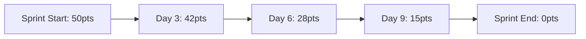

# 📚 GitHub機能詳細ガイド - 全20機能の完全解説

GitHubの全20機能について、実践的な使い方からプロレベルの活用法まで徹底的に解説します。

---

## 📋 目次

### 基本機能（1-6）
1. [リポジトリ（Repository）](#1-リポジトリrepository)
2. [ブランチ（Branch）](#2-ブランチbranch)
3. [コミット（Commit）](#3-コミットcommit)
4. [プルリクエスト（Pull Request）](#4-プルリクエストpull-request)
5. [イシュー（Issues）](#5-イシューissues)
6. [プロジェクト（Projects）](#6-プロジェクトprojects)

### 自動化・公開機能（7-9）
7. [アクション（Actions）](#7-アクションactions)
8. [ページ（Pages）](#8-ページpages)
9. [ウィキ（Wiki）](#9-ウィキwiki)

### ソーシャル機能（10-12）
10. [ウォッチ（Watch）](#10-ウォッチwatch)
11. [スター（Star）](#11-スターstar)
12. [フォーク（Fork）](#12-フォークfork)

### Git操作機能（13-16）
13. [クローン（Clone）](#13-クローンclone)
14. [プッシュ（Push）](#14-プッシュpush)
15. [プル（Pull）](#15-プルpull)
16. [マージ（Merge）](#16-マージmerge)

### 拡張機能（17-20）
17. [ディスカッション（Discussions）](#17-ディスカッションdiscussions)
18. [ギスト（Gist）](#18-ギストgist)
19. [パッケージ（Packages）](#19-パッケージpackages)
20. [スポンサー（Sponsors）](#20-スポンサーsponsors)

---

## 1. 📁 リポジトリ（Repository）

### 概要
リポジトリは、プロジェクトの全ファイル、履歴、設定を保存する基本単位です。Googleドライブのフォルダに似ていますが、変更履歴を完全に記録し、複数人での同時編集を可能にします。

### 詳細機能

#### リポジトリの種類
```
┌─────────────────────────────────────────────┐
│             リポジトリタイプ                 │
├─────────────────┬───────────────────────────┤
│   Public        │   Private                 │
├─────────────────┼───────────────────────────┤
│ ✓ 誰でも閲覧可  │ ✓ 招待者のみ閲覧可        │
│ ✓ 検索可能      │ ✗ 検索不可               │
│ ✓ 無料・無制限  │ ✓ 無料（個人）            │
│ ✓ GitHub Pages │ ✓ Pro版でPages可         │
└─────────────────┴───────────────────────────┘
```

#### 必須ファイル構成
```
my-project/
├── README.md          # プロジェクト説明（必須）
├── LICENSE           # ライセンス情報
├── .gitignore        # 無視ファイル設定
├── .github/          # GitHub設定
│   ├── workflows/    # Actions設定
│   ├── ISSUE_TEMPLATE/
│   ├── PULL_REQUEST_TEMPLATE.md
│   └── CODEOWNERS   # コードオーナー
├── docs/            # ドキュメント
├── src/             # ソースコード
└── tests/           # テストコード
```

### 実践例

#### 1. テンプレートからリポジトリ作成
```bash
# GitHub CLIを使用
gh repo create my-app --template owner/template-repo --public

# テンプレート使用の利点
- 標準構成の即時適用
- CI/CD設定の継承
- コーディング規約の統一
```

#### 2. モノレポ構成
```
company-monorepo/
├── packages/
│   ├── frontend/      # Reactアプリ
│   ├── backend/       # Node.js API
│   ├── mobile/        # React Native
│   └── shared/        # 共通ライブラリ
├── lerna.json         # Lernaモノレポ設定
└── package.json       # ルート設定
```

#### 3. リポジトリ設定のベストプラクティス
```yaml
# .github/settings.yml (probot/settings使用)
repository:
  name: my-project
  description: プロジェクトの説明
  private: false
  has_issues: true
  has_projects: true
  has_wiki: true
  has_downloads: true
  default_branch: main
  allow_squash_merge: true
  allow_merge_commit: true
  allow_rebase_merge: false
  delete_branch_on_merge: true
  enable_automated_security_fixes: true
```

### 高度な活用

#### 1. リポジトリインサイト分析
```
Insights → 各種分析
├── Pulse: 週次/月次アクティビティ
├── Contributors: 貢献者統計
├── Community: コミュニティ健全性
├── Traffic: アクセス統計
├── Commits: コミット頻度
├── Code frequency: コード追加/削除
└── Dependency graph: 依存関係
```

#### 2. セキュリティ設定
```yaml
# Security → Settings
- ✓ Dependency alerts
- ✓ Dependabot security updates
- ✓ Code scanning alerts
- ✓ Secret scanning alerts
```

#### 3. アクセス管理
```
Settings → Manage access
├── Collaborators: 個別招待
├── Teams: チーム単位管理
└── Deploy keys: CI/CD用鍵
```

### トラブルシューティング

#### リポジトリサイズ問題
```bash
# 大きなファイルの履歴削除
git filter-branch --force --index-filter \
  "git rm --cached --ignore-unmatch path/to/large-file" \
  --prune-empty --tag-name-filter cat -- --all

# Git LFS導入
git lfs track "*.psd"
git lfs track "*.zip"
git add .gitattributes
```

---

## 2. 🌿 ブランチ（Branch）

### 概要
ブランチは、メインのコードから分岐して独立した開発を行うための仕組みです。複数の機能を並行開発したり、実験的な変更を安全に試すことができます。

### ブランチ戦略

#### 1. Git Flow
```
main (production)
│
├── develop (開発統合)
│   ├── feature/user-auth
│   ├── feature/payment
│   └── feature/notifications
│
├── release/v1.2.0
│   └── 本番リリース準備
│
└── hotfix/critical-bug
    └── 緊急修正
```

#### 2. GitHub Flow（シンプル）
```
main
├── feature/new-feature
├── fix/bug-123
└── docs/update-readme
```

#### 3. GitLab Flow（環境別）
```
main
├── pre-production
├── production
└── feature-branches
```

### 実践的なブランチ運用

#### ブランチ命名規則
```bash
# 機能追加
feature/user-authentication
feature/JIRA-123-shopping-cart

# バグ修正
fix/login-error
bugfix/issue-456

# ドキュメント
docs/api-documentation
docs/installation-guide

# リファクタリング
refactor/database-optimization
chore/update-dependencies

# リリース
release/v2.0.0
release/2023-12-01
```

#### ブランチ保護ルール
```yaml
# branch protection rules
main:
  required_reviews: 2
  dismiss_stale_reviews: true
  require_code_owner_reviews: true
  required_status_checks:
    - continuous-integration/travis-ci
    - security/snyk
  enforce_admins: false
  restrictions:
    users: []
    teams: ["maintainers"]
```

### 高度なブランチ操作

#### 1. ブランチの比較とマージ予測
```bash
# ブランチ間の差分確認
git diff main..feature/new-feature

# マージ予測（ドライラン）
git merge --no-commit --no-ff feature/new-feature
git diff --cached
git merge --abort  # 取り消し

# コンフリクト事前確認
git log --oneline --left-right main...feature/new-feature
```

#### 2. ブランチのクリーンアップ
```bash
# マージ済みブランチ一覧
git branch --merged main

# リモートの削除済みブランチを反映
git remote prune origin

# 一括削除スクリプト
git branch --merged main | grep -v "main\|develop" | xargs -n 1 git branch -d
```

#### 3. ブランチ復元
```bash
# 削除したブランチを復元
git reflog
git checkout -b recovered-branch HEAD@{2}
```

### ワークフロー例

#### フィーチャーブランチワークフロー
```bash
# 1. 最新のmainから分岐
git checkout main
git pull origin main
git checkout -b feature/awesome-feature

# 2. 開発作業
# ... コード変更 ...
git add .
git commit -m "feat: add awesome feature"

# 3. 定期的にmainの変更を取り込む
git checkout main
git pull origin main
git checkout feature/awesome-feature
git rebase main

# 4. プッシュしてPR作成
git push origin feature/awesome-feature
gh pr create --fill
```

---

## 3. 💾 コミット（Commit）

### 概要
コミットは、ファイルの変更を履歴として記録する操作です。各コミットは一意のIDを持ち、いつでも過去の状態に戻すことができます。

### コミットメッセージの規約

#### Conventional Commits
```
<type>(<scope>): <subject>

<body>

<footer>
```

#### タイプ一覧
```
feat:     新機能
fix:      バグ修正
docs:     ドキュメントのみの変更
style:    フォーマット変更（コードの動作に影響なし）
refactor: リファクタリング
perf:     パフォーマンス改善
test:     テスト追加・修正
chore:    ビルドプロセスやツールの変更
ci:       CI設定の変更
```

#### 実例
```bash
# 良い例
git commit -m "feat(auth): add OAuth2 login support

- Implement Google OAuth2 integration
- Add refresh token handling
- Update user model with OAuth fields

Closes #123"

# 悪い例
git commit -m "更新"
git commit -m "fix"
```

### 高度なコミット操作

#### 1. インタラクティブリベース
```bash
# 直近3つのコミットを整理
git rebase -i HEAD~3

# エディタで操作を選択
pick abc1234 feat: add login
squash def5678 fix: typo
reword ghi9012 docs: update

# 結果: 3つのコミットが2つに整理される
```

#### 2. コミットの分割
```bash
# 大きすぎるコミットを分割
git reset HEAD~1
git add -p  # 部分的にステージング
git commit -m "feat: add user model"
git add -p
git commit -m "feat: add user controller"
```

#### 3. コミットの検索
```bash
# メッセージで検索
git log --grep="fix.*login"

# 変更内容で検索
git log -S "function loginUser"

# 日付範囲
git log --since="2023-01-01" --until="2023-12-31"

# 著者
git log --author="John Doe"
```

### コミットフック

#### pre-commit設定
```bash
# .git/hooks/pre-commit
#!/bin/sh
# コード品質チェック
npm run lint
npm run test:unit

# コミットメッセージ検証
commit_regex='^(feat|fix|docs|style|refactor|perf|test|chore|ci)(\(.+\))?: .{1,50}'
if ! grep -qE "$commit_regex" "$1"; then
    echo "Invalid commit message format!"
    exit 1
fi
```

### 署名付きコミット
```bash
# GPG署名の設定
git config --global user.signingkey YOUR_GPG_KEY
git config --global commit.gpgsign true

# 署名付きコミット
git commit -S -m "feat: secure feature"

# 署名の検証
git log --show-signature
```

---

## 4. 🔄 プルリクエスト（Pull Request）

### 概要
プルリクエスト（PR）は、ブランチの変更をメインブランチに統合する前に、コードレビューや議論を行うための機能です。

### PR作成のベストプラクティス

#### PRテンプレート
```markdown
<!-- .github/pull_request_template.md -->
## 概要
<!-- 変更の概要を記述 -->

## 変更タイプ
- [ ] 🐛 バグ修正
- [ ] ✨ 新機能
- [ ] 💥 破壊的変更
- [ ] 📝 ドキュメント更新

## 関連Issue
Closes #

## 変更内容
<!-- 詳細な変更内容 -->

## スクリーンショット
<!-- UI変更の場合 -->

## テスト
- [ ] ユニットテスト追加/更新
- [ ] 統合テスト実施
- [ ] 手動テスト完了

## チェックリスト
- [ ] セルフレビュー実施
- [ ] コーディング規約準拠
- [ ] ドキュメント更新
- [ ] 変更履歴（CHANGELOG）更新
```

#### PR自動化

##### 自動ラベリング
```yaml
# .github/labeler.yml
frontend:
  - src/components/**
  - src/pages/**

backend:
  - api/**
  - server/**

documentation:
  - docs/**
  - '*.md'

tests:
  - '**/*.test.js'
  - '**/*.spec.ts'
```

##### 自動アサイン
```yaml
# .github/CODEOWNERS
# フロントエンド
/src/components/ @frontend-team
/src/pages/ @frontend-team

# バックエンド
/api/ @backend-team @tech-lead

# ドキュメント
/docs/ @docs-team
*.md @docs-team
```

### 高度なPR管理

#### 1. Draft PR活用
```bash
# Draft PRとして作成
gh pr create --draft --title "WIP: New feature"

# 準備完了後
gh pr ready 123
```

#### 2. スタック型PR（依存PR）
```
main
└── PR #1: feature/database-schema
    └── PR #2: feature/api-endpoints
        └── PR #3: feature/frontend-ui
```

#### 3. PR自動マージ設定
```yaml
# .github/auto-merge.yml
merge_rules:
  - name: 自動マージ（dependabot）
    conditions:
      - author = dependabot[bot]
      - status-check = continuous-integration/travis-ci
      - '#approved-reviews >= 1'
    actions:
      merge:
        method: squash
```

### コードレビューのベストプラクティス

#### レビューコメントの書き方
```markdown
# 建設的なコメント例

## 🤔 質問
このアプローチを選んだ理由を教えていただけますか？
別の方法として〇〇も考えられますが、検討されましたか？

## 💡 提案
```suggestion
const result = users.filter(u => u.active).map(u => u.name);
```
パフォーマンスを考慮して、filterとmapを1回のreduceにまとめることを提案します。

## ⚠️ 懸念事項
このコードはN+1問題を引き起こす可能性があります。
データローダーの使用を検討してください。

## ✅ 良い点
エラーハンドリングが適切に実装されていて素晴らしいです！
```

---

## 5. 🎫 イシュー（Issues）

### 概要
Issuesは、バグ報告、機能要望、タスク管理、質問など、プロジェクトに関するあらゆる議論を管理する機能です。

### Issue活用パターン

#### 1. バグ報告テンプレート
```markdown
<!-- .github/ISSUE_TEMPLATE/bug_report.md -->
---
name: バグ報告
about: バグの報告はこちら
title: '[BUG] '
labels: bug, triage
assignees: ''
---

## バグの概要
<!-- 簡潔な説明 -->

## 再現手順
1. 
2. 
3. 

## 期待される動作
<!-- 正常な動作 -->

## 実際の動作
<!-- バグの動作 -->

## 環境
- OS: [e.g. macOS 13.0]
- ブラウザ: [e.g. Chrome 100]
- バージョン: [e.g. 1.0.0]

## スクリーンショット
<!-- 該当する場合 -->

## ログ
```
エラーログをここに貼付
```
```

#### 2. 機能要望テンプレート
```markdown
<!-- .github/ISSUE_TEMPLATE/feature_request.md -->
---
name: 機能要望
about: 新機能の提案
title: '[FEATURE] '
labels: enhancement
---

## 機能の概要
<!-- 提案する機能の説明 -->

## 解決したい課題
<!-- この機能で解決される問題 -->

## 提案する解決策
<!-- 実装方法の提案 -->

## 代替案
<!-- 他の解決方法 -->

## 追加情報
<!-- 参考資料やリンク -->
```

### 高度なIssue管理

#### 1. ラベル体系
```yaml
# 優先度
- P0: Critical
- P1: High
- P2: Medium
- P3: Low

# タイプ
- bug: バグ
- enhancement: 機能改善
- documentation: ドキュメント
- question: 質問

# 状態
- triage: トリアージ待ち
- in-progress: 作業中
- blocked: ブロック中
- ready-for-review: レビュー待ち

# コンポーネント
- frontend
- backend
- database
- infrastructure
```

#### 2. 自動化ルール
```yaml
# .github/workflows/issue-automation.yml
name: Issue Automation

on:
  issues:
    types: [opened, labeled]

jobs:
  auto-assign:
    runs-on: ubuntu-latest
    steps:
      - uses: actions/github-script@v6
        with:
          script: |
            // ラベルに基づく自動アサイン
            const labelAssignees = {
              'frontend': ['frontend-lead'],
              'backend': ['backend-lead'],
              'urgent': ['tech-lead', 'manager']
            };
            
            const labels = context.payload.issue.labels;
            const assignees = new Set();
            
            labels.forEach(label => {
              const users = labelAssignees[label.name];
              if (users) users.forEach(u => assignees.add(u));
            });
            
            if (assignees.size > 0) {
              await github.rest.issues.addAssignees({
                ...context.repo,
                issue_number: context.issue.number,
                assignees: Array.from(assignees)
              });
            }
```

#### 3. Issue分析ダッシュボード
```javascript
// GitHub GraphQL APIを使用した分析
const query = `
  query($owner: String!, $repo: String!) {
    repository(owner: $owner, name: $repo) {
      issues(first: 100, states: OPEN) {
        totalCount
        edges {
          node {
            createdAt
            closedAt
            labels(first: 10) {
              nodes { name }
            }
            assignees(first: 5) {
              nodes { login }
            }
          }
        }
      }
    }
  }
`;

// 平均解決時間、ラベル別統計などを計算
```

---

## 6. 📋 プロジェクト（Projects）

### 概要
GitHub Projectsは、カンバンボードやテーブル形式でタスクを視覚的に管理できる機能です。IssueやPRと連携して、プロジェクト全体の進捗を把握できます。

### Projects v2の活用

#### ビュータイプ
```
1. Board View（カンバン）
   └── ドラッグ&ドロップで直感的

2. Table View（表形式）
   └── フィルタ・ソートで分析

3. Roadmap View（タイムライン）
   └── スケジュール管理
```

#### カスタムフィールド
```yaml
fields:
  - name: Priority
    type: single_select
    options: [High, Medium, Low]
  
  - name: Story Points
    type: number
  
  - name: Sprint
    type: iteration
    duration: 2 weeks
  
  - name: Start Date
    type: date
  
  - name: Team
    type: single_select
    options: [Frontend, Backend, QA, DevOps]
```

### 実践的なプロジェクト設定

#### スクラム開発テンプレート
```
📋 Sprint Board
├── 📥 Backlog
├── 🎯 Sprint Planning
├── 🚧 In Progress
├── 👀 In Review
├── ✅ Done
└── 🚢 Deployed
```

#### 自動化ワークフロー
```yaml
# プロジェクト自動化
workflows:
  - name: 新規Issue追加
    trigger: item_added
    if: item.type == "issue"
    then:
      - set_field: "Status", "Backlog"
      - set_field: "Priority", "Medium"
  
  - name: PR作成時
    trigger: item_added
    if: item.type == "pull_request"
    then:
      - set_field: "Status", "In Review"
      - link_to_issue
  
  - name: 完了時
    trigger: item_closed
    then:
      - set_field: "Status", "Done"
      - set_field: "Completed Date", current_date()
```

### 高度な活用例

#### 1. ベロシティトラッキング
```javascript
// スプリント別の完了ポイント集計
const calculateVelocity = (projectItems) => {
  const sprintVelocity = {};
  
  projectItems
    .filter(item => item.status === 'Done')
    .forEach(item => {
      const sprint = item.fields.sprint;
      const points = item.fields.storyPoints || 0;
      sprintVelocity[sprint] = (sprintVelocity[sprint] || 0) + points;
    });
    
  return sprintVelocity;
};
```

#### 2. バーンダウンチャート


#### 3. 複数リポジトリ統合
```yaml
# Organization-level project
repositories:
  - frontend-app
  - backend-api
  - mobile-app
  - shared-components

sync_rules:
  - source: "*/issues"
    filter: "label:epic"
    destination: "Epic Board"
```

---

## 7. ⚡ アクション（Actions）

### 概要
GitHub Actionsは、CI/CD、自動化、定期実行など、あらゆるワークフローを実行できる強力な自動化プラットフォームです。

### 基本構造

```yaml
name: ワークフロー名
on: [トリガーイベント]
env:
  GLOBAL_VAR: value

jobs:
  job-name:
    runs-on: ubuntu-latest
    steps:
      - uses: actions/checkout@v4
      - name: ステップ名
        run: |
          実行コマンド
```

### 実践的なワークフロー例

#### 1. マルチ環境CI/CD
```yaml
name: CI/CD Pipeline

on:
  push:
    branches: [main, develop]
  pull_request:
    branches: [main]

env:
  NODE_VERSION: '18'
  
jobs:
  test:
    runs-on: ${{ matrix.os }}
    strategy:
      matrix:
        os: [ubuntu-latest, windows-latest, macos-latest]
        node: [16, 18, 20]
    
    steps:
    - uses: actions/checkout@v4
    
    - name: Setup Node.js
      uses: actions/setup-node@v4
      with:
        node-version: ${{ matrix.node }}
        cache: 'npm'
    
    - name: Install dependencies
      run: npm ci
    
    - name: Run tests
      run: |
        npm run lint
        npm run test:unit
        npm run test:integration
    
    - name: Upload coverage
      uses: codecov/codecov-action@v3
      with:
        token: ${{ secrets.CODECOV_TOKEN }}

  build:
    needs: test
    runs-on: ubuntu-latest
    
    steps:
    - uses: actions/checkout@v4
    
    - name: Build application
      run: |
        npm ci
        npm run build
    
    - name: Build Docker image
      run: |
        docker build -t ${{ github.repository }}:${{ github.sha }} .
        docker tag ${{ github.repository }}:${{ github.sha }} ${{ github.repository }}:latest
    
    - name: Push to registry
      if: github.ref == 'refs/heads/main'
      run: |
        echo ${{ secrets.DOCKER_PASSWORD }} | docker login -u ${{ secrets.DOCKER_USERNAME }} --password-stdin
        docker push ${{ github.repository }}:${{ github.sha }}
        docker push ${{ github.repository }}:latest

  deploy:
    needs: build
    if: github.ref == 'refs/heads/main'
    runs-on: ubuntu-latest
    environment: production
    
    steps:
    - name: Deploy to Kubernetes
      run: |
        kubectl set image deployment/app app=${{ github.repository }}:${{ github.sha }}
        kubectl rollout status deployment/app
```

#### 2. 定期実行ワークフロー
```yaml
name: Scheduled Tasks

on:
  schedule:
    # 毎日 9:00 JST
    - cron: '0 0 * * *'
    # 毎週月曜 10:00 JST
    - cron: '0 1 * * 1'

jobs:
  security-scan:
    runs-on: ubuntu-latest
    steps:
    - uses: actions/checkout@v4
    
    - name: Run security audit
      run: |
        npm audit
        pip-audit
        bundle-audit check
    
    - name: Dependency check
      uses: dependency-check/Dependency-Check_Action@main
      with:
        project: 'my-project'
        path: '.'
        format: 'HTML'
    
    - name: Upload reports
      uses: actions/upload-artifact@v3
      with:
        name: security-reports
        path: reports/

  backup:
    runs-on: ubuntu-latest
    steps:
    - name: Backup database
      run: |
        pg_dump ${{ secrets.DATABASE_URL }} > backup.sql
        aws s3 cp backup.sql s3://backups/$(date +%Y%m%d).sql
```

#### 3. 高度な条件分岐
```yaml
name: Conditional Workflow

on: [push, pull_request]

jobs:
  determine-changes:
    runs-on: ubuntu-latest
    outputs:
      frontend: ${{ steps.filter.outputs.frontend }}
      backend: ${{ steps.filter.outputs.backend }}
      docs: ${{ steps.filter.outputs.docs }}
    
    steps:
    - uses: actions/checkout@v4
    - uses: dorny/paths-filter@v2
      id: filter
      with:
        filters: |
          frontend:
            - 'src/**'
            - 'public/**'
            - 'package.json'
          backend:
            - 'api/**'
            - 'server/**'
            - 'requirements.txt'
          docs:
            - 'docs/**'
            - '*.md'

  frontend-tests:
    needs: determine-changes
    if: needs.determine-changes.outputs.frontend == 'true'
    runs-on: ubuntu-latest
    steps:
    - run: echo "Frontend changed, running tests..."

  backend-tests:
    needs: determine-changes
    if: needs.determine-changes.outputs.backend == 'true'
    runs-on: ubuntu-latest
    steps:
    - run: echo "Backend changed, running tests..."
```

### カスタムアクション開発

#### JavaScript Action
```yaml
# action.yml
name: 'Custom Action'
description: 'カスタムアクションの説明'
inputs:
  token:
    description: 'GitHub token'
    required: true
outputs:
  result:
    description: '処理結果'
runs:
  using: 'node16'
  main: 'dist/index.js'
```

```javascript
// index.js
const core = require('@actions/core');
const github = require('@actions/github');

async function run() {
  try {
    const token = core.getInput('token');
    const octokit = github.getOctokit(token);
    
    // カスタムロジック
    const result = await processData(octokit);
    
    core.setOutput('result', result);
  } catch (error) {
    core.setFailed(error.message);
  }
}

run();
```

---

## 8. 🌐 ページ（Pages）

### 概要
GitHub Pagesは、リポジトリから直接静的Webサイトをホスティングできる無料サービスです。

### 設定パターン

#### 1. 基本設定
```yaml
# _config.yml (Jekyll)
title: My Awesome Site
description: サイトの説明
url: https://username.github.io
baseurl: /repository-name

theme: minima
plugins:
  - jekyll-feed
  - jekyll-sitemap
  - jekyll-seo-tag
```

#### 2. カスタムドメイン設定
```
# CNAME
www.example.com
```

```
# DNS設定
A     @     185.199.108.153
A     @     185.199.109.153
A     @     185.199.110.153
A     @     185.199.111.153
CNAME www   username.github.io
```

### 高度な活用

#### 1. 複数の静的サイトジェネレータ
```yaml
# Hugo
name: Deploy Hugo site

on:
  push:
    branches: [main]

jobs:
  deploy:
    runs-on: ubuntu-latest
    steps:
    - uses: actions/checkout@v4
      with:
        submodules: true
    
    - name: Setup Hugo
      uses: peaceiris/actions-hugo@v2
      with:
        hugo-version: 'latest'
        extended: true
    
    - name: Build
      run: hugo --minify
    
    - name: Deploy
      uses: peaceiris/actions-gh-pages@v3
      with:
        github_token: ${{ secrets.GITHUB_TOKEN }}
        publish_dir: ./public
```

#### 2. SPA（Single Page Application）
```yaml
# React/Vue/Angular
name: Deploy SPA

on:
  push:
    branches: [main]

jobs:
  deploy:
    runs-on: ubuntu-latest
    steps:
    - uses: actions/checkout@v4
    
    - name: Setup Node.js
      uses: actions/setup-node@v4
      with:
        node-version: '18'
        cache: 'npm'
    
    - name: Install and Build
      run: |
        npm ci
        npm run build
      env:
        REACT_APP_API_URL: ${{ secrets.API_URL }}
    
    - name: Deploy
      uses: JamesIves/github-pages-deploy-action@v4
      with:
        folder: build
        clean: true
```

#### 3. ドキュメントサイト
```yaml
# VitePress/Docusaurus
name: Deploy Docs

on:
  push:
    branches: [main]
    paths:
      - 'docs/**'
      - 'package.json'

jobs:
  deploy:
    runs-on: ubuntu-latest
    steps:
    - uses: actions/checkout@v4
    
    - name: Build VitePress site
      run: |
        npm ci
        npm run docs:build
    
    - name: Deploy to GitHub Pages
      uses: crazy-max/ghaction-github-pages@v3
      with:
        target_branch: gh-pages
        build_dir: docs/.vitepress/dist
      env:
        GITHUB_TOKEN: ${{ secrets.GITHUB_TOKEN }}
```

### パフォーマンス最適化

```yaml
# 最適化設定
optimization:
  - HTML minification
  - CSS/JS minification
  - Image optimization
  - Lazy loading
  - Service Worker
  - CDN integration

# キャッシュ設定
cache_control:
  - "*.html": "no-cache"
  - "*.css": "max-age=31536000"
  - "*.js": "max-age=31536000"
  - "*.jpg": "max-age=31536000"
```

---

## 9. 📚 ウィキ（Wiki）

### 概要
GitHubのWikiは、プロジェクトの詳細なドキュメントを作成・管理するための機能です。リポジトリとは独立したGitリポジトリとして管理されます。

### Wiki構成のベストプラクティス

#### ディレクトリ構造
```
Home.md
├── Getting-Started/
│   ├── Installation.md
│   ├── Configuration.md
│   └── Quick-Start.md
├── User-Guide/
│   ├── Basic-Usage.md
│   ├── Advanced-Features.md
│   └── Troubleshooting.md
├── API-Reference/
│   ├── REST-API.md
│   ├── GraphQL-API.md
│   └── Webhooks.md
└── Contributing/
    ├── Code-Style.md
    ├── Testing.md
    └── Release-Process.md
```

### 高度なWiki管理

#### 1. Wikiの自動生成
```yaml
name: Generate Wiki

on:
  push:
    branches: [main]
    paths:
      - 'src/**'
      - 'docs/**'

jobs:
  wiki:
    runs-on: ubuntu-latest
    steps:
    - uses: actions/checkout@v4
    
    - name: Generate API docs
      run: |
        npm run docs:generate
        
    - name: Sync to Wiki
      uses: SwiftDocOrg/github-wiki-publish-action@v1
      with:
        path: docs/generated
      env:
        GH_PERSONAL_ACCESS_TOKEN: ${{ secrets.GH_PAT }}
```

#### 2. Wiki検索機能の実装
```javascript
// Wiki内検索（カスタム実装）
class WikiSearch {
  constructor(pages) {
    this.index = this.buildIndex(pages);
  }
  
  buildIndex(pages) {
    return pages.map(page => ({
      title: page.title,
      content: page.content.toLowerCase(),
      tokens: this.tokenize(page.content),
      url: page.url
    }));
  }
  
  search(query) {
    const queryTokens = this.tokenize(query.toLowerCase());
    return this.index
      .map(page => ({
        ...page,
        score: this.calculateScore(page.tokens, queryTokens)
      }))
      .filter(page => page.score > 0)
      .sort((a, b) => b.score - a.score);
  }
}
```

---

## 10. 👁️ ウォッチ（Watch）

### 概要
Watchは、リポジトリの活動を監視し、通知を受け取るための機能です。

### 通知レベルの詳細

```
┌─────────────────────────────────────────────────┐
│              Watch設定レベル                      │
├──────────────┬──────────────────────────────────┤
│ Not watching │ 参加しているIssue/PRのみ通知      │
│ Releases only│ リリース時のみ通知               │
│ Watching     │ すべての活動を通知               │
│ Ignoring     │ 通知を完全に無効化               │
└──────────────┴──────────────────────────────────┘
```

### カスタム通知設定

#### 1. 通知フィルタリング
```javascript
// GitHub API を使用した通知管理
const filterNotifications = async (octokit) => {
  const notifications = await octokit.rest.activity.listNotificationsForAuthenticatedUser();
  
  return notifications.data.filter(notification => {
    // 重要度でフィルタ
    if (notification.reason === 'security_alert') return true;
    if (notification.reason === 'mention') return true;
    if (notification.reason === 'review_requested') return true;
    
    // それ以外は無視
    return false;
  });
};
```

#### 2. 通知の自動処理
```yaml
name: Process Notifications

on:
  schedule:
    - cron: '*/30 * * * *'  # 30分ごと

jobs:
  process:
    runs-on: ubuntu-latest
    steps:
    - name: Auto-respond to notifications
      uses: actions/github-script@v6
      with:
        script: |
          const notifications = await github.rest.activity.listNotificationsForAuthenticatedUser();
          
          for (const notification of notifications.data) {
            if (notification.reason === 'ci_activity' && notification.subject.title.includes('passed')) {
              // CI成功通知は既読にする
              await github.rest.activity.markThreadAsRead({
                thread_id: notification.id
              });
            }
          }
```

---

## 11. ⭐ スター（Star）

### 概要
Starは、気に入ったリポジトリをブックマークし、プロジェクトへの支持を表明する機能です。

### スターの活用方法

#### 1. スター履歴の分析
```python
import requests
import matplotlib.pyplot as plt
from datetime import datetime

def analyze_star_history(owner, repo):
    # GitHub APIでスター履歴を取得
    headers = {'Accept': 'application/vnd.github.star+json'}
    stars = []
    page = 1
    
    while True:
        response = requests.get(
            f'https://api.github.com/repos/{owner}/{repo}/stargazers',
            headers=headers,
            params={'per_page': 100, 'page': page}
        )
        
        if not response.json():
            break
            
        stars.extend(response.json())
        page += 1
    
    # 日付ごとに集計
    dates = [datetime.fromisoformat(s['starred_at'].replace('Z', '')) for s in stars]
    cumulative_stars = range(1, len(dates) + 1)
    
    # グラフ化
    plt.plot(dates, cumulative_stars)
    plt.xlabel('Date')
    plt.ylabel('Stars')
    plt.title(f'{owner}/{repo} Star History')
    plt.show()
```

#### 2. スターベースの推薦システム
```javascript
// ユーザーのスター傾向から類似プロジェクトを推薦
async function recommendProjects(username) {
  const starredRepos = await getStarredRepos(username);
  const topics = extractTopics(starredRepos);
  const languages = extractLanguages(starredRepos);
  
  // 類似プロジェクトを検索
  const recommendations = await searchSimilarRepos({
    topics,
    languages,
    minStars: 100,
    exclude: starredRepos.map(r => r.full_name)
  });
  
  return recommendations;
}
```

---

## 12. 🍴 フォーク（Fork）

### 概要
Forkは、他のユーザーのリポジトリを自分のアカウントにコピーし、独立して開発を進められる機能です。

### フォークワークフロー

#### 1. コントリビューションフロー
```bash
# 1. フォーク後のセットアップ
git clone https://github.com/YOUR_USERNAME/FORKED_REPO.git
cd FORKED_REPO
git remote add upstream https://github.com/ORIGINAL_OWNER/ORIGINAL_REPO.git

# 2. 最新の変更を取り込む
git fetch upstream
git checkout main
git merge upstream/main

# 3. 機能ブランチで作業
git checkout -b feature/my-contribution
# ... 変更を加える ...
git commit -m "feat: add awesome feature"

# 4. プッシュしてPR作成
git push origin feature/my-contribution
gh pr create --repo ORIGINAL_OWNER/ORIGINAL_REPO
```

#### 2. フォークの同期自動化
```yaml
name: Sync Fork

on:
  schedule:
    - cron: '0 0 * * *'  # 毎日
  workflow_dispatch:

jobs:
  sync:
    runs-on: ubuntu-latest
    steps:
    - uses: actions/checkout@v4
      with:
        token: ${{ secrets.PAT }}
    
    - name: Sync upstream changes
      run: |
        git remote add upstream https://github.com/ORIGINAL_OWNER/ORIGINAL_REPO.git
        git fetch upstream
        git checkout main
        git merge upstream/main
        git push origin main
```

---

## 13-16. Git操作機能（Clone/Push/Pull/Merge）

### 13. 📥 クローン（Clone）

#### 基本的なクローン
```bash
# HTTPS
git clone https://github.com/user/repo.git

# SSH
git clone git@github.com:user/repo.git

# 特定のブランチ
git clone -b develop https://github.com/user/repo.git

# 浅いクローン（履歴を限定）
git clone --depth 1 https://github.com/user/repo.git

# サブモジュール含む
git clone --recursive https://github.com/user/repo.git
```

#### 大規模リポジトリの効率的なクローン
```bash
# 部分クローン（Partial Clone）
git clone --filter=blob:none https://github.com/large/repo.git

# スパースチェックアウト
git clone --no-checkout https://github.com/large/repo.git
cd repo
git sparse-checkout init --cone
git sparse-checkout set src/specific-folder
git checkout main
```

### 14. ⬆️ プッシュ（Push）

#### 高度なプッシュ操作
```bash
# 強制プッシュ（注意！）
git push --force-with-lease origin feature-branch

# タグをプッシュ
git push origin v1.0.0
git push origin --tags

# 削除をプッシュ
git push origin --delete old-branch

# 特定のコミットまでプッシュ
git push origin HEAD~3:feature-branch
```

### 15. ⬇️ プル（Pull）

#### プル戦略
```bash
# リベースでプル
git pull --rebase origin main

# 自動スタッシュ
git pull --autostash

# プルの詳細確認
git pull --verbose --progress
```

### 16. 🔀 マージ（Merge）

#### マージ戦略
```bash
# 通常のマージ
git merge feature-branch

# Squash マージ
git merge --squash feature-branch

# No-FF マージ（必ずマージコミット作成）
git merge --no-ff feature-branch

# Octopus マージ（複数ブランチ）
git merge feature-1 feature-2 feature-3
```

---

## 17. 💬 ディスカッション（Discussions）

### 概要
Discussionsは、コミュニティとの対話、Q&A、アイデア共有のためのフォーラム機能です。

### カテゴリ設定
```yaml
categories:
  - name: Announcements
    description: 重要なお知らせ
    emoji: 📢
    discussion_type: announcement
    
  - name: Q&A
    description: 質問と回答
    emoji: ❓
    discussion_type: q&a
    
  - name: Ideas
    description: アイデアと提案
    emoji: 💡
    discussion_type: ideas
    
  - name: Show and Tell
    description: 作品紹介
    emoji: 🎨
    discussion_type: general
```

### 高度な活用

#### 1. Discussion テンプレート
```markdown
<!-- .github/DISCUSSION_TEMPLATE/questions.yml -->
name: 質問
description: プロジェクトに関する質問
title: "[Question]: "
labels: ["question"]
body:
  - type: dropdown
    id: category
    attributes:
      label: カテゴリ
      options:
        - 使い方
        - インストール
        - バグかも？
        - その他
    validations:
      required: true
  
  - type: textarea
    id: question
    attributes:
      label: 質問内容
      description: できるだけ詳しく記載してください
    validations:
      required: true
```

#### 2. Discussion 分析
```python
# GitHub GraphQL APIでDiscussion分析
query = """
query($owner: String!, $repo: String!) {
  repository(owner: $owner, name: $repo) {
    discussions(first: 100) {
      nodes {
        title
        category { name }
        createdAt
        comments { totalCount }
        reactions { totalCount }
        answerChosenAt
      }
    }
  }
}
"""

# カテゴリ別の活発度、回答率などを分析
```

---

## 18. 📝 ギスト（Gist）

### 概要
Gistは、コードスニペットやメモを簡単に共有できる機能です。

### 活用パターン

#### 1. 設定ファイル管理
```bash
# dotfiles管理
https://gist.github.com/username/xxxxx
├── .vimrc
├── .bashrc
├── .gitconfig
└── .tmux.conf

# インストールスクリプト
curl -sL https://gist.github.com/username/xxxxx/raw/install.sh | bash
```

#### 2. コードスニペットライブラリ
```javascript
// 便利な関数集
const utils = {
  debounce: (func, wait) => {
    let timeout;
    return (...args) => {
      clearTimeout(timeout);
      timeout = setTimeout(() => func.apply(this, args), wait);
    };
  },
  
  deepClone: (obj) => {
    return JSON.parse(JSON.stringify(obj));
  },
  
  formatDate: (date, format) => {
    // 日付フォーマット実装
  }
};
```

#### 3. Gist API活用
```python
import requests

class GistManager:
    def __init__(self, token):
        self.token = token
        self.headers = {
            'Authorization': f'token {token}',
            'Accept': 'application/vnd.github.v3+json'
        }
    
    def create_gist(self, description, files, public=True):
        data = {
            'description': description,
            'public': public,
            'files': files
        }
        
        response = requests.post(
            'https://api.github.com/gists',
            headers=self.headers,
            json=data
        )
        
        return response.json()
    
    def update_gist(self, gist_id, files):
        data = {'files': files}
        
        response = requests.patch(
            f'https://api.github.com/gists/{gist_id}',
            headers=self.headers,
            json=data
        )
        
        return response.json()
```

---

## 19. 📦 パッケージ（Packages）

### 概要
GitHub Packagesは、ソフトウェアパッケージをホスティング・配布するためのレジストリサービスです。

### 各種パッケージの設定

#### 1. npm パッケージ
```json
// package.json
{
  "name": "@username/package-name",
  "version": "1.0.0",
  "publishConfig": {
    "registry": "https://npm.pkg.github.com"
  }
}
```

```yaml
# .npmrc
@username:registry=https://npm.pkg.github.com
//npm.pkg.github.com/:_authToken=${NODE_AUTH_TOKEN}
```

#### 2. Docker イメージ
```dockerfile
# Dockerfile
FROM node:18-alpine
WORKDIR /app
COPY package*.json ./
RUN npm ci --production
COPY . .
EXPOSE 3000
CMD ["node", "server.js"]
```

```yaml
# 自動ビルド・プッシュ
name: Docker Build and Push

on:
  push:
    tags:
      - 'v*'

jobs:
  docker:
    runs-on: ubuntu-latest
    steps:
    - uses: actions/checkout@v4
    
    - name: Set up Docker Buildx
      uses: docker/setup-buildx-action@v2
    
    - name: Login to GitHub Container Registry
      uses: docker/login-action@v2
      with:
        registry: ghcr.io
        username: ${{ github.actor }}
        password: ${{ secrets.GITHUB_TOKEN }}
    
    - name: Build and push
      uses: docker/build-push-action@v4
      with:
        context: .
        push: true
        tags: |
          ghcr.io/${{ github.repository }}:latest
          ghcr.io/${{ github.repository }}:${{ github.ref_name }}
        cache-from: type=gha
        cache-to: type=gha,mode=max
```

#### 3. Maven パッケージ
```xml
<!-- pom.xml -->
<distributionManagement>
  <repository>
    <id>github</id>
    <name>GitHub Packages</name>
    <url>https://maven.pkg.github.com/OWNER/REPOSITORY</url>
  </repository>
</distributionManagement>
```

---

## 20. 💖 スポンサー（Sponsors）

### 概要
GitHub Sponsorsは、オープンソース開発者を金銭的に支援するためのプラットフォームです。

### スポンサー設定

#### 1. プロフィール設定
```yaml
# .github/FUNDING.yml
github: [username1, username2]
patreon: username
open_collective: username
ko_fi: username
tidelift: npm/package-name
community_bridge: project-name
liberapay: username
issuehunt: username
otechie: username
custom: ['https://www.paypal.me/username']
```

#### 2. スポンサーティア設定
```yaml
tiers:
  - name: "☕ Coffee Supporter"
    amount: 3
    description: |
      バグ修正の優先対応
      Discordでの特別ロール
    rewards:
      - Priority bug fixes
      - Special Discord role
  
  - name: "🚀 Pro Supporter"
    amount: 10
    description: |
      機能リクエストの優先検討
      月次進捗レポート
      README にお名前掲載
    rewards:
      - Feature request priority
      - Monthly progress reports
      - Name in README
  
  - name: "🏢 Corporate Sponsor"
    amount: 100
    description: |
      専用サポートチャンネル
      ロゴ掲載
      四半期ミーティング
    rewards:
      - Dedicated support
      - Logo placement
      - Quarterly meetings
```

#### 3. スポンサー管理自動化
```yaml
name: Sponsor Management

on:
  sponsorship:
    types: [created, cancelled, edited, pending_cancellation, pending_tier_change, tier_changed]

jobs:
  update-sponsors:
    runs-on: ubuntu-latest
    steps:
    - uses: actions/checkout@v4
    
    - name: Update sponsor list
      uses: actions/github-script@v6
      with:
        script: |
          const sponsors = await github.graphql(`
            query {
              user(login: "${{ github.repository_owner }}") {
                sponsorshipsAsMaintainer(first: 100) {
                  nodes {
                    sponsor { login, name }
                    tier { name, monthlyPriceInDollars }
                  }
                }
              }
            }
          `);
          
          // README更新ロジック
          updateReadmeSponsors(sponsors);
    
    - name: Send thank you message
      if: github.event.action == 'created'
      run: |
        echo "New sponsor: ${{ github.event.sponsorship.sponsor.login }}"
        # 感謝のメッセージ送信
```

---

## まとめ

GitHubの20機能は、それぞれが独立して強力でありながら、組み合わせることでさらに大きな価値を生み出します。このガイドで紹介した実践例やベストプラクティスを参考に、プロジェクトに最適な使い方を見つけてください。

### 次のステップ

1. **基本機能の習得**: まずは1-6の基本機能をマスター
2. **自動化の導入**: Actions を使った効率化
3. **コミュニティ構築**: Discussions や Sponsors の活用
4. **継続的な改善**: Insights でデータ分析

質問や提案があれば、[Discussions](https://github.com/marketing-shibata50/github-research-tool/discussions) でお待ちしています！