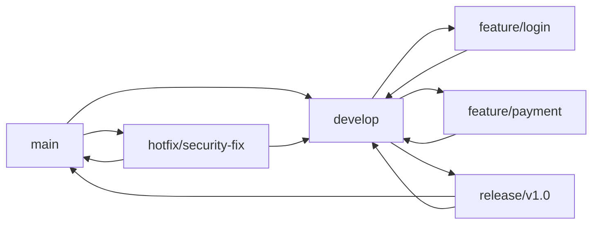
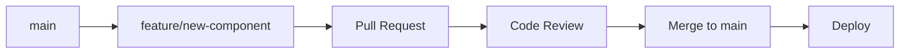
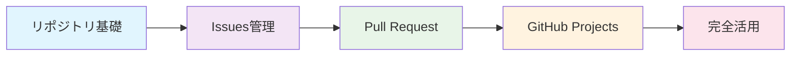

# 📁 GitHub リポジトリ基礎

GitHubリポジトリの基本的な機能と操作方法を網羅的に解説します。

## 🎯 学習目標

- リポジトリの作成から管理まで一連の操作をマスター
- ブランチ戦略の理解と実践
- タグとリリースの効果的な活用
- 外部ツールとの違いを理解

## 📚 目次

1. [リポジトリ作成・初期設定](#1-リポジトリ作成初期設定)
2. [ブランチ管理](#2-ブランチ管理)
3. [コミット管理](#3-コミット管理)
4. [タグ・リリース管理](#4-タグリリース管理)
5. [リポジトリ設定](#5-リポジトリ設定)
6. [外部ツールとの比較](#6-外部ツールとの比較)

---

## 1. リポジトリ作成・初期設定

### 🚀 新規リポジトリ作成

#### Web UIでの作成
```markdown
1. GitHub.com にログイン
2. 右上の「+」→「New repository」
3. 必要な設定を入力：
   - Repository name: プロジェクト名
   - Description: プロジェクトの説明
   - Public/Private: 公開範囲
   - README: 初期化オプション
   - .gitignore: 言語・フレームワーク選択
   - License: ライセンス選択
```

#### CLI (GitHub CLI) での作成
```bash
# 基本的なリポジトリ作成
gh repo create my-project --public --description "プロジェクトの説明"

# README、.gitignore、ライセンス付きで作成
gh repo create my-project --public --add-readme --gitignore Node --license MIT

# ローカルディレクトリから作成
gh repo create --source=. --public --push
```

### 🔧 初期設定のベストプラクティス

#### 1. README.md の充実
```markdown
# プロジェクト名

## 概要
プロジェクトの目的と機能の簡潔な説明

## インストール
```bash
npm install
```

## 使用方法
基本的な使い方のサンプル

## 貢献方法
コントリビューションガイドライン

## ライセンス
ライセンス情報
```

#### 2. .gitignore の設定
```bash
# GitHub提供のテンプレートを使用
curl -s https://api.github.com/gitignore/templates/Node > .gitignore

# 独自の設定を追加
echo "# Custom ignores
*.log
.env.local
dist/" >> .gitignore
```

---

## 2. ブランチ管理

### 🌳 ブランチ戦略

#### Git Flow


#### GitHub Flow (推奨)


### 📋 ブランチ操作

#### ローカルでのブランチ作成
```bash
# 新しいブランチを作成して切り替え
git checkout -b feature/user-authentication

# または（Git 2.23以降）
git switch -c feature/user-authentication

# リモートにプッシュ
git push -u origin feature/user-authentication
```

#### GitHub Web UIでのブランチ作成
```markdown
1. リポジトリページで「main」ブランチ選択部分をクリック
2. 新しいブランチ名を入力
3. 「Create branch: branch-name from main」をクリック
```

#### GitHub CLI でのブランチ作成
```bash
# ブランチ作成とチェックアウト
gh repo fork --clone
cd repository-name
git checkout -b feature/new-feature

# 変更をプッシュ
git push origin feature/new-feature
```

### 🛡️ ブランチ保護設定

#### main ブランチの保護
```markdown
1. Settings → Branches
2. 「Add rule」をクリック
3. Branch name pattern: `main`
4. 設定項目：
   ✅ Require a pull request before merging
   ✅ Require approvals (推奨: 1人以上)
   ✅ Dismiss stale PR approvals when new commits are pushed
   ✅ Require status checks to pass before merging
   ✅ Require branches to be up to date before merging
   ✅ Require conversation resolution before merging
   ✅ Restrict pushes that create files larger than 100MB
```

---

## 3. コミット管理

### 📝 効果的なコミットメッセージ

#### Conventional Commits 形式
```bash
# 形式: <type>[optional scope]: <description>

git commit -m "feat(auth): add user authentication system"
git commit -m "fix(api): resolve timeout issue in user endpoint"
git commit -m "docs: update README with installation guide"
git commit -m "refactor(utils): simplify date formatting function"
```

#### タイプ一覧
- `feat`: 新機能
- `fix`: バグ修正
- `docs`: ドキュメント変更
- `style`: コードスタイル変更（機能に影響なし）
- `refactor`: リファクタリング
- `test`: テスト追加・修正
- `chore`: ビルド・設定ファイル変更

### 🔍 コミット履歴の管理

#### 履歴の確認
```bash
# グラフィカルな履歴表示
git log --graph --oneline --all

# 特定のファイルの履歴
git log --follow -- path/to/file

# GitHub CLI での履歴確認
gh repo view --web
```

#### コミットの修正
```bash
# 最後のコミットメッセージを修正
git commit --amend -m "corrected commit message"

# 複数のコミットを整理（インタラクティブリベース）
git rebase -i HEAD~3
```

---

## 4. タグ・リリース管理

### 🏷️ タグの作成と管理

#### セマンティックバージョニング
```bash
# アノテートタグの作成
git tag -a v1.0.0 -m "Version 1.0.0 - Initial release"

# ライトウェイトタグの作成
git tag v1.0.1

# タグをリモートにプッシュ
git push origin v1.0.0

# すべてのタグをプッシュ
git push origin --tags
```

#### GitHub CLI でのタグ作成
```bash
# タグ作成とリリース同時作成
gh release create v1.0.0 --title "Version 1.0.0" --notes "初回リリース"

# プレリリース作成
gh release create v1.1.0-beta --prerelease --title "Beta Release" --notes "ベータ版"
```

### 📦 リリース管理

#### GitHub Releases の活用
```markdown
1. リポジトリページ → Releases → Create a new release
2. 設定項目：
   - Tag version: v1.0.0
   - Release title: Version 1.0.0 - New Features
   - Description: リリースノート（変更点、新機能など）
   - Attach binaries: ビルド成果物のアップロード
   - Pre-release: ベータ版の場合はチェック
```

#### 自動リリースノート生成
```yaml
# .github/release.yml
changelog:
  exclude:
    labels:
      - ignore-for-release
  categories:
    - title: Breaking Changes 🛠
      labels:
        - Semver-Major
        - breaking-change
    - title: Exciting New Features 🎉
      labels:
        - Semver-Minor
        - enhancement
    - title: Bug Fixes 🐛
      labels:
        - Semver-Patch
        - bug
```

---

## 5. リポジトリ設定

### ⚙️ 一般設定

#### 基本情報の設定
```markdown
Settings → General:
- Repository name: 名前変更
- Description: 説明文
- Website: プロジェクトURL
- Topics: 検索用タグ
- Include in the home page: 個人ページでの表示設定
```

#### 機能の有効/無効
```markdown
Features:
✅ Wikis: プロジェクトドキュメント
✅ Issues: バグ報告・機能要望
✅ Sponsorships: スポンサー機能
✅ Preserve this repository: アーカイブ設定
✅ Discussions: コミュニティディスカッション

Pull Requests:
✅ Allow merge commits
✅ Allow squash merging  
✅ Allow rebase merging
✅ Always suggest updating pull request branches
✅ Automatically delete head branches
```

### 🔐 セキュリティ設定

#### セキュリティ機能の有効化
```markdown
Settings → Security:
✅ Dependency graph: 依存関係の可視化
✅ Dependabot alerts: 脆弱性アラート
✅ Dependabot security updates: 自動セキュリティアップデート
✅ Dependabot version updates: 依存関係の自動更新
```

---

## 6. 外部ツールとの比較

### 📊 機能比較表

| 機能 | GitHub | GitLab | Bitbucket | SVN | 備考 |
|------|--------|--------|-----------|-----|------|
| リポジトリホスティング | ✅ | ✅ | ✅ | ❌ | GitHubは最大規模 |
| ブランチ管理 | ✅ | ✅ | ✅ | ❌ | SVNはtrunk/branches |
| タグ・リリース | ✅ | ✅ | ✅ | ✅ | GitHubのReleasesが最も充実 |
| Web UI | ✅ | ✅ | ✅ | ❌ | GitHubが最もユーザーフレンドリー |
| CLI ツール | ✅ | ✅ | ❌ | ❌ | GitHub CLIが最も強力 |
| ブランチ保護 | ✅ | ✅ | ✅ | ❌ | セキュリティルールの充実度 |

### 🔄 移行時のポイント

#### SVN → Git 移行
```bash
# SVNリポジトリをGitに変換
git svn clone http://svn.example.com/project

# GitHubリポジトリを作成
gh repo create migrated-project --public

# コードをプッシュ
git remote add origin https://github.com/username/migrated-project.git
git push -u origin main
```

#### 他のGitホスティングサービスからの移行
```bash
# 既存リポジトリをクローン
git clone --mirror https://gitlab.com/user/old-repo.git

# GitHubに新しいリポジトリを作成
gh repo create new-repo --public

# ミラーをプッシュ
cd old-repo.git
git remote set-url origin https://github.com/user/new-repo.git
git push --mirror
```

---

## 🎓 実践演習

### 演習1: リポジトリ作成から保護設定まで
1. 新しいリポジトリを作成
2. README、.gitignore、ライセンスを設定
3. developブランチを作成
4. main ブランチに保護ルールを設定

### 演習2: ブランチ戦略の実践
1. feature ブランチを作成
2. 機能を実装してコミット
3. プルリクエストを作成
4. マージ後のブランチクリーンアップ

### 演習3: リリース管理
1. セマンティックバージョンでタグ作成
2. リリースノートを作成
3. バイナリファイルの添付
4. 自動リリースノート設定

---

## 🔗 関連リソース

- [GitHub Docs - Repositories](https://docs.github.com/en/repositories)
- [GitHub CLI Manual](https://cli.github.com/manual/)
- [Git Documentation](https://git-scm.com/doc)
- [Semantic Versioning](https://semver.org/)
- [Conventional Commits](https://www.conventionalcommits.org/)

---

## 📝 まとめ

GitHub リポジトリの基本機能をマスターすることで：

✅ **効率的なコード管理** - ブランチ戦略によるチーム開発の最適化
✅ **品質保証** - ブランチ保護とレビュープロセスによる品質維持  
✅ **リリース管理** - タグとリリース機能による体系的なバージョン管理
✅ **セキュリティ** - 適切な設定による安全なコード管理

## 🔗 関連ガイド

- **次のステップ**: [Issues管理編](02-issues-management.md) - プロジェクト管理の基礎
- **さらに学習**: [Pull Request編](03-pull-requests.md) - コードレビューフロー
- **プロジェクト管理**: [GitHub Projects編](04-github-projects.md) - アジャイル開発手法
- **自動化**: [GitHub Actions編](05-github-actions.md) - CI/CD自動化
- **セキュリティ**: [GitHub Security編](06-github-security.md) - 総合セキュリティ
- **Web公開**: [GitHub Pages編](07-github-pages.md) - Webサイト・ドキュメント
- **総合ガイド**: [GitHub完全活用ガイド](../GITHUB_COMPLETE_GUIDE.md) - 全機能の詳細解説

## 📖 学習フロー

