# 🔄 Pull Request - 効率的なコードレビューフロー

GitHubのPull Request機能を最大限活用して、高品質なコード開発とチーム協調を実現する完全ガイド。外部ツールに依存せず、GitHub標準機能のみで企業レベルのコードレビュープロセスを構築します。

## 🎯 学習目標

- Pull Requestワークフローの完全理解と最適化
- 効率的なコードレビュープロセスの構築
- Draft PR、Suggested Changes等の高度機能活用
- 自動化による品質向上とレビュー効率化
- 外部ツール（GitLab MR、Bitbucket PR等）との比較理解

## 📚 目次

1. [Pull Request基本ワークフロー](#1-pull-request基本ワークフロー)
2. [効果的なPR作成方法](#2-効果的なpr作成方法)
3. [コードレビューのベストプラクティス](#3-コードレビューのベストプラクティス)
4. [高度なPR機能活用](#4-高度なpr機能活用)
5. [自動化とCI/CD連携](#5-自動化とcicd連携)
6. [外部ツールとの比較](#6-外部ツールとの比較)

---

## 1. Pull Request基本ワークフロー

### 🌊 GitHub Flowによる開発プロセス

#### 理想的なPRライフサイクル


#### 基本的なPR作成手順

**1. 機能ブランチの作成**
```bash
# メインブランチから最新を取得
git checkout main
git pull origin main

# 機能ブランチを作成
git checkout -b feature/user-authentication

# または GitHub CLI で
gh repo fork --clone
git checkout -b feature/user-authentication
```

**2. 実装とコミット**
```bash
# 変更を実装
# ... コーディング ...

# ステージングとコミット
git add .
git commit -m "feat(auth): implement user login functionality

- Add login form component
- Implement JWT authentication
- Add password validation
- Update user state management

Closes #123"

# リモートにプッシュ
git push origin feature/user-authentication
```

**3. Pull Request作成**
```bash
# GitHub CLI でPR作成
gh pr create \
  --title "feat: User authentication system" \
  --body-file .github/pull_request_template.md \
  --assignee @me \
  --reviewer team-lead,senior-dev \
  --label "enhancement,frontend"

# または Web UI で作成
# https://github.com/username/repo/compare/main...feature/user-authentication
```

### 📋 効果的なPRタイトルとコミットメッセージ

#### Conventional Commits準拠の形式
```bash
# タイプ別の例
feat(auth): add two-factor authentication support
fix(api): resolve timeout issue in user endpoint  
docs(readme): update installation instructions
style(css): improve responsive design for mobile
refactor(utils): simplify date formatting functions
test(auth): add comprehensive login flow tests
chore(deps): update dependencies to latest versions
ci(actions): optimize build performance
```

#### 詳細なコミットメッセージテンプレート
```
<type>(<scope>): <short description>

<detailed description explaining the why and what>

Breaking Changes:
- List any breaking changes

Closes: #123, #456
Related: #789
```

---

## 2. 効果的なPR作成方法

### 📝 PRテンプレートの活用

#### 包括的なPRテンプレート
```markdown
## 📋 変更内容の要約
<!-- このPRで何を変更したかを簡潔に説明 -->

## 🎯 関連Issue・タスク
Fixes #(issue番号)
Closes #(issue番号)  
Related to #(issue番号)

## 🔄 変更の種類
- [ ] 🐛 バグ修正
- [ ] ✨ 新機能
- [ ] 💥 破壊的変更
- [ ] 📚 ドキュメント更新
- [ ] 🎨 スタイル改善（機能に影響なし）
- [ ] ♻️ リファクタリング
- [ ] ⚡ パフォーマンス改善
- [ ] ✅ テスト追加・修正
- [ ] 🔧 設定・ビルドシステム変更

## 🧪 テスト方法
<!-- この変更をどのようにテストしたか -->

### 手動テスト手順
1. 
2. 
3. 

### 自動テスト
- [ ] 単体テスト追加・更新
- [ ] 統合テスト追加・更新
- [ ] E2Eテスト追加・更新
- [ ] 既存テストがすべて通ることを確認

## 📸 スクリーンショット・デモ
<!-- UIに変更がある場合 -->

| Before | After |
|--------|-------|
|        |       |

## 🔍 レビュー観点
<!-- レビュアーに特に見てほしいポイント -->

### 重点確認項目
- [ ] 機能要件を満たしているか
- [ ] エラーハンドリングが適切か
- [ ] パフォーマンスへの影響はないか
- [ ] セキュリティ面で問題ないか

## ✅ 作成者チェックリスト
- [ ] コードが自己文書化されている
- [ ] 適切なコメントが追加されている
- [ ] ドキュメントが更新されている
- [ ] テストカバレッジが十分
- [ ] 破壊的変更がある場合、CHANGELOGに記載
- [ ] セキュリティの観点で問題がない
- [ ] モバイル・レスポンシブ対応確認済み

## 📝 その他・備考
<!-- その他、レビュアーが知っておくべき情報 -->
```

### 🎨 Draft PRの効果的活用

#### Draft PRの使用場面
```bash
# 作業進行中のフィードバック取得
gh pr create --draft \
  --title "WIP: User authentication system" \
  --body "作業中のコードです。アプローチについてフィードバックをお願いします"

# 設計相談・アーキテクチャレビュー用
gh pr create --draft \
  --title "RFC: New API architecture proposal" \
  --body "新しいAPI設計について議論したく、Draft PRを作成しました"

# CI/CDテスト用
gh pr create --draft \
  --title "Test: CI pipeline validation" \
  --body "新しいワークフローのテスト用Draft PR"
```

#### Draft → Ready フロー
```bash
# レビュー準備完了時
gh pr ready

# またはWeb UIで「Ready for review」ボタンをクリック
```

---

## 3. コードレビューのベストプラクティス

### 👥 効果的なレビュープロセス

#### レビュアーの責務
```markdown
### 🔍 確認観点チェックリスト

#### 機能性・要件
- [ ] 要件仕様を満たしているか
- [ ] ユーザーストーリーの受け入れ条件をクリアしているか
- [ ] エッジケースが考慮されているか
- [ ] エラーハンドリングが適切か

#### コード品質
- [ ] 可読性：命名規則、コメント、構造
- [ ] 保守性：モジュール化、再利用性
- [ ] DRY原則：重複コードの排除
- [ ] SOLID原則：設計原則の遵守

#### パフォーマンス
- [ ] 不要な処理・ループがないか
- [ ] メモリ使用量は適切か
- [ ] データベースクエリは最適化されているか
- [ ] キャッシュ戦略は適切か

#### セキュリティ
- [ ] 入力値検証が適切か
- [ ] 認証・認可が正しく実装されているか
- [ ] 機密情報の漏洩リスクはないか
- [ ] SQLインジェクション等の脆弱性対策

#### テスト
- [ ] テストカバレッジは十分か
- [ ] テストケースは適切か
- [ ] モックの使用は適切か
- [ ] エッジケースのテストがあるか
```

#### 建設的なレビューコメント例
```markdown
# ❌ 避けるべきコメント
これはダメです。

# ✅ 建設的なコメント
この実装だと、将来的にスケールした際にパフォーマンス問題が発生する可能性があります。
以下のような改善案はいかがでしょうか？

```suggestion
// パフォーマンス改善案
const memoizedResult = useMemo(() => {
  return expensiveCalculation(data);
}, [data]);
```

### 🎯 Suggested Changes機能の活用

#### 具体的な修正提案
```markdown
# レビューコメントで具体的な修正案を提示

```suggestion
// 修正前
const user = users.find(u => u.id === userId);
if (user) {
  return user.name;
}
return null;

// 修正後：Optional chainingとNullish coalescingを使用
return users.find(u => u.id === userId)?.name ?? null;
```

この修正により、コードがより簡潔で読みやすくなります。
```

#### 複数行の修正提案
```markdown
```suggestion
const validateUser = (userData) => {
  // バリデーションロジックの改善
  const errors = {};
  
  if (!userData.email || !isValidEmail(userData.email)) {
    errors.email = 'Valid email is required';
  }
  
  if (!userData.password || userData.password.length < 8) {
    errors.password = 'Password must be at least 8 characters';
  }
  
  return {
    isValid: Object.keys(errors).length === 0,
    errors
  };
};
```
```

### 📊 レビュー効率化

#### レビュー自動化設定
```yaml
# .github/CODEOWNERS
# レビュー担当者の自動アサイン

# デフォルト
* @team-lead @senior-developer

# フロントエンド
/src/components/ @frontend-team @ui-specialist
/src/styles/ @frontend-team

# バックエンド  
/api/ @backend-team @architecture-lead
/database/ @backend-team @database-specialist

# セキュリティ関連
/auth/ @security-team @team-lead
/encryption/ @security-team

# インフラ・DevOps
/.github/ @devops-team
/docker/ @devops-team
/kubernetes/ @devops-team

# ドキュメント
/docs/ @tech-writer @team-lead
README.md @tech-writer
```

---

## 4. 高度なPR機能活用

### 🔄 マージ戦略の選択

#### マージオプションの使い分け
```bash
# 1. Merge commit（履歴を保持）
gh pr merge --merge

# 2. Squash and merge（履歴を整理）  
gh pr merge --squash

# 3. Rebase and merge（リニア履歴）
gh pr merge --rebase
```

#### 推奨マージ戦略
```markdown
### プロジェクト規模別の推奨方法

#### 小〜中規模プロジェクト
- **Squash and merge** を推奨
- 機能単位でのクリーンな履歴
- 簡潔なcommit message

#### 大規模プロジェクト  
- **Merge commit** を推奨
- 詳細な作業履歴の保持
- リバート時の容易性

#### オープンソース
- **Rebase and merge** を推奨
- リニアで美しい履歴
- Bisectの効率性
```

### 🔒 ブランチ保護ルール

#### 推奨保護設定
```markdown
### main ブランチ保護ルール

#### 基本設定
- ✅ Require a pull request before merging
- ✅ Require approvals: 2人以上（チーム規模に応じて調整）
- ✅ Dismiss stale PR approvals when new commits are pushed
- ✅ Require review from code owners

#### ステータスチェック
- ✅ Require status checks to pass before merging
- ✅ Require branches to be up to date before merging
- 必須チェック項目：
  - continuous-integration/github-actions
  - security/code-scanning
  - testing/unit-tests
  - testing/e2e-tests

#### 高度な設定
- ✅ Require conversation resolution before merging
- ✅ Require linear history（必要に応じて）
- ✅ Include administrators（管理者も同様のルールに従う）
- ❌ Allow force pushes
- ❌ Allow deletions
```

### 🚀 プルリクエスト自動化

#### 自動ラベリング
```yaml
# .github/workflows/pr-labeler.yml
name: PR Labeler
on:
  pull_request:
    types: [opened, edited, synchronize]

jobs:
  label:
    runs-on: ubuntu-latest
    steps:
      - uses: actions/labeler@v4
        with:
          repo-token: ${{ secrets.GITHUB_TOKEN }}
          configuration-path: .github/labeler.yml
```

```yaml
# .github/labeler.yml
"area:frontend":
  - "src/components/**/*"
  - "src/pages/**/*"
  - "**/*.vue"
  - "**/*.jsx"

"area:backend":
  - "api/**/*"
  - "server/**/*"
  - "**/*.py"
  - "**/*.go"

"area:database":
  - "migrations/**/*"
  - "**/*.sql"
  - "database/**/*"

"size:small":
  - any: ['**/*']
    count-within: 1..10

"size:medium":
  - any: ['**/*']
    count-within: 11..50

"size:large":
  - any: ['**/*']
    count-within: 51..
```

#### レビュアー自動アサイン
```yaml
# .github/workflows/assign-reviewers.yml
name: Auto Assign Reviewers
on:
  pull_request:
    types: [opened, ready_for_review]

jobs:
  assign:
    runs-on: ubuntu-latest
    steps:
      - uses: actions/github-script@v6
        with:
          script: |
            const pr = context.payload.pull_request;
            const files = await github.rest.pulls.listFiles({
              owner: context.repo.owner,
              repo: context.repo.repo,
              pull_number: pr.number
            });
            
            let reviewers = [];
            const fileNames = files.data.map(f => f.filename);
            
            // ファイルパスベースでレビュアー決定
            if (fileNames.some(f => f.includes('frontend'))) {
              reviewers.push('frontend-lead');
            }
            if (fileNames.some(f => f.includes('backend'))) {
              reviewers.push('backend-lead');
            }
            if (fileNames.some(f => f.includes('security'))) {
              reviewers.push('security-team');
            }
            
            if (reviewers.length > 0) {
              await github.rest.pulls.requestReviewers({
                owner: context.repo.owner,
                repo: context.repo.repo,
                pull_number: pr.number,
                reviewers: reviewers
              });
            }
```

---

## 5. 自動化とCI/CD連携

### ⚡ GitHub Actions との統合

#### 包括的なPRチェックワークフロー
```yaml
# .github/workflows/pr-checks.yml
name: PR Quality Checks

on:
  pull_request:
    branches: [main, develop]
    types: [opened, synchronize, reopened]

jobs:
  code-quality:
    name: Code Quality
    runs-on: ubuntu-latest
    steps:
      - uses: actions/checkout@v4
        with:
          fetch-depth: 0
      
      - name: Setup Node.js
        uses: actions/setup-node@v4
        with:
          node-version: '18'
          cache: 'npm'
      
      - name: Install dependencies
        run: npm ci
      
      - name: Lint check
        run: npm run lint
      
      - name: Type check
        run: npm run type-check
      
      - name: Format check
        run: npm run format:check

  security-scan:
    name: Security Scan
    runs-on: ubuntu-latest
    permissions:
      security-events: write
    steps:
      - uses: actions/checkout@v4
      
      - name: Run Trivy vulnerability scanner
        uses: aquasecurity/trivy-action@master
        with:
          scan-type: 'fs'
          scan-ref: '.'
          format: 'sarif'
          output: 'trivy-results.sarif'
      
      - name: Upload Trivy scan results
        uses: github/codeql-action/upload-sarif@v2
        with:
          sarif_file: 'trivy-results.sarif'

  test:
    name: Test Suite
    runs-on: ubuntu-latest
    strategy:
      matrix:
        node-version: [16, 18, 20]
    steps:
      - uses: actions/checkout@v4
      
      - name: Setup Node.js ${{ matrix.node-version }}
        uses: actions/setup-node@v4
        with:
          node-version: ${{ matrix.node-version }}
          cache: 'npm'
      
      - name: Install dependencies
        run: npm ci
      
      - name: Run tests
        run: npm run test:coverage
      
      - name: Upload coverage reports
        uses: codecov/codecov-action@v3
        with:
          token: ${{ secrets.CODECOV_TOKEN }}

  e2e-test:
    name: E2E Tests
    runs-on: ubuntu-latest
    steps:
      - uses: actions/checkout@v4
      
      - name: Setup Node.js
        uses: actions/setup-node@v4
        with:
          node-version: '18'
          cache: 'npm'
      
      - name: Install dependencies
        run: npm ci
      
      - name: Install Playwright
        run: npx playwright install --with-deps
      
      - name: Run E2E tests
        run: npm run test:e2e
      
      - name: Upload test results
        uses: actions/upload-artifact@v3
        if: failure()
        with:
          name: playwright-report
          path: playwright-report/

  performance:
    name: Performance Check
    runs-on: ubuntu-latest
    steps:
      - uses: actions/checkout@v4
      
      - name: Setup Node.js
        uses: actions/setup-node@v4
        with:
          node-version: '18'
          cache: 'npm'
      
      - name: Install dependencies
        run: npm ci
      
      - name: Build project
        run: npm run build
      
      - name: Run Lighthouse CI
        uses: treosh/lighthouse-ci-action@v9
        with:
          configPath: './lighthouserc.js'
          uploadArtifacts: true
          temporaryPublicStorage: true
```

### 📊 PR品質メトリクス

#### 自動品質レポート生成
```yaml
# .github/workflows/pr-metrics.yml
name: PR Metrics
on:
  pull_request:
    types: [closed]

jobs:
  metrics:
    if: github.event.pull_request.merged == true
    runs-on: ubuntu-latest
    steps:
      - uses: actions/checkout@v4
        with:
          fetch-depth: 0
      
      - name: Calculate PR metrics
        uses: actions/github-script@v6
        with:
          script: |
            const pr = context.payload.pull_request;
            
            // PR統計の計算
            const createdAt = new Date(pr.created_at);
            const mergedAt = new Date(pr.merged_at);
            const timeTaken = (mergedAt - createdAt) / (1000 * 60 * 60); // 時間
            
            // ファイル変更数の取得
            const files = await github.rest.pulls.listFiles({
              owner: context.repo.owner,
              repo: context.repo.repo,
              pull_number: pr.number
            });
            
            const stats = {
              prNumber: pr.number,
              title: pr.title,
              author: pr.user.login,
              timeToMerge: timeTaken.toFixed(2),
              filesChanged: files.data.length,
              additions: pr.additions,
              deletions: pr.deletions,
              reviewers: pr.requested_reviewers.map(r => r.login),
              comments: pr.review_comments + pr.comments
            };
            
            // 統計をIssueコメントに投稿
            await github.rest.issues.createComment({
              owner: context.repo.owner,
              repo: context.repo.repo,
              issue_number: pr.number,
              body: `## 📊 PR Statistics
              
              - **⏱️ Time to merge**: ${stats.timeToMerge} hours
              - **📁 Files changed**: ${stats.filesChanged}
              - **➕ Additions**: ${stats.additions}
              - **➖ Deletions**: ${stats.deletions}
              - **💬 Comments**: ${stats.comments}
              - **👥 Reviewers**: ${stats.reviewers.join(', ') || 'None'}
              
              Thanks @${stats.author} for the contribution! 🎉`
            });
```

---

## 6. 外部ツールとの比較

### 📊 機能比較マトリックス

| 機能 | GitHub PR | GitLab MR | Bitbucket PR | Azure DevOps | 備考 |
|------|-----------|-----------|--------------|--------------|------|
| **基本PR機能** | ✅ | ✅ | ✅ | ✅ | 全て対応 |
| **Draft PR** | ✅ | ✅ | ❌ | ✅ | Bitbucketは部分対応 |
| **Suggested Changes** | ✅ | ✅ | ❌ | ⚠️ | GitHubが最も使いやすい |
| **自動マージ** | ✅ | ✅ | ✅ | ✅ | 条件設定の柔軟性はGitHubが優秀 |
| **ブランチ保護** | ✅ | ✅ | ✅ | ✅ | 設定の詳細度はGitHubが最高 |
| **レビュアー自動アサイン** | ✅ | ✅ | ✅ | ✅ | CODEOWNERS機能 |
| **CI/CD統合** | ✅ | ✅ | ✅ | ✅ | Actions統合はシームレス |
| **コメント機能** | ✅ | ✅ | ✅ | ✅ | GitHub が最も直感的 |
| **モバイル対応** | ✅ | ⚠️ | ⚠️ | ⚠️ | GitHubモバイルアプリが優秀 |
| **API充実度** | ✅ | ✅ | ⚠️ | ✅ | GitHub REST/GraphQL API |

### 🔄 GitLab からの移行

#### 主要な差分と移行方法

**GitLab MR → GitHub PR 移行マッピング**
```markdown
### 機能対応表

| GitLab MR | GitHub PR | 移行方法 |
|-----------|-----------|----------|
| Merge Request | Pull Request | 1:1対応 |
| Draft MR | Draft PR | 機能同等 |
| WIP: タイトル | Draft PR | Draftフラグ使用 |
| Approval Rules | Branch Protection | 保護ルールで設定 |
| Merge Trains | Auto-merge | キューイング機能 |
| Squash Commits | Squash and merge | マージオプション |
| Cherry-pick | GitHub CLI | `gh pr checkout` + `git cherry-pick` |
```

#### 移行スクリプト例
```python
# gitlab_to_github_pr_migration.py
import requests
import json

class GitLabToGitHubMigrator:
    def __init__(self, gitlab_token, github_token, gitlab_project_id, github_repo):
        self.gitlab_token = gitlab_token
        self.github_token = github_token
        self.gitlab_project_id = gitlab_project_id
        self.github_repo = github_repo
        
    def migrate_merge_requests(self):
        # GitLab MRsを取得
        gitlab_mrs = self.fetch_gitlab_mrs()
        
        for mr in gitlab_mrs:
            if mr['state'] == 'merged':
                # マージ済みMRの情報を記録
                self.record_merged_mr(mr)
            elif mr['state'] == 'opened':
                # オープンMRをGitHub PRとして再作成
                self.create_github_pr(mr)
                
    def create_github_pr(self, gitlab_mr):
        github_pr_data = {
            'title': gitlab_mr['title'],
            'head': gitlab_mr['source_branch'],
            'base': gitlab_mr['target_branch'],
            'body': self.convert_description(gitlab_mr['description']),
            'draft': gitlab_mr['work_in_progress']
        }
        
        # GitHub API でPR作成
        response = requests.post(
            f"https://api.github.com/repos/{self.github_repo}/pulls",
            headers={"Authorization": f"token {self.github_token}"},
            json=github_pr_data
        )
        
        if response.status_code == 201:
            print(f"Created PR: {github_pr_data['title']}")
        else:
            print(f"Failed to create PR: {response.text}")
```

### ⚖️ コスト・効率性比較

#### 年間運用コスト比較（100人チーム想定）
```markdown
### プラットフォーム別コスト分析

#### GitHub Enterprise
- **ライセンス**: $21,000/年
- **運用工数**: 最小限（SaaS）
- **学習コスト**: 低（広く普及）
- **合計**: $25,000/年

#### GitLab Premium
- **ライセンス**: $19,000/年  
- **運用工数**: 中程度（自己管理オプション）
- **学習コスト**: 中（機能豊富）
- **合計**: $28,000/年

#### Bitbucket Premium
- **ライセンス**: $15,000/年
- **運用工数**: 中程度
- **学習コスト**: 中
- **合計**: $22,000/年

### 効率性指標

| 指標 | GitHub | GitLab | Bitbucket |
|------|--------|--------|-----------|
| **PR作成時間** | 30秒 | 45秒 | 60秒 |
| **レビュー効率** | 95% | 90% | 85% |
| **マージ時間** | 10秒 | 15秒 | 20秒 |
| **モバイル対応** | 100% | 70% | 60% |
```

---

## 🎓 実践演習

### 演習1: 完全なPRワークフロー実践
1. **Issue作成** - 機能要求の詳細化
2. **ブランチ作成** - 適切な命名規則
3. **実装** - コード品質を意識
4. **Draft PR作成** - 早期フィードバック取得
5. **CI/CD実行** - 自動テスト・品質チェック
6. **レビュー対応** - 建設的な議論
7. **マージ** - 適切な戦略選択

### 演習2: 高度なレビュー機能活用
1. **Suggested Changes** - 具体的修正提案
2. **CODEOWNERS** - 自動レビュアーアサイン
3. **ブランチ保護** - 品質ゲート設定
4. **自動化** - ラベリング・通知設定

### 演習3: チーム用PR規約策定
1. **PRテンプレート** - チーム標準化
2. **レビューガイドライン** - 観点の明確化
3. **マージルール** - 戦略の統一
4. **品質メトリクス** - 継続改善指標

---

## 🔗 関連リソース

### 公式ドキュメント
- [GitHub Pull Requests](https://docs.github.com/en/pull-requests)
- [Code Review Best Practices](https://docs.github.com/en/pull-requests/collaborating-with-pull-requests/reviewing-changes-in-pull-requests)
- [Branch Protection Rules](https://docs.github.com/en/repositories/configuring-branches-and-merges-in-your-repository/defining-the-mergeability-of-pull-requests)

### ツール・拡張機能
- [GitHub CLI](https://cli.github.com/)
- [GitHub Desktop](https://desktop.github.com/)
- [GitHub Mobile](https://github.com/mobile)
- [VS Code GitHub Pull Requests](https://marketplace.visualstudio.com/items?itemName=GitHub.vscode-pull-request-github)

### 参考記事
- [Conventional Commits](https://www.conventionalcommits.org/)
- [Git Flow vs GitHub Flow](https://lucamezzalira.com/2014/03/10/git-flow-vs-github-flow/)
- [Code Review Best Practices](https://smartbear.com/learn/code-review/best-practices-for-peer-code-review/)

---

## 📝 まとめ

GitHub Pull Request機能を効果的に活用することで：

✅ **高品質なコード** - 体系的なレビュープロセスによる品質向上
✅ **チーム協調** - 透明性のある開発プロセス
✅ **知識共有** - レビューを通じた技術的成長
✅ **効率化** - 自動化による作業時間短縮
✅ **外部ツール不要** - GitHub標準機能のみで企業レベルの開発プロセス

## 🔗 関連ガイド

- **前のステップ**: [Issues管理編](02-issues-management.md) - タスク管理とプロジェクト追跡
- **次のステップ**: [GitHub Projects編](04-github-projects.md) - プロジェクト管理の最適化
- **基礎知識**: [リポジトリ基礎編](01-repository-basics.md) - ブランチ管理とタグ運用
- **自動化**: [GitHub Actions編](05-github-actions.md) - PR自動化・CI/CD
- **セキュリティ**: [GitHub Security編](06-github-security.md) - セキュアな開発プロセス
- **総合ガイド**: [GitHub完全活用ガイド](../GITHUB_COMPLETE_GUIDE.md) - 全機能の詳細解説

## 📖 学習フロー

```mermaid
graph LR
    A[リポジトリ基礎] --> B[Issues管理]
    B --> C[Pull Request]
    C --> D[GitHub Projects]
    D --> E[完全活用]
    
    style A fill:#f3e5f5
    style B fill:#f3e5f5
    style C fill:#e1f5fe
    style D fill:#e8f5e8
    style E fill:#fce4ec
```



次は[GitHub Projects編](04-github-projects.md)で、プロジェクト管理の最適化を学習しましょう。