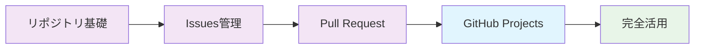

# 📋 GitHub Projects - アジャイル開発のためのプロジェクト管理

GitHub Projects V2を活用して、Jira・Trello・Asanaなどの外部ツールに依存しない、統合されたプロジェクト管理環境を構築する完全ガイド。Issues・Pull Requestsとシームレスに連携し、開発から運用まで一元管理を実現します。

## 🎯 学習目標

- GitHub Projects V2の全機能理解と実践的活用
- アジャイル開発手法（スクラム・カンバン）の実装
- 外部プロジェクト管理ツールからの完全移行
- 自動化によるプロジェクト運用効率化
- チーム協働とステークホルダー管理の最適化

## 📚 目次

1. [GitHub Projects V2 概要](#1-github-projects-v2-概要)
2. [プロジェクト作成と基本設定](#2-プロジェクト作成と基本設定)
3. [ビューとワークフローの設計](#3-ビューとワークフローの設計)
4. [カスタムフィールドと自動化](#4-カスタムフィールドと自動化)
5. [アジャイル手法の実装](#5-アジャイル手法の実装)
6. [外部ツールからの移行](#6-外部ツールからの移行)

---

## 1. GitHub Projects V2 概要

### 🚀 従来版との主要な違い

#### Projects V2 の革新的機能
```markdown
### V1 → V2 進化ポイント

#### データ構造
- **V1**: カード形式（制限的）
- **V2**: テーブル形式（柔軟性）

#### カスタマイズ性  
- **V1**: 基本的なカラム移動のみ
- **V2**: カスタムフィールド・フィルタ・グループ化

#### 自動化
- **V1**: 限定的なワークフロー
- **V2**: 高度な自動化ルール

#### ビュー機能
- **V1**: カンバンビューのみ
- **V2**: カンバン・テーブル・ロードマップ・ガントチャート

#### スコープ
- **V1**: リポジトリレベル
- **V2**: 組織・個人・複数リポジトリ対応
```

### 📊 外部ツールとの機能比較

| 機能 | GitHub Projects V2 | Jira | Trello | Asana | Linear | 備考 |
|------|-------------------|------|-------|-------|--------|------|
| **カンバンボード** | ✅ | ✅ | ✅ | ✅ | ✅ | 全て対応 |
| **ガントチャート** | ✅ | ✅ | ❌ | ✅ | ❌ | Projects V2で新対応 |
| **スプリント管理** | ✅ | ✅ | ⚠️ | ✅ | ✅ | カスタムフィールドで実現 |
| **バーンダウンチャート** | ⚠️ | ✅ | ❌ | ⚠️ | ✅ | APIで実現可能 |
| **カスタムフィールド** | ✅ | ✅ | ❌ | ✅ | ✅ | 高い柔軟性 |
| **自動化** | ✅ | ✅ | ⚠️ | ✅ | ✅ | GitHub Actions連携 |
| **レポート機能** | ⚠️ | ✅ | ❌ | ✅ | ✅ | Insights・API活用 |
| **コード連携** | ✅ | ⚠️ | ❌ | ❌ | ⚠️ | 最も強力 |
| **コスト（100人）** | $0-2,100 | $7,000 | $5,000 | $12,000 | $8,000 | 圧倒的にコスト効率良い |

---

## 2. プロジェクト作成と基本設定

### 🛠️ プロジェクト初期設定

#### 新規プロジェクト作成
```bash
# GitHub CLI でプロジェクト作成
gh project create --title "Product Development Q1 2024" \
  --body "Q1期の製品開発プロジェクト管理"

# または Web UI で作成
# https://github.com/users/USERNAME/projects/new
# または組織: https://github.com/orgs/ORGANIZATION/projects/new
```

#### 基本設定の最適化
```markdown
### プロジェクト基本情報

#### 必須設定項目
- **プロジェクト名**: 明確で検索しやすい名前
- **説明**: 目的・スコープ・期間を明記
- **可視性**: Private（機密） / Public（オープンソース）
- **所有者**: 個人 / 組織
- **README**: プロジェクトの詳細情報

#### 推奨README構成
```markdown
# Product Development Q1 2024

## 🎯 プロジェクト概要
Q1期間中の製品開発における機能開発・バグ修正・リリース管理

## 📅 期間
2024年1月1日 - 2024年3月31日

## 👥 チーム構成
- **Product Manager**: @product-lead
- **Tech Lead**: @tech-lead  
- **Frontend**: @frontend-team
- **Backend**: @backend-team
- **QA**: @qa-team

## 🎯 主要マイルストーン
- [ ] Alpha版リリース (1/31)
- [ ] Beta版リリース (2/28)
- [ ] 本番リリース (3/31)

## 📊 成功指標
- 機能完成率: 95%以上
- バグ解決率: 100%
- リリース予定遵守率: 90%以上
```

### 🔗 リポジトリとの連携設定

#### 複数リポジトリの統合管理
```bash
# プロジェクトにリポジトリを追加
gh project item-create PROJECT_ID \
  --owner OWNER \
  --repo REPO_NAME

# 複数リポジトリの一括追加例
REPOS=("frontend-app" "backend-api" "mobile-app" "documentation")
for repo in "${REPOS[@]}"; do
  gh project item-create $PROJECT_ID --owner $OWNER --repo $repo
done
```

---

## 3. ビューとワークフローの設計

### 📊 多角的ビューの構築

#### 1. カンバンビュー（日常業務用）
```markdown
### カンバン列設計

#### 基本フロー
📋 **Backlog** → 🏗️ **Ready** → 🔄 **In Progress** → 👀 **Review** → ✅ **Done**

#### 詳細ステータス定義
- **Backlog**: 優先順位付け待ち・要件未確定
- **Ready**: 開発可能・担当者アサイン済み
- **In Progress**: 実装中・ブロック状況の監視
- **Review**: PR作成済み・レビュー待ち
- **Done**: マージ完了・検証済み

#### 高度な列設定
- **Ice Box**: 将来検討・低優先度アイデア
- **Blocked**: 外部依存・技術的課題で停止中
- **Waiting**: 顧客フィードバック・承認待ち
- **Deployed**: 本番環境デプロイ完了
```

#### 2. テーブルビュー（詳細管理用）
```markdown
### カスタムフィールド設計

#### 必須フィールド
- **Status**: Single select（Backlog, Ready, In Progress, Review, Done）
- **Priority**: Single select（Critical, High, Medium, Low）
- **Size**: Single select（XS, S, M, L, XL）
- **Epic**: Text（関連するエピック名）
- **Sprint**: Single select（Sprint 1, Sprint 2, ...）
- **Assignee**: People（担当者）
- **Due Date**: Date（期限）
- **Story Points**: Number（見積もりポイント）

#### 発展フィールド
- **Component**: Multi-select（Frontend, Backend, Mobile, API）
- **Customer Impact**: Single select（High, Medium, Low, None）
- **Technical Debt**: Single select（Yes, No）
- **Risk Level**: Single select（High, Medium, Low）
- **Reviewer**: People（レビュー担当者）
```

#### 3. ロードマップビュー（戦略的計画用）
```markdown
### 時系列での進捗可視化

#### 設定項目
- **X軸**: 時間軸（週・月・四半期）
- **Y軸**: エピック・チーム・コンポーネント
- **マーカー**: マイルストーン・リリース予定日
- **色分け**: 優先度・ステータス・担当チーム

#### 活用シーン
- **エグゼクティブレビュー**: 経営陣への進捗報告
- **リリース計画**: 機能リリースのタイムライン
- **リソース配分**: チーム間の作業バランス確認
- **依存関係管理**: ブロッカーの可視化
```

### 🔄 ワークフロー自動化の設計

#### Issue → Project 自動追加
```yaml
# .github/workflows/add-to-project.yml
name: Add Issue to Project
on:
  issues:
    types: [opened, labeled]

jobs:
  add-to-project:
    runs-on: ubuntu-latest
    steps:
      - name: Add to project
        uses: actions/add-to-project@v0.4.0
        with:
          project-url: https://github.com/users/USERNAME/projects/1
          github-token: ${{ secrets.ADD_TO_PROJECT_TOKEN }}
          labeled: bug,enhancement,feature
```

#### ステータス自動更新
```yaml
# .github/workflows/update-project-status.yml
name: Update Project Status
on:
  pull_request:
    types: [opened, closed, merged]

jobs:
  update-status:
    runs-on: ubuntu-latest
    steps:
      - name: Update status on PR
        uses: actions/github-script@v6
        with:
          script: |
            const pr = context.payload.pull_request;
            
            // PRの状態に応じてプロジェクトアイテムのステータスを更新
            let newStatus;
            if (pr.state === 'open') {
              newStatus = 'Review';
            } else if (pr.merged) {
              newStatus = 'Done';
            } else if (pr.state === 'closed') {
              newStatus = 'Backlog';
            }
            
            // GraphQL APIでプロジェクトアイテムを更新
            const query = `
              mutation($projectId: ID!, $itemId: ID!, $fieldId: ID!, $value: String!) {
                updateProjectV2ItemFieldValue(
                  input: {
                    projectId: $projectId
                    itemId: $itemId
                    fieldId: $fieldId
                    value: { singleSelectOptionId: $value }
                  }
                ) {
                  projectV2Item {
                    id
                  }
                }
              }
            `;
            
            // 実際の更新処理
            // 注：projectId, itemId, fieldIdは環境に応じて設定
```

---

## 4. カスタムフィールドと自動化

### 🎛️ 高度なカスタマイズ

#### スクラム開発用フィールド設定
```markdown
### スクラム特化カスタムフィールド

#### ストーリー管理
- **User Story**: Text（ユーザーストーリー記述）
- **Acceptance Criteria**: Text（受け入れ条件）
- **Story Points**: Number（1, 2, 3, 5, 8, 13, 21）
- **Business Value**: Single select（High, Medium, Low）

#### スプリント管理
- **Sprint**: Single select（Current, Next, Future, Backlog）
- **Sprint Goal**: Text（スプリント目標）
- **Velocity**: Number（チームの開発速度）
- **Burndown**: Number（残作業量）

#### 品質管理
- **Definition of Done**: Checkbox（完了条件チェックリスト）
- **Test Coverage**: Number（テストカバレッジ%）
- **Code Review Status**: Single select（Pending, Approved, Changes Requested）
- **QA Status**: Single select（Not Started, In Progress, Passed, Failed）
```

#### カンバン開発用フィールド設定
```markdown
### カンバン特化カスタムフィールド

#### フロー管理
- **WIP Limit**: Number（作業中上限数）
- **Cycle Time**: Number（開始から完了までの日数）
- **Lead Time**: Number（要求から完了までの日数）
- **Flow Efficiency**: Number（実作業時間の割合%）

#### 継続改善
- **Blocker Reason**: Text（ブロック理由）
- **Improvement Suggestion**: Text（改善提案）
- **Retrospective Item**: Checkbox（振り返り対象）
- **Customer Feedback**: Text（顧客からのフィードバック）
```

### 🤖 自動化ルールの実装

#### 複雑な条件分岐自動化
```yaml
# .github/workflows/project-automation.yml
name: Advanced Project Automation
on:
  issues:
    types: [opened, edited, labeled, assigned]
  pull_request:
    types: [opened, closed, review_requested, review_submitted]

jobs:
  project-automation:
    runs-on: ubuntu-latest
    steps:
      - name: Advanced Automation Logic
        uses: actions/github-script@v6
        with:
          script: |
            const { data: projects } = await github.rest.projects.listForUser({
              username: context.repo.owner
            });
            
            const projectId = projects.find(p => p.name === 'Development Board')?.id;
            if (!projectId) return;
            
            // 複雑な条件分岐処理
            const event = context.eventName;
            const action = context.payload.action;
            
            switch(event) {
              case 'issues':
                await handleIssueEvent(action, context.payload.issue);
                break;
              case 'pull_request':
                await handlePREvent(action, context.payload.pull_request);
                break;
            }
            
            async function handleIssueEvent(action, issue) {
              // 優先度に応じた自動アサイン
              if (issue.labels.some(l => l.name === 'priority:critical')) {
                await github.rest.issues.addAssignees({
                  owner: context.repo.owner,
                  repo: context.repo.repo,
                  issue_number: issue.number,
                  assignees: ['team-lead']
                });
              }
              
              // 見積もりポイントの自動設定
              let storyPoints = 3; // デフォルト
              if (issue.labels.some(l => l.name === 'size:small')) storyPoints = 1;
              if (issue.labels.some(l => l.name === 'size:large')) storyPoints = 8;
              
              // プロジェクトアイテムのフィールド更新
              // 注：実際のGraphQL実装が必要
            }
            
            async function handlePREvent(action, pr) {
              if (action === 'opened') {
                // PR作成時：関連Issueのステータスを「Review」に更新
                const linkedIssues = extractLinkedIssues(pr.body);
                for (const issueNumber of linkedIssues) {
                  // ステータス更新処理
                }
              }
            }
            
            function extractLinkedIssues(prBody) {
              const regex = /(?:close[sd]?|fix(?:e[sd])?|resolve[sd]?)\s+#(\d+)/gi;
              const matches = [...prBody.matchAll(regex)];
              return matches.map(match => parseInt(match[1]));
            }
```

---

## 5. アジャイル手法の実装

### 🏃‍♂️ スクラム手法の完全実装

#### スプリント計画・実行・振り返り

**スプリント計画ビューの設定**
```markdown
### Sprint Planning View 設定

#### フィルタ設定
- **Status**: Backlog, Ready
- **Sprint**: Current, Next
- **Story Points**: 1-21（見積もり済み）

#### グループ化
- **Primary**: Epic（機能群別）
- **Secondary**: Priority（優先度別）

#### ソート順
1. Priority（Critical → High → Medium → Low）
2. Business Value（High → Medium → Low） 
3. Story Points（小 → 大）

#### 表示カラム
- Title, Status, Assignee, Story Points, Sprint, Due Date
```

**スプリント実行中のデイリースタンドアップ支援**
```markdown
### Daily Standup Dashboard

#### 今日の作業ビュー
- **フィルタ**: Status = "In Progress", Assignee = "@me"
- **表示**: 昨日完了・今日予定・ブロッカー情報

#### チーム全体の進捗ビュー  
- **グループ化**: Assignee（担当者別）
- **色分け**: ステータス別（緑=順調、黄=注意、赤=遅延）
- **アラート**: 期限超過・長期停滞アイテム

#### ブロッカー監視ビュー
- **フィルタ**: Labels contains "blocked"
- **ソート**: 作成日（古い順）
- **アクション**: 担当者への通知・エスカレーション
```

#### スプリントレトロスペクティブ
```markdown
### Sprint Retrospective Template

#### 振り返り観点
- **Keep**: 継続すべきこと
- **Problem**: 改善が必要なこと  
- **Try**: 次スプリントで試すこと

#### メトリクス収集
- **Velocity**: 完了ストーリーポイント
- **Burndown**: 日別残作業量推移
- **Cycle Time**: 平均完了時間
- **Bug Rate**: 不具合発生率

#### 改善アクション
- 特定された問題の対策アイテム作成
- プロセス改善のためのタスク追加
- 次スプリントでの実験項目設定
```

### 📊 カンバン手法の実装

#### 継続的フロー最適化

**WIP制限の設定と監視**
```markdown
### WIP Limits by Column

#### 推奨設定（5人チーム）
- **Ready**: 10アイテム（バックログの充実）
- **In Progress**: 5アイテム（チーム人数と同じ）
- **Review**: 3アイテム（迅速なレビュー）
- **Blocked**: 制限なし（問題の可視化）

#### 監視とアラート
- WIP超過時の自動通知
- 長期滞留アイテムの検出
- フロー効率の計測・レポート
```

**累積フロー図（CFD）の作成**
```python
# cfd_generator.py - Cumulative Flow Diagram 生成
import requests
import matplotlib.pyplot as plt
import pandas as pd
from datetime import datetime, timedelta

class CFDGenerator:
    def __init__(self, github_token, project_id):
        self.token = github_token
        self.project_id = project_id
        
    def generate_cfd(self, days=30):
        """過去30日間の累積フロー図を生成"""
        end_date = datetime.now()
        start_date = end_date - timedelta(days=days)
        
        daily_data = []
        current_date = start_date
        
        while current_date <= end_date:
            # その日のステータス別アイテム数を取得
            status_counts = self.get_status_counts_for_date(current_date)
            daily_data.append({
                'date': current_date,
                **status_counts
            })
            current_date += timedelta(days=1)
        
        df = pd.DataFrame(daily_data)
        
        # 累積フロー図の描画
        plt.figure(figsize=(12, 8))
        statuses = ['Done', 'Review', 'In Progress', 'Ready', 'Backlog']
        colors = ['#28a745', '#ffc107', '#007bff', '#6c757d', '#dc3545']
        
        for i, status in enumerate(statuses):
            plt.fill_between(df['date'], 
                           df[status] if i == 0 else df[statuses[:i+1]].sum(axis=1),
                           df[statuses[:i]].sum(axis=1) if i > 0 else 0,
                           color=colors[i], alpha=0.7, label=status)
        
        plt.xlabel('Date')
        plt.ylabel('Number of Items')
        plt.title('Cumulative Flow Diagram')
        plt.legend()
        plt.xticks(rotation=45)
        plt.tight_layout()
        plt.savefig('cfd.png', dpi=300, bbox_inches='tight')
        
        return df
    
    def get_status_counts_for_date(self, date):
        """指定日のステータス別アイテム数を取得"""
        # GitHub GraphQL API を使用してプロジェクトデータを取得
        # 実装の詳細は省略（実際のAPI呼び出しが必要）
        return {
            'Backlog': 15,
            'Ready': 8, 
            'In Progress': 5,
            'Review': 3,
            'Done': 25
        }

# 使用例
cfd = CFDGenerator(github_token="your_token", project_id="project_id")
data = cfd.generate_cfd()
print("CFD generated successfully!")
```

---

## 6. 外部ツールからの移行

### 🔄 Jira からの移行

#### 完全移行チェックリスト
```markdown
### Phase 1: データマッピング設計（1週間）

#### Jiraフィールド → GitHub Projects フィールド対応
- **Issue Type** → **Labels**（bug, feature, story, epic）
- **Priority** → **Priority**（Critical, High, Medium, Low）
- **Status** → **Status**（Backlog, In Progress, Done等）
- **Assignee** → **Assignee**（ユーザーマッピング必要）
- **Epic Link** → **Epic**（カスタムテキストフィールド）
- **Story Points** → **Story Points**（カスタム数値フィールド）
- **Sprint** → **Sprint**（カスタム選択フィールド）
- **Components** → **Labels**（複数ラベルで対応）

### Phase 2: 移行ツール開発（2週間）

#### 自動移行スクリプト
```python
# jira_to_github_projects.py
import requests
import json
from jira import JIRA

class JiraToGitHubMigrator:
    def __init__(self, jira_url, jira_user, jira_token, github_token, github_project_id):
        self.jira = JIRA(server=jira_url, basic_auth=(jira_user, jira_token))
        self.github_token = github_token
        self.project_id = github_project_id
        
    def migrate_project(self, jira_project_key):
        """Jiraプロジェクト全体を移行"""
        # 1. Jira Issuesを取得
        issues = self.jira.search_issues(f'project={jira_project_key}', maxResults=1000)
        
        # 2. GitHub Issues/Project Itemsを作成
        for issue in issues:
            github_issue = self.create_github_issue(issue)
            self.add_to_project(github_issue['number'])
            
    def create_github_issue(self, jira_issue):
        """Jira Issue を GitHub Issue に変換"""
        # フィールドマッピング
        title = jira_issue.fields.summary
        body = self.convert_description(jira_issue.fields.description)
        labels = self.map_labels(jira_issue.fields.issuetype, jira_issue.fields.priority)
        
        issue_data = {
            'title': title,
            'body': body,
            'labels': labels
        }
        
        # GitHub API で Issue 作成
        response = requests.post(
            f'https://api.github.com/repos/{self.repo}/issues',
            headers={'Authorization': f'token {self.github_token}'},
            json=issue_data
        )
        
        return response.json()
```

### Phase 3: チーム教育・並行運用（2週間）

#### 教育プログラム
- **ハンズオン研修**: GitHub Projects V2操作方法
- **ワークショップ**: アジャイルプロセスの再設計
- **QAセッション**: 移行に関する疑問解決
- **ドキュメント**: 新しいプロセスの標準化

### Phase 4: 完全移行・Jira停止（1週間）

#### 移行完了基準
- [ ] 全データ移行完了・検証済み
- [ ] チーム全員が新プロセスに習熟
- [ ] 自動化・インテグレーション動作確認
- [ ] パフォーマンス・可用性確認
- [ ] バックアップ・ロールバック手順準備
```

### 📊 コスト効果分析

#### 移行前後の比較（100人チーム・年間）
```markdown
### 導入・運用コスト比較

#### Jira（移行前）
- **ライセンス費用**: $7,000/年
- **管理・運用**: 1人 × 20% = $20,000/年
- **教育・サポート**: $5,000/年
- **カスタマイズ**: $10,000/年
- **合計**: $42,000/年

#### GitHub Projects V2（移行後）
- **ライセンス費用**: $0（GitHub Pro に含まれる）
- **管理・運用**: 1人 × 5% = $5,000/年
- **教育・サポート**: $2,000/年（初年度のみ）
- **カスタマイズ**: $3,000/年（自動化開発）
- **合計**: $10,000/年

### ROI計算
- **年間削減額**: $32,000
- **移行コスト**: $15,000（一時費用）
- **投資回収期間**: 5.6ヶ月
- **3年間総節約額**: $81,000
```

---

## 🎓 実践演習

### 演習1: スクラムプロジェクト構築
1. **プロジェクト作成** - チーム用スクラムボード
2. **カスタムフィールド設定** - ストーリーポイント・スプリント
3. **自動化ルール** - Issue→Project追加・ステータス更新
4. **レポートビュー** - スプリント進捗・ベロシティ

### 演習2: カンバンフロー最適化
1. **フロー設計** - WIP制限・フロー効率
2. **メトリクス収集** - サイクルタイム・リードタイム
3. **継続改善** - ボトルネック特定・プロセス改善
4. **可視化** - 累積フロー図・バーンアップチャート

### 演習3: 外部ツール移行
1. **現状分析** - 既存ツールの機能・データ調査
2. **移行計画** - フェーズ別移行ロードマップ
3. **データマッピング** - フィールド・ワークフロー対応
4. **並行運用** - リスク軽減・段階的移行

---

## 🔗 関連リソース

### 公式ドキュメント
- [GitHub Projects Documentation](https://docs.github.com/en/issues/planning-and-tracking-with-projects)
- [Projects V2 GraphQL API](https://docs.github.com/en/graphql/reference/objects#projectv2)
- [GitHub Projects Best Practices](https://github.blog/2022-07-27-planning-next-to-your-code-github-projects-is-now-generally-available/)

### 移行・活用ツール
- [Jira to GitHub Issues Migration](https://github.com/marketplace/actions/jira-to-github-issues)
- [Projects V2 CLI](https://cli.github.com/manual/gh_project)
- [GitHub Projects API Scripts](https://github.com/github/projects-scripts)

### アジャイル手法参考資料
- [Scrum Guide](https://scrumguides.org/)
- [Kanban Method](https://www.atlassian.com/agile/kanban)
- [Agile Metrics](https://www.agilealliance.org/agile101/guide-to-agile-metrics/)

---

## 📝 まとめ

GitHub Projects V2を効果的に活用することで：

✅ **統合された開発環境** - コードとプロジェクト管理の一元化
✅ **コスト大幅削減** - 外部ツールライセンス費用の削減
✅ **チーム生産性向上** - シームレスなワークフローと自動化
✅ **柔軟なプロセス適応** - スクラム・カンバン・独自手法に対応
✅ **データドリブン改善** - メトリクス収集と継続的最適化

次は実際のプロジェクトでGitHub Projects V2を活用し、チームの開発プロセスを最適化しましょう！

## 🔗 関連ガイド

- **前のステップ**: [Pull Request編](03-pull-requests.md) - コードレビュープロセス最適化
- **基礎知識**: [Issues管理編](02-issues-management.md) - タスク管理の基礎
- **さらに基礎**: [リポジトリ基礎編](01-repository-basics.md) - 基本的なGit操作
- **総合ガイド**: [GitHub完全活用ガイド](../GITHUB_COMPLETE_GUIDE.md) - 全機能の詳細解説

## 📖 学習フロー

