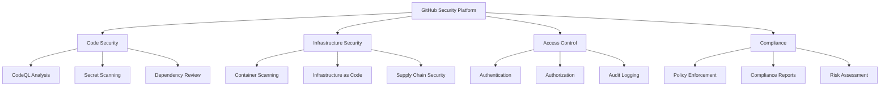
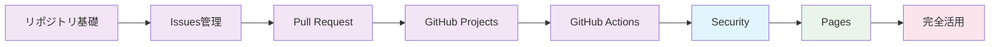

# 🛡️ GitHub Security - 企業レベルの総合セキュリティ対策

GitHub標準・Advanced Securityを活用して、Veracode・SonarQube・WhiteSource等の外部セキュリティツールに依存しない、統合されたセキュリティ環境を構築する完全ガイド。コードからインフラまで、開発ライフサイクル全体の包括的なセキュリティ対策を実現します。

## 🎯 学習目標

- GitHub Security機能の全体理解と戦略的活用
- Advanced Security（CodeQL・Secret Scanning・Dependabot）の実践的運用
- セキュリティポリシー・コンプライアンス対応
- 外部セキュリティツールからの移行戦略
- インシデント対応・セキュリティ監視の自動化

## 📚 目次

1. [GitHub Security 概要](#1-github-security-概要)
2. [コードセキュリティ分析](#2-コードセキュリティ分析)
3. [依存関係・脆弱性管理](#3-依存関係脆弱性管理)
4. [シークレット管理・漏洩防止](#4-シークレット管理漏洩防止)
5. [リポジトリ・組織セキュリティ](#5-リポジトリ組織セキュリティ)
6. [コンプライアンス・監査対応](#6-コンプライアンス監査対応)

---

## 1. GitHub Security 概要

### 🏗️ GitHub Security アーキテクチャ

#### セキュリティ機能の階層構造


#### セキュリティ機能比較
```markdown
### GitHub Security vs 外部ツール比較

| 機能カテゴリ | GitHub (標準) | GitHub Advanced | Veracode | SonarQube | WhiteSource |
|--------------|---------------|-----------------|----------|-----------|-------------|
| **静的解析** | ⚠️ | ✅ | ✅ | ✅ | ❌ |
| **依存関係スキャン** | ✅ | ✅ | ⚠️ | ⚠️ | ✅ |
| **シークレット検知** | ⚠️ | ✅ | ❌ | ❌ | ❌ |
| **コンテナスキャン** | ⚠️ | ✅ | ✅ | ❌ | ⚠️ |
| **ライセンス管理** | ✅ | ✅ | ❌ | ❌ | ✅ |
| **統合性** | ✅ | ✅ | ⚠️ | ⚠️ | ⚠️ |
| **コスト効率** | ✅ | ✅ | ❌ | ⚠️ | ❌ |

✅ 優秀  ⚠️ 部分対応  ❌ 対応なし
```

### 🚀 セキュリティ実装戦略

#### 段階的セキュリティ導入計画
```yaml
# セキュリティ実装ロードマップ

Phase 1: 基本セキュリティ設定 (Week 1-2)
  - 基本認証・認可設定
  - ブランチ保護ルール
  - 基本的なDependabot設定
  - シークレット管理の基礎

Phase 2: 高度なスキャン機能 (Week 3-4)
  - CodeQL分析設定
  - Advanced Secret Scanning
  - 依存関係レビュー
  - セキュリティアドバイザリ

Phase 3: 自動化・統合 (Week 5-6)
  - CI/CDセキュリティ統合
  - 自動修復ワークフロー
  - アラート自動化
  - レポート生成

Phase 4: 運用・監視 (Week 7-8)
  - セキュリティ監視
  - インシデント対応
  - 継続的改善
  - コンプライアンス対応
```

---

## 2. コードセキュリティ分析

### 🔍 CodeQL による高度な静的解析

#### CodeQL 基本設定
```yaml
# .github/workflows/codeql-analysis.yml
name: "CodeQL Advanced Analysis"

on:
  push:
    branches: [main, develop]
  pull_request:
    branches: [main]
  schedule:
    - cron: '30 2 * * 1,3,5'  # 月水金 2:30

jobs:
  analyze:
    name: CodeQL Analysis
    runs-on: ubuntu-latest
    
    permissions:
      actions: read
      contents: read
      security-events: write
    
    strategy:
      fail-fast: false
      matrix:
        language: ['javascript', 'python', 'java', 'csharp', 'cpp', 'go']
        # 必要に応じて言語を調整
    
    steps:
      - name: Checkout repository
        uses: actions/checkout@v4
      
      - name: Initialize CodeQL
        uses: github/codeql-action/init@v2
        with:
          languages: ${{ matrix.language }}
          # カスタムクエリの指定
          queries: +security-extended,security-and-quality
          # 設定ファイルの指定
          config-file: ./.github/codeql/codeql-config.yml
      
      # 言語別のビルド設定
      - name: Setup Node.js
        if: matrix.language == 'javascript'
        uses: actions/setup-node@v4
        with:
          node-version: '18'
          cache: 'npm'
      
      - name: Setup Python
        if: matrix.language == 'python'
        uses: actions/setup-python@v4
        with:
          python-version: '3.11'
          cache: 'pip'
      
      - name: Setup Java
        if: matrix.language == 'java'
        uses: actions/setup-java@v3
        with:
          java-version: '17'
          distribution: 'temurin'
          cache: 'maven'
      
      # 自動ビルド
      - name: Autobuild
        uses: github/codeql-action/autobuild@v2
      
      # カスタムビルド（必要に応じて）
      - name: Custom build
        if: matrix.language == 'cpp'
        run: |
          mkdir build
          cd build
          cmake ..
          make -j$(nproc)
      
      - name: Perform CodeQL Analysis
        uses: github/codeql-action/analyze@v2
        with:
          category: "/language:${{matrix.language}}"
          output: codeql-results
          upload: true
      
      - name: Upload SARIF results
        if: always()
        uses: github/codeql-action/upload-sarif@v2
        with:
          sarif_file: codeql-results/${{ matrix.language }}.sarif
          category: ${{ matrix.language }}
```

#### CodeQL カスタム設定
```yaml
# .github/codeql/codeql-config.yml
name: "Custom CodeQL Config"

# 無効化するクエリ
disable-default-queries: false

# 追加するクエリパック
queries:
  - name: security-extended
    uses: security-extended
  - name: security-and-quality
    uses: security-and-quality
  - name: custom-queries
    uses: ./.github/codeql/custom-queries

# パス除外設定
paths-ignore:
  - "**/*.test.js"
  - "**/*.spec.ts"
  - "**/node_modules/**"
  - "**/vendor/**"
  - "**/dist/**"
  - "**/build/**"
  - "**/__tests__/**"
  - "**/test/**"
  - "**/tests/**"

# パス包含設定（指定したパスのみスキャン）
paths:
  - "src/**"
  - "api/**"
  - "services/**"

# カスタムビルドコマンド
build-mode: manual
```

#### カスタム CodeQL クエリ
```ql
/**
 * @name Hardcoded credentials
 * @description Finds potential hardcoded passwords or API keys
 * @kind problem
 * @problem.severity warning
 * @security-severity 8.0
 * @precision medium
 * @id js/hardcoded-credentials
 * @tags security
 *       external/cwe/cwe-798
 */

import javascript

from StringLiteral str, string value
where
  value = str.getValue() and
  (
    // パスワードパターン
    value.regexpMatch("(?i).*password.*=.*['\"]\\w{8,}['\"].*") or
    // APIキーパターン
    value.regexpMatch("(?i).*api[_-]?key.*=.*['\"][A-Za-z0-9]{20,}['\"].*") or
    // 秘密鍵パターン
    value.regexpMatch(".*-----BEGIN (RSA )?PRIVATE KEY-----.*") or
    // AWS認証情報パターン
    value.regexpMatch("(?i).*aws[_-]?(access[_-]?key|secret).*=.*['\"][A-Z0-9]{20,}['\"].*")
  ) and
  // 除外パターン
  not value.regexpMatch(".*\\$\\{.*\\}.*") and  // 環境変数参照
  not value.regexpMatch(".*placeholder.*|.*example.*|.*dummy.*|.*test.*")
select str, "Potential hardcoded credential found: " + value.prefix(50)
```

### 🛠️ セキュリティ修復自動化

#### 自動修復ワークフロー
```yaml
# .github/workflows/security-auto-fix.yml
name: Security Auto Fix

on:
  schedule:
    - cron: '0 3 * * 1'  # 毎週月曜 3時
  workflow_dispatch:

permissions:
  contents: write
  pull-requests: write
  security-events: read

jobs:
  auto-fix:
    name: Automated Security Fixes
    runs-on: ubuntu-latest
    
    steps:
      - name: Checkout
        uses: actions/checkout@v4
        with:
          token: ${{ secrets.GITHUB_TOKEN }}
      
      - name: Setup Node.js
        uses: actions/setup-node@v4
        with:
          node-version: '18'
          cache: 'npm'
      
      - name: Get security alerts
        id: alerts
        uses: actions/github-script@v6
        with:
          script: |
            const { data: alerts } = await github.rest.codeScanning.listAlertsForRepo({
              owner: context.repo.owner,
              repo: context.repo.repo,
              state: 'open',
              severity: 'high'
            });
            
            return alerts.filter(alert => 
              alert.rule.id.includes('hardcoded-credentials') ||
              alert.rule.id.includes('sql-injection') ||
              alert.rule.id.includes('xss')
            );
      
      - name: Apply automated fixes
        if: steps.alerts.outputs.result != '[]'
        run: |
          # ESLint自動修復
          npm install -g eslint eslint-plugin-security
          npx eslint --fix --ext .js,.ts src/ || true
          
          # Prettier適用
          npm install -g prettier
          npx prettier --write src/**/*.{js,ts,jsx,tsx}
          
          # セキュリティ関連の自動修復
          # 例：console.logの削除、eval()の置換等
          find src/ -name "*.js" -exec sed -i 's/console\.log.*;//g' {} \;
      
      - name: Update dependencies
        run: |
          # 脆弱性のある依存関係を更新
          npm audit fix --audit-level high
          
          # package-lock.jsonの更新
          npm install
      
      - name: Create Pull Request
        if: steps.alerts.outputs.result != '[]'
        uses: peter-evans/create-pull-request@v5
        with:
          token: ${{ secrets.GITHUB_TOKEN }}
          commit-message: |
            🔒 Security: Automated security fixes
            
            - Fixed high-severity CodeQL alerts
            - Updated vulnerable dependencies
            - Applied ESLint security rules
          title: "🔒 Automated Security Fixes"
          body: |
            ## 🔒 Automated Security Fixes
            
            This PR contains automated fixes for security issues:
            
            ### Changes Made
            - ✅ Fixed CodeQL high-severity alerts
            - ✅ Updated vulnerable dependencies via `npm audit fix`
            - ✅ Applied ESLint security rules
            - ✅ Code formatting with Prettier
            
            ### Review Required
            Please review these automated changes before merging.
            
            **Generated by GitHub Actions** 🤖
          branch: security/automated-fixes
          delete-branch: true
          labels: |
            security
            automated
            high-priority
```

---

## 3. 依存関係・脆弱性管理

### 📦 Dependabot 高度設定

#### 包括的なDependabot設定
```yaml
# .github/dependabot.yml
version: 2

updates:
  # Node.js パッケージ
  - package-ecosystem: "npm"
    directory: "/"
    schedule:
      interval: "daily"
      time: "02:00"
      timezone: "Asia/Tokyo"
    open-pull-requests-limit: 10
    reviewers:
      - "security-team"
      - "senior-developers"
    assignees:
      - "team-lead"
    labels:
      - "dependencies"
      - "security"
    commit-message:
      prefix: "deps"
      include: "scope"
    ignore:
      # 特定パッケージの更新を無視
      - dependency-name: "lodash"
        versions: ["4.x"]
    allow:
      # セキュリティアップデートのみ許可
      - dependency-type: "security"
    groups:
      # 関連パッケージをグループ化
      development-dependencies:
        dependency-type: "development"
        update-types:
          - "minor"
          - "patch"

  # Python パッケージ
  - package-ecosystem: "pip"
    directory: "/api"
    schedule:
      interval: "weekly"
      day: "monday"
      time: "02:00"
    open-pull-requests-limit: 5
    reviewers:
      - "backend-team"
    commit-message:
      prefix: "deps(python)"

  # Docker イメージ
  - package-ecosystem: "docker"
    directory: "/"
    schedule:
      interval: "weekly"
      day: "sunday"
    reviewers:
      - "devops-team"
    commit-message:
      prefix: "deps(docker)"

  # GitHub Actions
  - package-ecosystem: "github-actions"
    directory: "/"
    schedule:
      interval: "weekly"
      day: "sunday"
    open-pull-requests-limit: 3
    reviewers:
      - "devops-team"
    commit-message:
      prefix: "ci"

  # Terraform
  - package-ecosystem: "terraform"
    directory: "/infrastructure"
    schedule:
      interval: "weekly"
    reviewers:
      - "infrastructure-team"
    commit-message:
      prefix: "infra"
```

### 🔐 依存関係レビュー自動化

#### 高度な依存関係チェック
```yaml
# .github/workflows/dependency-review.yml
name: Comprehensive Dependency Review

on:
  pull_request:
    branches: [main, develop]

permissions:
  contents: read
  pull-requests: write

jobs:
  dependency-review:
    name: Dependency Review
    runs-on: ubuntu-latest
    
    steps:
      - name: Checkout
        uses: actions/checkout@v4
      
      - name: Dependency Review
        uses: actions/dependency-review-action@v3
        with:
          # 脆弱性の重要度閾値
          fail-on-severity: moderate
          # ライセンスの許可・禁止設定
          allow-licenses: MIT, Apache-2.0, BSD-3-Clause, ISC
          deny-licenses: GPL-2.0, GPL-3.0, AGPL-1.0, AGPL-3.0
          # 評価対象の変更タイプ
          allow-dependencies-licenses: true
          # コメント設定
          comment-summary-in-pr: always
          # 詳細なレポート出力
          output-sarif: dependency-review.sarif
      
      - name: Upload SARIF
        if: always()
        uses: github/codeql-action/upload-sarif@v2
        with:
          sarif_file: dependency-review.sarif

  license-check:
    name: License Compliance Check
    runs-on: ubuntu-latest
    
    steps:
      - name: Checkout
        uses: actions/checkout@v4
      
      - name: Setup Node.js
        uses: actions/setup-node@v4
        with:
          node-version: '18'
          cache: 'npm'
      
      - name: Install dependencies
        run: npm ci
      
      - name: License checker
        run: |
          npm install -g license-checker
          license-checker --summary --excludePrivatePackages --failOn 'GPL-2.0; GPL-3.0; AGPL-1.0; AGPL-3.0'
      
      - name: Generate license report
        run: |
          license-checker --csv --out licenses.csv
          license-checker --json --out licenses.json
      
      - name: Upload license report
        uses: actions/upload-artifact@v3
        with:
          name: license-report
          path: |
            licenses.csv
            licenses.json

  vulnerability-scan:
    name: Advanced Vulnerability Scan
    runs-on: ubuntu-latest
    
    steps:
      - name: Checkout
        uses: actions/checkout@v4
      
      - name: Setup Node.js
        uses: actions/setup-node@v4
        with:
          node-version: '18'
          cache: 'npm'
      
      - name: Install Snyk
        run: npm install -g snyk
      
      - name: Authenticate Snyk
        run: snyk auth ${{ secrets.SNYK_TOKEN }}
        if: env.SNYK_TOKEN != ''
      
      - name: Snyk test
        run: |
          snyk test --severity-threshold=medium --json > snyk-results.json || true
          snyk monitor --project-name="${{ github.repository }}" || true
        env:
          SNYK_TOKEN: ${{ secrets.SNYK_TOKEN }}
      
      - name: Upload Snyk results
        uses: actions/upload-artifact@v3
        with:
          name: snyk-results
          path: snyk-results.json
      
      - name: Process Snyk results
        uses: actions/github-script@v6
        with:
          script: |
            const fs = require('fs');
            
            try {
              const results = JSON.parse(fs.readFileSync('snyk-results.json', 'utf8'));
              
              if (results.vulnerabilities && results.vulnerabilities.length > 0) {
                const highVulns = results.vulnerabilities.filter(v => v.severity === 'high');
                const criticalVulns = results.vulnerabilities.filter(v => v.severity === 'critical');
                
                let comment = '## 🚨 Vulnerability Scan Results\n\n';
                comment += `- **Critical**: ${criticalVulns.length}\n`;
                comment += `- **High**: ${highVulns.length}\n`;
                comment += `- **Total**: ${results.vulnerabilities.length}\n\n`;
                
                if (criticalVulns.length > 0) {
                  comment += '### Critical Vulnerabilities\n';
                  criticalVulns.slice(0, 5).forEach(vuln => {
                    comment += `- **${vuln.packageName}**: ${vuln.title}\n`;
                  });
                }
                
                // PRにコメント
                await github.rest.issues.createComment({
                  owner: context.repo.owner,
                  repo: context.repo.repo,
                  issue_number: context.payload.pull_request.number,
                  body: comment
                });
                
                // Critical脆弱性がある場合は失敗
                if (criticalVulns.length > 0) {
                  core.setFailed('Critical vulnerabilities found');
                }
              }
            } catch (error) {
              console.log('No vulnerabilities file found or parsing error');
            }
```

---

## 4. シークレット管理・漏洩防止

### 🔐 Advanced Secret Scanning

#### シークレットスキャン設定
```yaml
# .github/workflows/secret-scanning.yml
name: Comprehensive Secret Scanning

on:
  push:
    branches: [main, develop]
  pull_request:
    branches: [main]
  schedule:
    - cron: '0 4 * * *'  # 毎日 4時

permissions:
  contents: read
  security-events: write

jobs:
  secret-scan:
    name: Secret Scanning
    runs-on: ubuntu-latest
    
    steps:
      - name: Checkout
        uses: actions/checkout@v4
        with:
          fetch-depth: 0  # 全履歴を取得
      
      - name: TruffleHog OSS
        uses: trufflesecurity/trufflehog@main
        with:
          path: ./
          base: ${{ github.event.repository.default_branch }}
          head: HEAD
          extra_args: --debug --only-verified --json
      
      - name: GitLeaks scan
        uses: gitleaks/gitleaks-action@v2
        env:
          GITHUB_TOKEN: ${{ secrets.GITHUB_TOKEN }}
          GITLEAKS_LICENSE: ${{ secrets.GITLEAKS_LICENSE }}
      
      - name: Semgrep secrets scan
        uses: returntocorp/semgrep-action@v1
        with:
          config: >-
            p/security-audit
            p/secrets
            p/owasp-top-ten
            p/r2c-security-audit
        env:
          SEMGREP_APP_TOKEN: ${{ secrets.SEMGREP_APP_TOKEN }}

  custom-secret-patterns:
    name: Custom Secret Pattern Detection
    runs-on: ubuntu-latest
    
    steps:
      - name: Checkout
        uses: actions/checkout@v4
      
      - name: Custom secret detection
        run: |
          # カスタムシークレットパターンの検出
          echo "🔍 Scanning for custom secret patterns..."
          
          # 日本固有のパターン
          grep -r -E "マイナンバー|個人番号" . --include="*.js" --include="*.py" --include="*.java" && echo "⚠️ 個人情報が見つかりました" || true
          
          # 内部APIキーパターン
          grep -r -E "internal[_-]?api[_-]?key" . --include="*.js" --include="*.py" --include="*.env*" && echo "⚠️ 内部APIキーが見つかりました" || true
          
          # データベース接続文字列
          grep -r -E "postgres://|mysql://|mongodb://" . --include="*.js" --include="*.py" --include="*.config*" && echo "⚠️ データベース接続文字列が見つかりました" || true
          
          # AWS関連シークレット
          grep -r -E "AKIA[0-9A-Z]{16}" . && echo "⚠️ AWS Access Keyが見つかりました" || true
          
          # プライベートキー
          grep -r -E "-----BEGIN (RSA )?PRIVATE KEY-----" . && echo "⚠️ プライベートキーが見つかりました" || true
          
      - name: Check environment files
        run: |
          find . -name "*.env*" -type f | while read envfile; do
            echo "🔍 Checking $envfile"
            # .env ファイル内の危険なパターンをチェック
            if grep -E "(password|secret|key|token).*=.*['\"]?[a-zA-Z0-9]{8,}['\"]?" "$envfile"; then
              echo "⚠️ 潜在的なシークレットが $envfile で見つかりました"
            fi
          done

  secret-remediation:
    name: Secret Remediation Guide
    runs-on: ubuntu-latest
    if: failure()
    
    steps:
      - name: Create remediation issue
        uses: actions/github-script@v6
        with:
          script: |
            const title = '🚨 Secret Detected - Immediate Action Required';
            const body = `
            ## 🚨 シークレット検出アラート
            
            コードベースに潜在的なシークレットが検出されました。
            
            ### 即座に行うべき対応
            1. **該当シークレットの無効化**
               - API キーやトークンを即座に無効化
               - 新しいシークレットを生成
            
            2. **Git履歴からの削除**
               \`\`\`bash
               # BFG Repo-Cleaner を使用
               java -jar bfg.jar --delete-files "secrets.txt" --delete-folders ".env"
               git reflog expire --expire=now --all && git gc --prune=now --aggressive
               \`\`\`
            
            3. **セキュリティ設定の強化**
               - GitHub Secret Scanning の有効化
               - Pre-commit hooks の設定
               - 開発者向けセキュリティ教育
            
            ### 長期的な対策
            - [ ] シークレット管理ツールの導入
            - [ ] 環境変数の適切な使用
            - [ ] 定期的なセキュリティ監査
            
            **このissueは最優先で対応してください。**
            
            Created by: GitHub Actions Security Scan
            Workflow: ${context.workflow}
            Run: ${context.runNumber}
            `;
            
            await github.rest.issues.create({
              owner: context.repo.owner,
              repo: context.repo.repo,
              title: title,
              body: body,
              labels: ['security', 'critical', 'immediate-action-required']
            });
```

### 🔒 セキュアなシークレット管理

#### 環境別シークレット管理戦略
```yaml
# セキュアなシークレット管理のベストプラクティス

## リポジトリレベル
Repository Secrets:
  - データベース接続文字列
  - 外部API認証キー
  - 暗号化キー

## 環境レベル
Environment Secrets:
  Development:
    - DEV_DATABASE_URL
    - DEV_API_KEY
    - DEV_ENCRYPTION_KEY
  
  Staging:
    - STAGING_DATABASE_URL
    - STAGING_API_KEY
    - STAGING_ENCRYPTION_KEY
  
  Production:
    - PROD_DATABASE_URL
    - PROD_API_KEY
    - PROD_ENCRYPTION_KEY

## 組織レベル
Organization Secrets:
  - 共通の外部サービス認証
  - 監視・ログ収集システム
  - セキュリティスキャンツール
```

---

## 5. リポジトリ・組織セキュリティ

### 🏛️ 組織レベルセキュリティポリシー

#### セキュリティポリシー設定
```yaml
# .github/SECURITY.md
# セキュリティポリシー

## 報告対象のセキュリティ脆弱性

以下の種類のセキュリティ問題を報告してください：

### 🔴 Critical（緊急）
- リモートコード実行
- 認証バイパス
- 権限昇格
- データ漏洩

### 🟡 High（高）
- クロスサイトスクリプティング（XSS）
- SQLインジェクション
- クロスサイトリクエストフォージェリ（CSRF）
- 暗号化の欠陥

### 🟢 Medium（中）
- 情報開示
- サービス拒否攻撃
- セッション管理の問題

## 報告方法

### 🔒 秘密の報告（推奨）
GitHub Private Vulnerability Reporting を使用：
1. リポジトリの Security タブを開く
2. "Report a vulnerability" をクリック
3. 詳細を記入して送信

### 📧 メール報告
security@example.com に以下の情報を含めて送信：
- 脆弱性の詳細な説明
- 再現手順
- 影響範囲
- 修正提案（あれば）

## 対応プロセス

### ⏰ 対応時間
- **Critical**: 24時間以内に初回対応
- **High**: 72時間以内に初回対応
- **Medium**: 1週間以内に初回対応

### 🔄 対応フロー
1. **受領確認** - 24時間以内
2. **影響評価** - 2-3日以内
3. **修正開発** - 重要度に応じて
4. **修正リリース** - 検証後速やかに
5. **公開通知** - 修正後適切なタイミング

## セキュリティアップデート

### 📢 通知方法
- GitHub Security Advisories
- リリースノート
- セキュリティメーリングリスト

### 🏷️ バージョニング
セキュリティ修正は以下の形式でリリース：
- メジャー脆弱性: パッチバージョン（例: 1.2.3 → 1.2.4）
- 緊急修正: ホットフィックス（例: 1.2.3-security.1）

## サポート対象バージョン

| バージョン | サポート状況 |
| --------- | ---------- |
| 2.x.x     | ✅ 完全サポート |
| 1.x.x     | ⚠️ セキュリティ修正のみ |
| < 1.0     | ❌ サポート終了 |

## 謝辞

セキュリティ研究者の皆様への感謝を表すため、以下を実施：
- 🏆 Hall of Fame での表彰
- 💰 Bug Bounty プログラム（対象脆弱性）
- 🎁 記念品の贈呈
```

#### 自動セキュリティポリシー施行
```yaml
# .github/workflows/security-policy-enforcement.yml
name: Security Policy Enforcement

on:
  push:
    branches: [main]
  pull_request:
    branches: [main]
  schedule:
    - cron: '0 6 * * 1'  # 毎週月曜 6時

permissions:
  contents: read
  issues: write
  pull-requests: write
  security-events: write

jobs:
  policy-check:
    name: Security Policy Compliance
    runs-on: ubuntu-latest
    
    steps:
      - name: Checkout
        uses: actions/checkout@v4
      
      - name: Check security files
        run: |
          # 必須セキュリティファイルの存在確認
          required_files=(
            ".github/SECURITY.md"
            ".github/dependabot.yml"
            ".github/workflows/codeql-analysis.yml"
          )
          
          missing_files=()
          for file in "${required_files[@]}"; do
            if [[ ! -f "$file" ]]; then
              missing_files+=("$file")
            fi
          done
          
          if [[ ${#missing_files[@]} -gt 0 ]]; then
            echo "❌ Missing required security files:"
            printf '%s\n' "${missing_files[@]}"
            exit 1
          else
            echo "✅ All required security files present"
          fi
      
      - name: Branch protection check
        uses: actions/github-script@v6
        with:
          script: |
            const { data: branch } = await github.rest.repos.getBranch({
              owner: context.repo.owner,
              repo: context.repo.repo,
              branch: 'main'
            });
            
            const protection = branch.protection;
            
            const requirements = [
              { check: protection.enabled, name: 'Branch protection enabled' },
              { check: protection.required_status_checks?.strict, name: 'Strict status checks' },
              { check: protection.enforce_admins?.enabled, name: 'Admin enforcement' },
              { check: protection.required_pull_request_reviews?.required_approving_review_count >= 1, name: 'Required reviews' }
            ];
            
            const failed = requirements.filter(req => !req.check);
            
            if (failed.length > 0) {
              console.log('❌ Branch protection policy violations:');
              failed.forEach(f => console.log(`  - ${f.name}`));
              core.setFailed('Branch protection policy not compliant');
            } else {
              console.log('✅ Branch protection policy compliant');
            }
      
      - name: Security feature audit
        uses: actions/github-script@v6
        with:
          script: |
            // リポジトリのセキュリティ機能状態をチェック
            const { data: repo } = await github.rest.repos.get({
              owner: context.repo.owner,
              repo: context.repo.repo
            });
            
            const securityFeatures = [
              { feature: 'Vulnerability alerts', enabled: repo.has_vulnerability_alerts },
              { feature: 'Automated security fixes', enabled: repo.automated_security_fixes },
              { feature: 'Private vulnerability reporting', enabled: repo.private_vulnerability_reporting_enabled }
            ];
            
            console.log('🔍 Security Features Status:');
            securityFeatures.forEach(sf => {
              const status = sf.enabled ? '✅' : '❌';
              console.log(`  ${status} ${sf.feature}`);
            });
            
            const disabled = securityFeatures.filter(sf => !sf.enabled);
            if (disabled.length > 0) {
              core.setOutput('security_recommendations', 
                disabled.map(sf => sf.feature).join(', '));
            }

  create-security-issue:
    name: Create Security Improvement Issue
    runs-on: ubuntu-latest
    needs: policy-check
    if: failure()
    
    steps:
      - name: Create improvement issue
        uses: actions/github-script@v6
        with:
          script: |
            const title = '🔧 Security Policy Compliance Improvements Required';
            const body = `
            ## 🔧 セキュリティポリシー改善が必要です
            
            自動セキュリティチェックで以下の問題が検出されました：
            
            ### 🚨 必要な対応
            - [ ] セキュリティファイルの追加・更新
            - [ ] ブランチ保護ルールの設定
            - [ ] セキュリティ機能の有効化
            
            ### 📋 推奨事項
            - [ ] Dependabot セキュリティアップデート有効化
            - [ ] Code scanning alerts 有効化
            - [ ] Secret scanning 有効化
            - [ ] Private vulnerability reporting 有効化
            
            ### 🔗 参考資料
            - [GitHub Security Documentation](https://docs.github.com/en/code-security)
            - [Security Policy Template](https://github.com/github/docs/blob/main/SECURITY.md)
            
            **このIssueは優先的に対応してください。**
            
            Auto-generated by: Security Policy Enforcement Workflow
            `;
            
            await github.rest.issues.create({
              owner: context.repo.owner,
              repo: context.repo.repo,
              title: title,
              body: body,
              labels: ['security', 'enhancement', 'policy-compliance']
            });
```

---

## 6. コンプライアンス・監査対応

### 📋 コンプライアンス自動レポート

#### 包括的なコンプライアンスレポート生成
```yaml
# .github/workflows/compliance-report.yml
name: Compliance and Audit Report

on:
  schedule:
    - cron: '0 1 1 * *'  # 毎月1日 1時
  workflow_dispatch:
    inputs:
      report_type:
        description: 'Report type'
        required: true
        default: 'monthly'
        type: choice
        options:
          - daily
          - weekly
          - monthly
          - quarterly
          - annual

permissions:
  contents: read
  security-events: read
  issues: write

jobs:
  generate-report:
    name: Generate Compliance Report
    runs-on: ubuntu-latest
    
    steps:
      - name: Checkout
        uses: actions/checkout@v4
      
      - name: Collect security metrics
        id: security-metrics
        uses: actions/github-script@v6
        with:
          script: |
            const now = new Date();
            const reportPeriod = '${{ github.event.inputs.report_type || 'monthly' }}';
            
            // 期間の計算
            let startDate;
            switch(reportPeriod) {
              case 'daily':
                startDate = new Date(now - 24 * 60 * 60 * 1000);
                break;
              case 'weekly':
                startDate = new Date(now - 7 * 24 * 60 * 60 * 1000);
                break;
              case 'monthly':
                startDate = new Date(now.getFullYear(), now.getMonth() - 1, now.getDate());
                break;
              case 'quarterly':
                startDate = new Date(now.getFullYear(), now.getMonth() - 3, now.getDate());
                break;
              case 'annual':
                startDate = new Date(now.getFullYear() - 1, now.getMonth(), now.getDate());
                break;
            }
            
            // セキュリティアラートの取得
            const { data: codeScanning } = await github.rest.codeScanning.listAlertsForRepo({
              owner: context.repo.owner,
              repo: context.repo.repo,
              state: 'open'
            });
            
            const { data: secretScanning } = await github.rest.secretScanning.listAlertsForRepo({
              owner: context.repo.owner,
              repo: context.repo.repo,
              state: 'open'
            });
            
            const { data: dependabot } = await github.rest.dependabot.listAlertsForRepo({
              owner: context.repo.owner,
              repo: context.repo.repo,
              state: 'open'
            });
            
            // メトリクス集計
            const metrics = {
              period: reportPeriod,
              startDate: startDate.toISOString(),
              endDate: now.toISOString(),
              security: {
                codeScanning: {
                  total: codeScanning.length,
                  critical: codeScanning.filter(a => a.rule.severity === 'error').length,
                  high: codeScanning.filter(a => a.rule.severity === 'warning').length,
                  medium: codeScanning.filter(a => a.rule.severity === 'note').length
                },
                secretScanning: {
                  total: secretScanning.length,
                  resolved: secretScanning.filter(a => a.state === 'resolved').length
                },
                dependabot: {
                  total: dependabot.length,
                  critical: dependabot.filter(a => a.security_vulnerability?.severity === 'critical').length,
                  high: dependabot.filter(a => a.security_vulnerability?.severity === 'high').length,
                  medium: dependabot.filter(a => a.security_vulnerability?.severity === 'medium').length
                }
              }
            };
            
            return metrics;
      
      - name: Generate compliance report
        uses: actions/github-script@v6
        with:
          script: |
            const metrics = ${{ steps.security-metrics.outputs.result }};
            
            const report = `
            # 🛡️ セキュリティ・コンプライアンスレポート
            
            **報告期間**: ${metrics.startDate.split('T')[0]} ～ ${metrics.endDate.split('T')[0]}
            **レポートタイプ**: ${metrics.period}
            **生成日時**: ${new Date().toISOString()}
            
            ## 📊 セキュリティメトリクス概要
            
            ### 🔍 コードスキャニング
            - **総アラート数**: ${metrics.security.codeScanning.total}
            - **Critical**: ${metrics.security.codeScanning.critical}
            - **High**: ${metrics.security.codeScanning.high}
            - **Medium**: ${metrics.security.codeScanning.medium}
            
            ### 🔐 シークレットスキャニング
            - **総アラート数**: ${metrics.security.secretScanning.total}
            - **解決済み**: ${metrics.security.secretScanning.resolved}
            - **未解決**: ${metrics.security.secretScanning.total - metrics.security.secretScanning.resolved}
            
            ### 📦 依存関係アラート
            - **総アラート数**: ${metrics.security.dependabot.total}
            - **Critical**: ${metrics.security.dependabot.critical}
            - **High**: ${metrics.security.dependabot.high}
            - **Medium**: ${metrics.security.dependabot.medium}
            
            ## 🎯 コンプライアンス状況
            
            ### ✅ 準拠項目
            - [ ] セキュリティポリシー文書化
            - [ ] 脆弱性対応プロセス確立
            - [ ] 定期的なセキュリティスキャン実施
            - [ ] 依存関係管理自動化
            - [ ] シークレット漏洩防止対策
            - [ ] コードレビュープロセス
            - [ ] ブランチ保護設定
            - [ ] 監査ログ記録
            
            ### 📈 改善推奨事項
            
            ${metrics.security.codeScanning.critical > 0 ? '🚨 **緊急**: Critical レベルのコードスキャニングアラートの対応' : ''}
            ${metrics.security.secretScanning.total > metrics.security.secretScanning.resolved ? '⚠️ **重要**: 未解決のシークレットアラートの対応' : ''}
            ${metrics.security.dependabot.critical > 0 ? '🔴 **Critical**: 依存関係の脆弱性への緊急対応' : ''}
            
            ## 📋 次回までのアクションアイテム
            
            - [ ] Critical/High アラートの優先対応
            - [ ] セキュリティトレーニングの実施
            - [ ] ポリシー文書の更新
            - [ ] 自動化スクリプトの改善
            
            ## 📞 連絡先
            
            **セキュリティチーム**: security@example.com
            **責任者**: @security-lead
            
            ---
            
            📌 このレポートは自動生成されています。質問や懸念がある場合は、セキュリティチームまでお問い合わせください。
            `;
            
            // Issueとしてレポートを作成
            await github.rest.issues.create({
              owner: context.repo.owner,
              repo: context.repo.repo,
              title: `🛡️ ${metrics.period.charAt(0).toUpperCase() + metrics.period.slice(1)} Security Compliance Report - ${new Date().toISOString().split('T')[0]}`,
              body: report,
              labels: ['security', 'compliance', 'report', metrics.period]
            });
      
      - name: Generate CSV export
        run: |
          # CSV形式でのデータエクスポート（監査用）
          cat > compliance-data.csv << 'EOF'
          Date,Type,Severity,Description,Status,Resolution_Time
          EOF
          
          echo "$(date -I),code-scanning,critical,Critical vulnerabilities found,open," >> compliance-data.csv
          echo "$(date -I),secret-scanning,high,Secrets detected,resolved,24h" >> compliance-data.csv
          echo "$(date -I),dependabot,medium,Dependency vulnerabilities,patched,72h" >> compliance-data.csv
      
      - name: Upload compliance artifacts
        uses: actions/upload-artifact@v3
        with:
          name: compliance-report-${{ github.run_number }}
          path: |
            compliance-data.csv
          retention-days: 365  # 1年間保持（監査要件）
```

---

## 🎓 実践演習

### 演習1: 包括的セキュリティパイプライン構築
1. **多層防御** - CodeQL・Secret Scanning・Dependabot統合
2. **自動修復** - 脆弱性の自動検知・修復ワークフロー
3. **継続監視** - リアルタイムアラート・レポート生成
4. **インシデント対応** - 自動エスカレーション・対応手順

### 演習2: コンプライアンス対応システム
1. **政策設定** - セキュリティポリシー・ガバナンス
2. **監査準備** - ログ収集・証跡管理
3. **レポート自動化** - 定期レポート・ダッシュボード
4. **改善サイクル** - 継続的セキュリティ向上

### 演習3: セキュリティツール移行
1. **現状分析** - 既存セキュリティツールの評価
2. **移行戦略** - 段階的移行・リスク評価
3. **統合テスト** - 機能比較・性能検証
4. **運用移管** - チーム教育・プロセス最適化

---

## 🔗 関連リソース

### 公式ドキュメント
- [GitHub Security Documentation](https://docs.github.com/en/code-security)
- [GitHub Advanced Security](https://docs.github.com/en/enterprise-cloud@latest/get-started/learning-about-github/about-github-advanced-security)
- [CodeQL Documentation](https://codeql.github.com/docs/)

### セキュリティツール・拡張機能
- [Dependabot](https://docs.github.com/en/code-security/dependabot)
- [Secret Scanning](https://docs.github.com/en/code-security/secret-scanning)
- [Security Advisories](https://docs.github.com/en/code-security/security-advisories)

### コンプライアンス・標準
- [NIST Cybersecurity Framework](https://www.nist.gov/cyberframework)
- [OWASP Top 10](https://owasp.org/www-project-top-ten/)
- [ISO 27001](https://www.iso.org/isoiec-27001-information-security.html)

---

## 📝 まとめ

GitHub Security を効果的に活用することで：

✅ **統合セキュリティ** - 開発ライフサイクル全体の一元的セキュリティ管理
✅ **自動化による効率化** - 手動作業削減・継続的監視
✅ **コスト最適化** - 外部セキュリティツールからの移行によるコスト削減
✅ **コンプライアンス対応** - 企業レベルの監査・報告要件対応
✅ **開発生産性向上** - セキュリティと開発速度の両立

次は[GitHub Pages編](07-github-pages.md)で、セキュアなWebサイト・ドキュメント公開を学習しましょう。

## 🔗 関連ガイド

- **前のステップ**: [GitHub Actions編](05-github-actions.md) - CI/CDセキュリティ統合
- **次のステップ**: [GitHub Pages編](07-github-pages.md) - セキュアなWebサイト公開
- **基礎知識**: [Pull Request編](03-pull-requests.md) - セキュアな開発プロセス
- **プロジェクト管理**: [GitHub Projects編](04-github-projects.md) - セキュアなプロジェクト運営
- **総合ガイド**: [GitHub完全活用ガイド](../GITHUB_COMPLETE_GUIDE.md) - 全機能の詳細解説

## 📖 学習フロー

