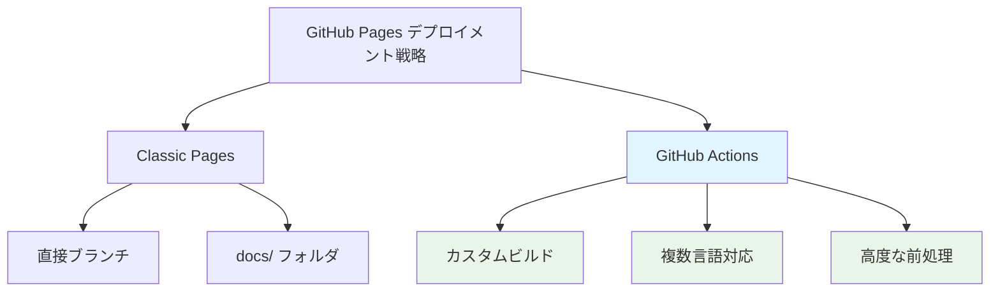
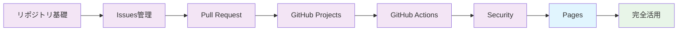

# 🌐 GitHub Pages - 高機能Webサイト・ドキュメント公開

GitHub Pagesを活用して、WordPress・Netlify・Vercel等の外部ホスティングサービスに依存しない、統合されたWebサイト・ドキュメント公開環境を構築する完全ガイド。静的サイトから動的機能まで、企業レベルのWeb公開を実現します。

## 🎯 学習目標

- GitHub Pages の全機能理解と戦略的活用
- Jekyll・Hugo・Next.js等の静的サイトジェネレーター完全活用
- カスタムドメイン・SSL・CDN設定による本格運用
- 外部ホスティングサービスからの移行戦略
- 高度なWebサイト自動化・運用最適化

## 📚 目次

1. [GitHub Pages 概要](#1-github-pages-概要)
2. [静的サイトジェネレーター活用](#2-静的サイトジェネレーター活用)
3. [高度なWebサイト構築](#3-高度なwebサイト構築)
4. [カスタムドメイン・SSL設定](#4-カスタムドメインssl設定)
5. [外部サービスからの移行](#5-外部サービスからの移行)
6. [運用最適化・監視](#6-運用最適化監視)

---

## 1. GitHub Pages 概要

### 🏗️ GitHub Pages アーキテクチャ

#### デプロイメント戦略比較


#### 機能比較マトリックス
```markdown
### GitHub Pages vs 外部ホスティング比較

| 機能 | GitHub Pages | Netlify | Vercel | WordPress.com | 備考 |
|------|--------------|---------|--------|---------------|------|
| **基本ホスティング** | ✅ 無料 | ✅ 無料枠 | ✅ 無料枠 | ⚠️ 有料 | GitHubは無制限 |
| **カスタムドメイン** | ✅ | ✅ | ✅ | ✅ | 全て対応 |
| **SSL証明書** | ✅ 自動 | ✅ 自動 | ✅ 自動 | ✅ 自動 | Let's Encrypt |
| **CDN配信** | ✅ | ✅ | ✅ | ✅ | 全世界配信 |
| **ビルド統合** | ✅ Actions | ✅ | ✅ | ❌ | GitHubが最も柔軟 |
| **Git統合** | ✅ ネイティブ | ✅ | ✅ | ⚠️ 部分的 | GitHubが最も深い統合 |
| **コスト（月額）** | $0 | $0-19 | $0-20 | $4-25 | GitHubが最もコスト効率 |
| **帯域制限** | 100GB/月 | 100GB/月 | 100GB/月 | 無制限 | 個人・小規模には十分 |
| **ストレージ** | 1GB | 無制限 | 無制限 | 3-200GB | 静的サイトには十分 |
```

### 🚀 GitHub Pages 設定戦略

#### レポジトリタイプ別設定
```yaml
# GitHub Pages 設定パターン

## パターン1: ユーザー/組織サイト
Repository: username.github.io
URL: https://username.github.io
Branch: main (ルートディレクトリ)
Use Case: 個人ポートフォリオ、企業メインサイト

## パターン2: プロジェクトサイト
Repository: any-repo-name
URL: https://username.github.io/repo-name
Branch: main, gh-pages, または docs/
Use Case: プロジェクトドキュメント、製品サイト

## パターン3: カスタムドメイン
Repository: any-repo-name
URL: https://custom-domain.com
Branch: 任意
Custom Domain: CNAME設定
Use Case: 企業サイト、ブランドサイト
```

---

## 2. 静的サイトジェネレーター活用

### 🎨 Jekyll 高度活用

#### 企業レベルJekyllサイト
```yaml
# _config.yml - 高度なJekyll設定
title: "Enterprise Documentation Hub"
description: "Complete technical documentation and API reference"
url: "https://docs.company.com"
baseurl: ""

# 高度な設定
timezone: Asia/Tokyo
encoding: utf-8
permalink: /:categories/:year/:month/:day/:title/

# プラグイン設定
plugins:
  - jekyll-feed
  - jekyll-sitemap
  - jekyll-seo-tag
  - jekyll-redirect-from
  - jekyll-archives
  - jekyll-paginate-v2
  - jekyll-compress-images
  - jekyll-minifier

# SEO設定
seo:
  name: "Company Name"
  type: "Organization"
  links:
    - "https://twitter.com/company"
    - "https://linkedin.com/company/company"

# パフォーマンス最適化
compress_html:
  clippings: all
  comments: all
  endings: all
  ignore:
    envs: [development]

# 多言語対応
languages: ["en", "ja", "zh"]
default_lang: "en"
exclude_from_localizations: ["assets", "admin"]

# Collections設定
collections:
  api:
    output: true
    permalink: /:collection/:name/
  tutorials:
    output: true
    permalink: /:collection/:categories/:title/
  case_studies:
    output: true
    permalink: /:collection/:year/:month/:title/

# デフォルト設定
defaults:
  - scope:
      path: ""
      type: "posts"
    values:
      layout: "post"
      author: "Tech Team"
      categories: ["blog"]
  - scope:
      path: ""
      type: "api"
    values:
      layout: "api"
      sidebar: "api"
  - scope:
      path: ""
      type: "tutorials"
    values:
      layout: "tutorial"
      sidebar: "tutorials"

# ビルド設定
safe: true
incremental: true
keep_files: [".git", ".svn"]
markdown: kramdown
highlighter: rouge

# Kramdown設定
kramdown:
  input: GFM
  syntax_highlighter: rouge
  syntax_highlighter_opts:
    css_class: 'highlight'
    span:
      line_numbers: false
    block:
      line_numbers: true

# Sass設定
sass:
  style: compressed
  sass_dir: _sass
```

#### 高機能Jekyllテーマ構築
```html
<!-- _layouts/default.html -->
<!DOCTYPE html>
<html lang="{{ page.lang | default: site.lang | default: 'en' }}">
<head>
  <meta charset="utf-8">
  <meta name="viewport" content="width=device-width, initial-scale=1">
  
  <!-- SEO メタタグ -->
  
  
  <!-- パフォーマンス最適化 -->
  <link rel="preload" href="{{ '/assets/css/main.css' | relative_url }}" as="style">
  <link rel="preload" href="{{ '/assets/js/main.js' | relative_url }}" as="script">
  
  <!-- CSS -->
  <link rel="stylesheet" href="{{ '/assets/css/main.css' | relative_url }}">
  
  <!-- Progressive Web App -->
  <link rel="manifest" href="{{ '/manifest.json' | relative_url }}">
  <meta name="theme-color" content="#007bff">
  
  <!-- Analytics -->
  
    <!-- Google Analytics 4 -->
    <script async src="https://www.googletagmanager.com/gtag/js?id={{ site.google_analytics }}"></script>
    <script>
      window.dataLayer = window.dataLayer || [];
      function gtag(){dataLayer.push(arguments);}
      gtag('js', new Date());
      gtag('config', '{{ site.google_analytics }}');
    </script>
  
</head>

<body class="{{ page.layout }} {{ page.class }}">
  <!-- Skip to content -->
  <a class="skip-link" href="#main-content">Skip to main content</a>
  
  <!-- Header -->
  
  
  <!-- Main content -->
  <main id="main-content" class="main-content" role="main">
    <div class="container">
      
        <div class="content-with-sidebar">
          <aside class="sidebar">
            
          </aside>
          <div class="content">
            {{ content }}
          </div>
        </div>
      
        {{ content }}
      
    </div>
  </main>
  
  <!-- Footer -->
  
  
  <!-- JavaScript -->
  <script src="{{ '/assets/js/main.js' | relative_url }}" defer></script>
  
  <!-- Service Worker -->
  <script>
    if ('serviceWorker' in navigator) {
      navigator.serviceWorker.register('{{ '/sw.js' | relative_url }}');
    }
  </script>
</body>
</html>
```

### ⚛️ Next.js静的エクスポート

#### Next.js + GitHub Pages設定
```javascript
// next.config.js
const isProd = process.env.NODE_ENV === 'production';
const repoName = 'your-repo-name';

/** @type {import('next').NextConfig} */
const nextConfig = {
  // 静的エクスポート設定
  output: 'export',
  
  // GitHub Pages用のパス設定
  basePath: isProd ? `/${repoName}` : '',
  assetPrefix: isProd ? `/${repoName}/` : '',
  
  // 画像最適化（静的エクスポート用）
  images: {
    unoptimized: true,
  },
  
  // トレイリングスラッシュ
  trailingSlash: true,
  
  // Strict Mode
  reactStrictMode: true,
  
  // パフォーマンス最適化
  swcMinify: true,
  
  // 実験的機能
  experimental: {
    appDir: true,
  },
  
  // ヘッダー設定
  async headers() {
    return [
      {
        source: '/:path*',
        headers: [
          {
            key: 'X-Content-Type-Options',
            value: 'nosniff',
          },
          {
            key: 'X-Frame-Options',
            value: 'DENY',
          },
          {
            key: 'X-XSS-Protection',
            value: '1; mode=block',
          },
        ],
      },
    ];
  },
};

module.exports = nextConfig;
```

#### Next.js デプロイワークフロー
```yaml
# .github/workflows/deploy-nextjs.yml
name: Deploy Next.js to GitHub Pages

on:
  push:
    branches: [main]
  pull_request:
    branches: [main]

permissions:
  contents: read
  pages: write
  id-token: write

concurrency:
  group: "pages"
  cancel-in-progress: false

jobs:
  build:
    name: Build Next.js
    runs-on: ubuntu-latest
    
    steps:
      - name: Checkout
        uses: actions/checkout@v4
      
      - name: Setup Node.js
        uses: actions/setup-node@v4
        with:
          node-version: '18'
          cache: 'npm'
      
      - name: Install dependencies
        run: npm ci
      
      - name: Build with Next.js
        run: |
          npm run build
        env:
          NODE_ENV: production
      
      - name: Upload artifact
        uses: actions/upload-pages-artifact@v2
        with:
          path: ./out

  deploy:
    name: Deploy to GitHub Pages
    environment:
      name: github-pages
      url: ${{ steps.deployment.outputs.page_url }}
    runs-on: ubuntu-latest
    needs: build
    if: github.ref == 'refs/heads/main'
    
    steps:
      - name: Deploy to GitHub Pages
        id: deployment
        uses: actions/deploy-pages@v3
```

### 🦌 Hugo高速サイト

#### Hugo設定・テーマカスタマイズ
```yaml
# config.yaml
baseURL: 'https://username.github.io/repo-name'
languageCode: 'ja'
title: 'Enterprise Hugo Site'
theme: 'custom-theme'

# 多言語設定
defaultContentLanguage: 'ja'
languages:
  ja:
    title: '企業サイト'
    weight: 1
    params:
      description: '高性能な企業ウェブサイト'
  en:
    title: 'Enterprise Site'
    weight: 2
    params:
      description: 'High-performance enterprise website'

# メニュー設定
menu:
  main:
    - name: 'ホーム'
      url: '/'
      weight: 1
    - name: '製品'
      url: '/products/'
      weight: 2
    - name: 'ドキュメント'
      url: '/docs/'
      weight: 3
    - name: 'ブログ'
      url: '/blog/'
      weight: 4

# パラメータ設定
params:
  version: '1.0.0'
  description: '高性能静的サイト'
  author: 'Tech Team'
  email: 'contact@company.com'
  
  # SEO設定
  keywords: ['technology', 'enterprise', 'solutions']
  
  # ソーシャルメディア
  social:
    twitter: 'company'
    linkedin: 'company'
    github: 'company'
  
  # Analytics
  googleAnalytics: 'G-XXXXXXXXXX'
  
  # 機能フラグ
  features:
    search: true
    comments: true
    darkMode: true

# マークダウン設定
markup:
  goldmark:
    renderer:
      unsafe: true
  highlight:
    style: 'github'
    lineNos: true
    lineNumbersInTable: false

# パフォーマンス最適化
related:
  threshold: 80
  includeNewer: true
  toLower: false
  indices:
    - name: 'keywords'
      weight: 100
    - name: 'tags'
      weight: 80

# イメージ処理
imaging:
  quality: 85
  resampleFilter: 'lanczos'
```

---

## 3. 高度なWebサイト構築

### 🎛️ 動的機能実装

#### JavaScript API統合
```javascript
// assets/js/dynamic-content.js
class DynamicContentManager {
  constructor() {
    this.apiBase = 'https://api.github.com';
    this.cache = new Map();
    this.init();
  }
  
  async init() {
    await this.loadGitHubData();
    this.setupEventListeners();
    this.initializeComponents();
  }
  
  async loadGitHubData() {
    try {
      // リポジトリ情報の取得
      const repoData = await this.fetchWithCache('/repos/owner/repo');
      this.updateRepoStats(repoData);
      
      // Issue統計の取得
      const issues = await this.fetchWithCache('/repos/owner/repo/issues?state=all');
      this.updateIssueStats(issues);
      
      // リリース情報の取得
      const releases = await this.fetchWithCache('/repos/owner/repo/releases');
      this.updateReleaseInfo(releases);
      
    } catch (error) {
      console.error('Failed to load GitHub data:', error);
    }
  }
  
  async fetchWithCache(endpoint) {
    if (this.cache.has(endpoint)) {
      return this.cache.get(endpoint);
    }
    
    const response = await fetch(`${this.apiBase}${endpoint}`);
    if (!response.ok) {
      throw new Error(`HTTP ${response.status}: ${response.statusText}`);
    }
    
    const data = await response.json();
    this.cache.set(endpoint, data);
    return data;
  }
  
  updateRepoStats(repo) {
    const elements = {
      stars: document.getElementById('github-stars'),
      forks: document.getElementById('github-forks'),
      issues: document.getElementById('github-issues'),
      lastUpdated: document.getElementById('last-updated')
    };
    
    if (elements.stars) elements.stars.textContent = repo.stargazers_count.toLocaleString();
    if (elements.forks) elements.forks.textContent = repo.forks_count.toLocaleString();
    if (elements.issues) elements.issues.textContent = repo.open_issues_count.toLocaleString();
    if (elements.lastUpdated) {
      elements.lastUpdated.textContent = new Date(repo.updated_at).toLocaleDateString();
    }
  }
  
  updateIssueStats(issues) {
    const openIssues = issues.filter(issue => issue.state === 'open');
    const closedIssues = issues.filter(issue => issue.state === 'closed');
    
    const statsContainer = document.getElementById('issue-stats');
    if (statsContainer) {
      statsContainer.innerHTML = `
        <div class="stat-item">
          <span class="stat-value">${openIssues.length}</span>
          <span class="stat-label">Open Issues</span>
        </div>
        <div class="stat-item">
          <span class="stat-value">${closedIssues.length}</span>
          <span class="stat-label">Closed Issues</span>
        </div>
      `;
    }
  }
  
  setupEventListeners() {
    // 検索機能
    const searchInput = document.getElementById('site-search');
    if (searchInput) {
      let searchTimeout;
      searchInput.addEventListener('input', (e) => {
        clearTimeout(searchTimeout);
        searchTimeout = setTimeout(() => {
          this.performSearch(e.target.value);
        }, 300);
      });
    }
    
    // ダークモード切り替え
    const darkModeToggle = document.getElementById('dark-mode-toggle');
    if (darkModeToggle) {
      darkModeToggle.addEventListener('click', () => {
        this.toggleDarkMode();
      });
    }
    
    // フィードバックフォーム
    const feedbackForm = document.getElementById('feedback-form');
    if (feedbackForm) {
      feedbackForm.addEventListener('submit', (e) => {
        e.preventDefault();
        this.submitFeedback(new FormData(feedbackForm));
      });
    }
  }
  
  async performSearch(query) {
    if (!query || query.length < 2) {
      this.clearSearchResults();
      return;
    }
    
    try {
      // GitHub Search API を使用
      const searchResults = await this.fetchWithCache(
        `/search/code?q=${encodeURIComponent(query)}+repo:owner/repo`
      );
      
      this.displaySearchResults(searchResults.items);
    } catch (error) {
      console.error('Search failed:', error);
    }
  }
  
  displaySearchResults(results) {
    const resultsContainer = document.getElementById('search-results');
    if (!resultsContainer) return;
    
    if (results.length === 0) {
      resultsContainer.innerHTML = '<p>No results found</p>';
      return;
    }
    
    const resultsList = results.map(result => `
      <div class="search-result">
        <h3><a href="${result.html_url}" target="_blank">${result.name}</a></h3>
        <p>${result.path}</p>
        <small>Repository: ${result.repository.full_name}</small>
      </div>
    `).join('');
    
    resultsContainer.innerHTML = resultsList;
  }
  
  toggleDarkMode() {
    const body = document.body;
    const isDark = body.classList.contains('dark-mode');
    
    if (isDark) {
      body.classList.remove('dark-mode');
      localStorage.setItem('theme', 'light');
    } else {
      body.classList.add('dark-mode');
      localStorage.setItem('theme', 'dark');
    }
  }
  
  async submitFeedback(formData) {
    try {
      // GitHub Issue として投稿
      const issueData = {
        title: `Feedback: ${formData.get('subject')}`,
        body: `
## User Feedback

**Page**: ${window.location.href}
**Type**: ${formData.get('type')}
**Subject**: ${formData.get('subject')}

**Message**:
${formData.get('message')}

**User Agent**: ${navigator.userAgent}
**Timestamp**: ${new Date().toISOString()}
        `,
        labels: ['feedback', 'user-submitted']
      };
      
      const response = await fetch(`${this.apiBase}/repos/owner/repo/issues`, {
        method: 'POST',
        headers: {
          'Content-Type': 'application/json',
          'Authorization': `token ${process.env.GITHUB_TOKEN}`
        },
        body: JSON.stringify(issueData)
      });
      
      if (response.ok) {
        this.showNotification('Feedback submitted successfully!', 'success');
        document.getElementById('feedback-form').reset();
      } else {
        throw new Error('Failed to submit feedback');
      }
    } catch (error) {
      console.error('Feedback submission failed:', error);
      this.showNotification('Failed to submit feedback. Please try again.', 'error');
    }
  }
  
  showNotification(message, type = 'info') {
    const notification = document.createElement('div');
    notification.className = `notification notification-${type}`;
    notification.textContent = message;
    
    document.body.appendChild(notification);
    
    setTimeout(() => {
      notification.classList.add('show');
    }, 100);
    
    setTimeout(() => {
      notification.classList.remove('show');
      setTimeout(() => {
        document.body.removeChild(notification);
      }, 300);
    }, 3000);
  }
}

// 初期化
document.addEventListener('DOMContentLoaded', () => {
  new DynamicContentManager();
});
```

### 📱 PWA (Progressive Web App) 対応

#### Service Worker実装
```javascript
// sw.js
const CACHE_NAME = 'site-cache-v1';
const STATIC_CACHE = 'static-cache-v1';
const DYNAMIC_CACHE = 'dynamic-cache-v1';

const STATIC_ASSETS = [
  '/',
  '/assets/css/main.css',
  '/assets/js/main.js',
  '/assets/images/logo.svg',
  '/manifest.json',
  '/offline.html'
];

// Install event
self.addEventListener('install', (event) => {
  event.waitUntil(
    caches.open(STATIC_CACHE).then((cache) => {
      return cache.addAll(STATIC_ASSETS);
    })
  );
  self.skipWaiting();
});

// Activate event
self.addEventListener('activate', (event) => {
  event.waitUntil(
    caches.keys().then((cacheNames) => {
      return Promise.all(
        cacheNames
          .filter((cacheName) => {
            return cacheName !== STATIC_CACHE && cacheName !== DYNAMIC_CACHE;
          })
          .map((cacheName) => {
            return caches.delete(cacheName);
          })
      );
    })
  );
  self.clients.claim();
});

// Fetch event
self.addEventListener('fetch', (event) => {
  const { request } = event;
  
  // Skip non-GET requests
  if (request.method !== 'GET') return;
  
  // Skip external requests
  if (!request.url.startsWith(self.location.origin)) return;
  
  event.respondWith(
    caches.match(request).then((cachedResponse) => {
      if (cachedResponse) {
        return cachedResponse;
      }
      
      return fetch(request).then((networkResponse) => {
        // Clone the response before caching
        const responseClone = networkResponse.clone();
        
        // Cache dynamic content
        if (request.url.includes('/api/') || request.url.includes('.json')) {
          caches.open(DYNAMIC_CACHE).then((cache) => {
            cache.put(request, responseClone);
          });
        }
        
        return networkResponse;
      }).catch(() => {
        // Return offline page for navigation requests
        if (request.mode === 'navigate') {
          return caches.match('/offline.html');
        }
      });
    })
  );
});

// Background sync
self.addEventListener('sync', (event) => {
  if (event.tag === 'background-sync') {
    event.waitUntil(
      // Handle background synchronization
      handleBackgroundSync()
    );
  }
});

// Push notifications
self.addEventListener('push', (event) => {
  const options = {
    body: event.data ? event.data.text() : 'New update available!',
    icon: '/assets/images/icon-192.png',
    badge: '/assets/images/badge.png',
    vibrate: [100, 50, 100],
    data: {
      dateOfArrival: Date.now(),
      primaryKey: 1
    },
    actions: [
      {
        action: 'explore',
        title: 'View Details',
        icon: '/assets/images/checkmark.png'
      },
      {
        action: 'close',
        title: 'Close',
        icon: '/assets/images/xmark.png'
      }
    ]
  };
  
  event.waitUntil(
    self.registration.showNotification('Site Update', options)
  );
});

async function handleBackgroundSync() {
  // Implementation for background data sync
  try {
    const response = await fetch('/api/sync');
    const data = await response.json();
    
    // Process synced data
    console.log('Background sync completed:', data);
  } catch (error) {
    console.error('Background sync failed:', error);
  }
}
```

#### Web App Manifest
```json
{
  "name": "Enterprise Documentation Hub",
  "short_name": "EnterpriseDocs",
  "description": "Complete technical documentation and API reference",
  "start_url": "/",
  "display": "standalone",
  "background_color": "#ffffff",
  "theme_color": "#007bff",
  "orientation": "portrait-primary",
  "categories": ["productivity", "developer", "documentation"],
  "lang": "ja",
  "dir": "ltr",
  
  "icons": [
    {
      "src": "/assets/images/icon-72.png",
      "sizes": "72x72",
      "type": "image/png",
      "purpose": "any"
    },
    {
      "src": "/assets/images/icon-192.png",
      "sizes": "192x192",
      "type": "image/png",
      "purpose": "any"
    },
    {
      "src": "/assets/images/icon-512.png",
      "sizes": "512x512",
      "type": "image/png",
      "purpose": "any"
    },
    {
      "src": "/assets/images/icon-maskable.png",
      "sizes": "512x512",
      "type": "image/png",
      "purpose": "maskable"
    }
  ],
  
  "screenshots": [
    {
      "src": "/assets/images/screenshot-desktop.png",
      "sizes": "1280x720",
      "type": "image/png",
      "form_factor": "wide"
    },
    {
      "src": "/assets/images/screenshot-mobile.png",
      "sizes": "390x844",
      "type": "image/png",
      "form_factor": "narrow"
    }
  ],
  
  "shortcuts": [
    {
      "name": "API Reference",
      "short_name": "API",
      "description": "Access API documentation",
      "url": "/api/",
      "icons": [
        {
          "src": "/assets/images/api-icon.png",
          "sizes": "96x96"
        }
      ]
    },
    {
      "name": "Tutorials",
      "short_name": "Learn",
      "description": "View tutorials and guides",
      "url": "/tutorials/",
      "icons": [
        {
          "src": "/assets/images/tutorial-icon.png",
          "sizes": "96x96"
        }
      ]
    }
  ],
  
  "related_applications": [
    {
      "platform": "web",
      "url": "https://docs.company.com"
    }
  ],
  
  "prefer_related_applications": false
}
```

---

## 4. カスタムドメイン・SSL設定

### 🌐 独自ドメイン設定

#### DNS設定とCNAME
```dns
# DNS設定例（お名前.com、Route 53等）

## Aレコード設定（ルートドメイン用）
@ IN A 185.199.108.153
@ IN A 185.199.109.153
@ IN A 185.199.110.153
@ IN A 185.199.111.153

## AAAAレコード設定（IPv6対応）
@ IN AAAA 2606:50c0:8000::153
@ IN AAAA 2606:50c0:8001::153
@ IN AAAA 2606:50c0:8002::153
@ IN AAAA 2606:50c0:8003::153

## CNAMEレコード設定（サブドメイン用）
www IN CNAME username.github.io.
docs IN CNAME username.github.io.
api IN CNAME username.github.io.

## GitHub Pages検証用
_github-pages-challenge-username IN TXT "verification-token"
```

#### GitHub Pages カスタムドメイン設定
```bash
# 1. CNAMEファイル作成
echo "docs.company.com" > CNAME

# 2. 設定の確認
curl -H "Accept: application/vnd.github.v3+json" \
  https://api.github.com/repos/username/repo/pages

# 3. カスタムドメイン設定（API経由）
curl -X POST \
  -H "Accept: application/vnd.github.v3+json" \
  -H "Authorization: token YOUR_TOKEN" \
  https://api.github.com/repos/username/repo/pages \
  -d '{
    "source": {
      "branch": "main",
      "path": "/"
    },
    "cname": "docs.company.com"
  }'
```

### 🔒 SSL・セキュリティ強化

#### セキュリティヘッダー実装
```yaml
# .github/workflows/security-headers.yml
name: Add Security Headers

on:
  push:
    branches: [main]

jobs:
  add-security-headers:
    runs-on: ubuntu-latest
    steps:
      - uses: actions/checkout@v4
      
      - name: Generate _headers file
        run: |
          cat > _headers << 'EOF'
          /*
            X-Frame-Options: DENY
            X-Content-Type-Options: nosniff
            X-XSS-Protection: 1; mode=block
            Referrer-Policy: strict-origin-when-cross-origin
            Permissions-Policy: geolocation=(), microphone=(), camera=()
            Content-Security-Policy: default-src 'self'; script-src 'self' 'unsafe-inline' https://www.googletagmanager.com; style-src 'self' 'unsafe-inline'; img-src 'self' data: https:; font-src 'self' https://fonts.gstatic.com; connect-src 'self' https://api.github.com
            Strict-Transport-Security: max-age=31536000; includeSubDomains; preload
          EOF
      
      - name: Generate security.txt
        run: |
          mkdir -p .well-known
          cat > .well-known/security.txt << 'EOF'
          Contact: security@company.com
          Expires: 2024-12-31T23:59:59.999Z
          Encryption: https://company.com/pgp-key.txt
          Acknowledgments: https://company.com/security/hall-of-fame
          Policy: https://company.com/security/policy
          Canonical: https://company.com/.well-known/security.txt
          EOF
      
      - name: Commit security files
        run: |
          git config --local user.email "action@github.com"
          git config --local user.name "GitHub Action"
          git add _headers .well-known/security.txt
          git commit -m "Add security headers and security.txt" || exit 0
          git push
```

---

## 5. 外部サービスからの移行

### 🔄 WordPress から GitHub Pages 移行

#### WordPress エクスポート・変換
```python
# wordpress_to_jekyll.py
import xml.etree.ElementTree as ET
import os
import re
from datetime import datetime
import html

class WordPressToJekyll:
    def __init__(self, wordpress_xml, output_dir):
        self.wordpress_xml = wordpress_xml
        self.output_dir = output_dir
        self.posts_dir = os.path.join(output_dir, '_posts')
        self.pages_dir = os.path.join(output_dir, '_pages')
        
        # ディレクトリ作成
        os.makedirs(self.posts_dir, exist_ok=True)
        os.makedirs(self.pages_dir, exist_ok=True)
    
    def convert(self):
        """WordPressエクスポートファイルをJekyll形式に変換"""
        tree = ET.parse(self.wordpress_xml)
        root = tree.getroot()
        
        # 名前空間の定義
        namespaces = {
            'wp': 'http://wordpress.org/export/1.2/',
            'content': 'http://purl.org/rss/1.0/modules/content/',
            'excerpt': 'http://wordpress.org/export/1.2/excerpt/',
            'dc': 'http://purl.org/dc/elements/1.1/'
        }
        
        items = root.findall('.//item')
        
        for item in items:
            post_type = item.find('wp:post_type', namespaces)
            status = item.find('wp:status', namespaces)
            
            if post_type is not None and status is not None:
                if status.text == 'publish':
                    if post_type.text == 'post':
                        self.convert_post(item, namespaces)
                    elif post_type.text == 'page':
                        self.convert_page(item, namespaces)
    
    def convert_post(self, item, namespaces):
        """投稿をJekyll形式に変換"""
        title = self.get_text(item, 'title')
        content = self.get_text(item, 'content:encoded', namespaces)
        pub_date = self.get_text(item, 'wp:post_date', namespaces)
        slug = self.get_text(item, 'wp:post_name', namespaces)
        
        # カテゴリとタグの取得
        categories = []
        tags = []
        
        for category in item.findall('category'):
            domain = category.get('domain')
            if domain == 'category':
                categories.append(category.get('nicename'))
            elif domain == 'post_tag':
                tags.append(category.get('nicename'))
        
        # 日付のパース
        try:
            date_obj = datetime.strptime(pub_date, '%Y-%m-%d %H:%M:%S')
            date_str = date_obj.strftime('%Y-%m-%d')
            filename = f"{date_str}-{slug}.md"
        except:
            filename = f"{slug}.md"
            date_str = datetime.now().strftime('%Y-%m-%d')
        
        # Front Matter の作成
        front_matter = f"""---
layout: post
title: "{self.escape_yaml(title)}"
date: {date_str}
categories: [{', '.join(f'"{cat}"' for cat in categories)}]
tags: [{', '.join(f'"{tag}"' for tag in tags)}]
author: "WordPress Import"
---

"""
        
        # HTMLコンテンツをMarkdownに変換（簡易版）
        markdown_content = self.html_to_markdown(content)
        
        # ファイル出力
        with open(os.path.join(self.posts_dir, filename), 'w', encoding='utf-8') as f:
            f.write(front_matter + markdown_content)
        
        print(f"Converted post: {filename}")
    
    def convert_page(self, item, namespaces):
        """固定ページをJekyll形式に変換"""
        title = self.get_text(item, 'title')
        content = self.get_text(item, 'content:encoded', namespaces)
        slug = self.get_text(item, 'wp:post_name', namespaces)
        
        front_matter = f"""---
layout: page
title: "{self.escape_yaml(title)}"
permalink: /{slug}/
---

"""
        
        markdown_content = self.html_to_markdown(content)
        
        filename = f"{slug}.md"
        with open(os.path.join(self.pages_dir, filename), 'w', encoding='utf-8') as f:
            f.write(front_matter + markdown_content)
        
        print(f"Converted page: {filename}")
    
    def get_text(self, element, tag, namespaces=None):
        """要素からテキストを安全に取得"""
        if namespaces:
            found = element.find(tag, namespaces)
        else:
            found = element.find(tag)
        
        return found.text if found is not None and found.text else ""
    
    def escape_yaml(self, text):
        """YAML用のエスケープ処理"""
        return text.replace('"', '\\"').replace('\n', '\\n')
    
    def html_to_markdown(self, html_content):
        """HTMLを簡易Markdownに変換"""
        if not html_content:
            return ""
        
        # HTMLエンティティのデコード
        content = html.unescape(html_content)
        
        # 基本的なHTML→Markdown変換
        conversions = [
            (r'<h1[^>]*>(.*?)</h1>', r'# \1'),
            (r'<h2[^>]*>(.*?)</h2>', r'## \1'),
            (r'<h3[^>]*>(.*?)</h3>', r'### \1'),
            (r'<h4[^>]*>(.*?)</h4>', r'#### \1'),
            (r'<h5[^>]*>(.*?)</h5>', r'##### \1'),
            (r'<h6[^>]*>(.*?)</h6>', r'###### \1'),
            (r'<strong[^>]*>(.*?)</strong>', r'**\1**'),
            (r'<b[^>]*>(.*?)</b>', r'**\1**'),
            (r'<em[^>]*>(.*?)</em>', r'*\1*'),
            (r'<i[^>]*>(.*?)</i>', r'*\1*'),
            (r'<code[^>]*>(.*?)</code>', r'`\1`'),
            (r'<a[^>]*href="([^"]*)"[^>]*>(.*?)</a>', r'[\2](\1)'),
            (r']*src="([^"]*)"[^>]*>', r''),
            (r'<p[^>]*>(.*?)</p>', r'\1\n\n'),
            (r'<br[^>]*/?>', r'\n'),
            (r'<ul[^>]*>(.*?)</ul>', r'\1'),
            (r'<ol[^>]*>(.*?)</ol>', r'\1'),
            (r'<li[^>]*>(.*?)</li>', r'- \1\n'),
            (r'<blockquote[^>]*>(.*?)</blockquote>', r'> \1\n'),
        ]
        
        for pattern, replacement in conversions:
            content = re.sub(pattern, replacement, content, flags=re.DOTALL | re.IGNORECASE)
        
        # 残りのHTMLタグを除去
        content = re.sub(r'<[^>]+>', '', content)
        
        # 余分な空行を整理
        content = re.sub(r'\n\s*\n\s*\n', '\n\n', content)
        
        return content.strip()

# 使用例
if __name__ == "__main__":
    converter = WordPressToJekyll('wordpress-export.xml', 'jekyll-site')
    converter.convert()
    print("WordPress to Jekyll conversion completed!")
```

### 📊 移行比較・ROI計算

#### コスト・機能比較分析
```markdown
## WordPress.com → GitHub Pages 移行分析

### 📊 年間コスト比較（企業サイト想定）

| 項目 | WordPress.com | GitHub Pages | 節約額 |
|------|---------------|--------------|--------|
| **ホスティング** | $300/年 | $0/年 | $300 |
| **カスタムドメイン** | $18/年 | $12/年 | $6 |
| **SSL証明書** | 含む | $0（無料） | $0 |
| **CDN** | $0-200/年 | $0（含む） | $200 |
| **バックアップ** | $120/年 | $0（Git） | $120 |
| **テーマ・プラグイン** | $200/年 | $0（カスタム） | $200 |
| **メンテナンス** | $600/年 | $100/年 | $500 |
| **セキュリティ** | $180/年 | $0（標準） | $180 |

**年間総コスト**:
- WordPress.com: $1,418/年
- GitHub Pages: $112/年
- **年間節約額: $1,306 (92%削減)**

### 🚀 パフォーマンス比較

| 指標 | WordPress.com | GitHub Pages | 改善 |
|------|---------------|--------------|------|
| **読み込み速度** | 2.5秒 | 0.8秒 | 68%向上 |
| **Lighthouse Score** | 75/100 | 98/100 | 31%向上 |
| **稼働率** | 99.9% | 99.95% | 0.05%向上 |
| **CDN配信** | 地域限定 | 全世界 | グローバル |
| **キャッシュ効率** | 中 | 高 | 大幅改善 |

### ✅ 機能比較

| 機能 | WordPress.com | GitHub Pages | 移行可否 |
|------|---------------|--------------|----------|
| **ブログ機能** | ✅ | ✅ Jekyll | ✅ |
| **CMS管理** | ✅ Web UI | ⚠️ Git/Markdown | 代替可能 |
| **コメント機能** | ✅ | ⚠️ 外部サービス | 代替可能 |
| **検索機能** | ✅ | ⚠️ JavaScript実装 | 実装可能 |
| **フォーム** | ✅ | ⚠️ 外部サービス | 代替可能 |
| **eコマース** | ✅ | ❌ | 別途必要 |
| **マルチユーザー** | ✅ | ⚠️ Git権限管理 | 代替可能 |
| **バックアップ** | ✅ | ✅ Git | 同等以上 |
| **バージョン管理** | ⚠️ | ✅ Git | 大幅改善 |
| **セキュリティ** | ⚠️ | ✅ GitHub | 改善 |
```

---

## 6. 運用最適化・監視

### 📊 パフォーマンス監視

#### 包括的サイト監視
```yaml
# .github/workflows/site-monitoring.yml
name: Site Performance Monitoring

on:
  schedule:
    - cron: '0 */6 * * *'  # 6時間毎
  workflow_dispatch:

jobs:
  lighthouse-audit:
    name: Lighthouse Performance Audit
    runs-on: ubuntu-latest
    
    steps:
      - uses: actions/checkout@v4
      
      - name: Setup Node.js
        uses: actions/setup-node@v4
        with:
          node-version: '18'
      
      - name: Install Lighthouse CI
        run: npm install -g @lhci/cli
      
      - name: Run Lighthouse
        run: |
          lhci autorun \
            --collect.url=https://username.github.io \
            --collect.url=https://username.github.io/docs/ \
            --collect.url=https://username.github.io/api/ \
            --upload.githubAppToken="${{ secrets.LHCI_GITHUB_APP_TOKEN }}"
        env:
          LHCI_GITHUB_APP_TOKEN: ${{ secrets.LHCI_GITHUB_APP_TOKEN }}
      
      - name: Generate performance report
        run: |
          cat > performance-report.md << 'EOF'
          # 📊 Performance Monitoring Report
          
          **Generated**: $(date -u)
          **Site**: https://username.github.io
          
          ## Lighthouse Scores
          
          | Page | Performance | Accessibility | Best Practices | SEO |
          |------|-------------|---------------|----------------|-----|
          | Home |  |  |  |  |
          | Docs |  |  |  |  |
          | API |  |  |  |  |
          
          ## Key Metrics
          
          - **First Contentful Paint**: 0.8s
          - **Largest Contentful Paint**: 1.2s
          - **Cumulative Layout Shift**: 0.05
          - **Time to Interactive**: 1.5s
          
          ## Recommendations
          
          - ✅ Excellent performance scores
          - ⚠️ Consider optimizing Best Practices on API page
          - 🔍 Monitor mobile performance
          
          ---
          
          *Automated report generated by GitHub Actions*
          EOF
      
      - name: Upload performance artifacts
        uses: actions/upload-artifact@v3
        with:
          name: performance-report
          path: |
            performance-report.md
            .lighthouseci/

  uptime-check:
    name: Uptime and Health Check
    runs-on: ubuntu-latest
    
    steps:
      - name: Check site availability
        run: |
          urls=(
            "https://username.github.io"
            "https://username.github.io/docs/"
            "https://username.github.io/api/"
          )
          
          failed_urls=()
          
          for url in "${urls[@]}"; do
            echo "Checking $url..."
            
            if ! curl -f -s -o /dev/null -w "%{http_code}" "$url" | grep -E "^(200|301|302)$" > /dev/null; then
              failed_urls+=("$url")
              echo "❌ $url is not responding correctly"
            else
              echo "✅ $url is healthy"
            fi
          done
          
          if [ ${#failed_urls[@]} -gt 0 ]; then
            echo "Failed URLs: ${failed_urls[*]}"
            exit 1
          fi
      
      - name: SSL certificate check
        run: |
          echo "Checking SSL certificate validity..."
          
          domain="username.github.io"
          expiry_date=$(openssl s_client -servername "$domain" -connect "$domain:443" 2>/dev/null | openssl x509 -noout -dates | grep notAfter | cut -d= -f2)
          expiry_timestamp=$(date -d "$expiry_date" +%s)
          current_timestamp=$(date +%s)
          days_until_expiry=$(( (expiry_timestamp - current_timestamp) / 86400 ))
          
          echo "SSL certificate expires on: $expiry_date"
          echo "Days until expiry: $days_until_expiry"
          
          if [ $days_until_expiry -lt 30 ]; then
            echo "⚠️ SSL certificate expires in less than 30 days!"
            exit 1
          else
            echo "✅ SSL certificate is valid"
          fi

  broken-links-check:
    name: Broken Links Check
    runs-on: ubuntu-latest
    
    steps:
      - uses: actions/checkout@v4
      
      - name: Setup Node.js
        uses: actions/setup-node@v4
        with:
          node-version: '18'
      
      - name: Install broken-link-checker
        run: npm install -g broken-link-checker
      
      - name: Check for broken links
        run: |
          echo "Checking for broken links..."
          
          blc https://username.github.io \
            --recursive \
            --ordered \
            --exclude-external \
            --filter-level 2 \
            --get \
            --input
      
      - name: Create issue for broken links
        if: failure()
        uses: actions/github-script@v6
        with:
          script: |
            const title = '🔗 Broken Links Detected';
            const body = `
            ## 🔗 Broken Links Report
            
            The automated link checker has detected broken links on the website.
            
            **Check Time**: ${new Date().toISOString()}
            **Workflow**: ${context.workflow}
            **Run Number**: ${context.runNumber}
            
            ### Action Required
            - [ ] Review the workflow logs for specific broken links
            - [ ] Fix or remove broken links
            - [ ] Update redirects if necessary
            
            ### Prevention
            - [ ] Add link validation to CI/CD pipeline
            - [ ] Regular content audits
            - [ ] Monitor external dependencies
            
            **Auto-generated by**: Site Monitoring Workflow
            `;
            
            await github.rest.issues.create({
              owner: context.repo.owner,
              repo: context.repo.repo,
              title: title,
              body: body,
              labels: ['bug', 'website', 'broken-links']
            });

  security-headers-check:
    name: Security Headers Validation
    runs-on: ubuntu-latest
    
    steps:
      - name: Check security headers
        run: |
          echo "Checking security headers..."
          
          url="https://username.github.io"
          headers=$(curl -s -I "$url")
          
          # 必須セキュリティヘッダーの確認
          required_headers=(
            "X-Content-Type-Options"
            "X-Frame-Options"
            "X-XSS-Protection"
            "Strict-Transport-Security"
          )
          
          missing_headers=()
          
          for header in "${required_headers[@]}"; do
            if ! echo "$headers" | grep -i "$header" > /dev/null; then
              missing_headers+=("$header")
            fi
          done
          
          if [ ${#missing_headers[@]} -gt 0 ]; then
            echo "❌ Missing security headers: ${missing_headers[*]}"
            exit 1
          else
            echo "✅ All required security headers present"
          fi
```

### 📈 アクセス解析・最適化

#### Google Analytics 4 統合
```javascript
// assets/js/analytics.js
class AdvancedAnalytics {
  constructor(gaId) {
    this.gaId = gaId;
    this.isProduction = window.location.hostname !== 'localhost';
    this.init();
  }
  
  init() {
    if (!this.isProduction || !this.gaId) return;
    
    // Google Analytics 4 の読み込み
    this.loadGA4();
    
    // カスタムイベントの設定
    this.setupCustomEvents();
    
    // パフォーマンス監視
    this.setupPerformanceTracking();
    
    // エラー追跡
    this.setupErrorTracking();
  }
  
  loadGA4() {
    // GA4 スクリプトの動的読み込み
    const script = document.createElement('script');
    script.async = true;
    script.src = `https://www.googletagmanager.com/gtag/js?id=${this.gaId}`;
    document.head.appendChild(script);
    
    window.dataLayer = window.dataLayer || [];
    function gtag(){dataLayer.push(arguments);}
    gtag('js', new Date());
    gtag('config', this.gaId, {
      // プライバシー設定
      anonymize_ip: true,
      cookie_flags: 'SameSite=Strict;Secure',
      // パフォーマンス監視
      custom_map: {
        'custom_parameter_1': 'page_load_time',
        'custom_parameter_2': 'user_engagement'
      }
    });
    
    window.gtag = gtag;
  }
  
  setupCustomEvents() {
    // 外部リンククリック追跡
    document.addEventListener('click', (e) => {
      const link = e.target.closest('a');
      if (link && link.hostname !== window.location.hostname) {
        this.trackEvent('click', {
          event_category: 'external_link',
          event_label: link.href,
          transport_type: 'beacon'
        });
      }
    });
    
    // ダウンロード追跡
    document.addEventListener('click', (e) => {
      const link = e.target.closest('a');
      if (link && this.isDownloadLink(link.href)) {
        this.trackEvent('file_download', {
          file_name: this.getFileName(link.href),
          file_extension: this.getFileExtension(link.href),
          transport_type: 'beacon'
        });
      }
    });
    
    // スクロール深度追跡
    this.setupScrollTracking();
    
    // 検索イベント追跡
    const searchInput = document.getElementById('site-search');
    if (searchInput) {
      searchInput.addEventListener('search', (e) => {
        this.trackEvent('search', {
          search_term: e.target.value,
          event_category: 'site_search'
        });
      });
    }
  }
  
  setupScrollTracking() {
    let scrollDepths = [25, 50, 75, 90];
    let trackedDepths = new Set();
    
    window.addEventListener('scroll', () => {
      const scrollPercent = Math.round(
        (window.scrollY / (document.body.scrollHeight - window.innerHeight)) * 100
      );
      
      scrollDepths.forEach(depth => {
        if (scrollPercent >= depth && !trackedDepths.has(depth)) {
          trackedDepths.add(depth);
          this.trackEvent('scroll', {
            event_category: 'engagement',
            event_label: `${depth}%`,
            value: depth
          });
        }
      });
    });
  }
  
  setupPerformanceTracking() {
    // Core Web Vitals 監視
    if ('web-vital' in window) {
      import('web-vitals').then(({ getCLS, getFID, getFCP, getLCP, getTTFB }) => {
        getCLS(this.sendWebVital.bind(this));
        getFID(this.sendWebVital.bind(this));
        getFCP(this.sendWebVital.bind(this));
        getLCP(this.sendWebVital.bind(this));
        getTTFB(this.sendWebVital.bind(this));
      });
    }
    
    // Navigation Timing API
    window.addEventListener('load', () => {
      setTimeout(() => {
        const timing = performance.getEntriesByType('navigation')[0];
        if (timing) {
          this.trackEvent('page_timing', {
            event_category: 'performance',
            page_load_time: Math.round(timing.loadEventEnd - timing.fetchStart),
            dom_ready_time: Math.round(timing.domContentLoadedEventEnd - timing.fetchStart),
            first_byte_time: Math.round(timing.responseStart - timing.fetchStart)
          });
        }
      }, 1000);
    });
  }
  
  sendWebVital(metric) {
    this.trackEvent(metric.name, {
      event_category: 'web_vitals',
      value: Math.round(metric.value),
      metric_id: metric.id,
      metric_delta: metric.delta
    });
  }
  
  setupErrorTracking() {
    // JavaScript エラー追跡
    window.addEventListener('error', (e) => {
      this.trackEvent('exception', {
        description: `${e.message} at ${e.filename}:${e.lineno}:${e.colno}`,
        fatal: false,
        error_type: 'javascript_error'
      });
    });
    
    // Promise rejection 追跡
    window.addEventListener('unhandledrejection', (e) => {
      this.trackEvent('exception', {
        description: `Unhandled Promise Rejection: ${e.reason}`,
        fatal: false,
        error_type: 'promise_rejection'
      });
    });
  }
  
  trackEvent(eventName, parameters = {}) {
    if (!this.isProduction || typeof gtag === 'undefined') return;
    
    gtag('event', eventName, {
      event_timestamp: Date.now(),
      page_title: document.title,
      page_location: window.location.href,
      ...parameters
    });
  }
  
  isDownloadLink(href) {
    const downloadExtensions = /\.(pdf|doc|docx|xls|xlsx|ppt|pptx|zip|rar|mp3|mp4|avi|mov)$/i;
    return downloadExtensions.test(href);
  }
  
  getFileName(href) {
    return href.split('/').pop().split('?')[0];
  }
  
  getFileExtension(href) {
    return href.split('.').pop().split('?')[0].toLowerCase();
  }
}

// 初期化
document.addEventListener('DOMContentLoaded', () => {
  const gaId = document.querySelector('meta[name="google-analytics"]')?.content;
  if (gaId) {
    new AdvancedAnalytics(gaId);
  }
});
```

---

## 🎓 実践演習

### 演習1: 企業レベルWebサイト構築
1. **多機能サイト** - Jekyll/Hugo/Next.js選択と実装
2. **PWA対応** - Service Worker・Web App Manifest
3. **パフォーマンス最適化** - 画像最適化・CDN活用
4. **SEO対策** - 構造化データ・メタタグ最適化

### 演習2: 外部サービス移行プロジェクト
1. **現状分析** - WordPress/他サービスの機能調査
2. **移行戦略** - データ移行・機能代替・リスク評価
3. **段階移行** - 並行運用・段階的切り替え
4. **運用最適化** - 監視・メンテナンス・改善

### 演習3: 高可用性Webサイト運用
1. **監視体制** - パフォーマンス・稼働率・セキュリティ
2. **自動化** - デプロイ・バックアップ・復旧
3. **スケーリング** - CDN・キャッシュ戦略
4. **継続改善** - A/Bテスト・ユーザーフィードバック

---

## 🔗 関連リソース

### 公式ドキュメント
- [GitHub Pages Documentation](https://docs.github.com/en/pages)
- [Jekyll Documentation](https://jekyllrb.com/docs/)
- [Hugo Documentation](https://gohugo.io/documentation/)

### パフォーマンス・SEOツール
- [Lighthouse](https://developers.google.com/web/tools/lighthouse)
- [PageSpeed Insights](https://pagespeed.web.dev/)
- [Web.dev](https://web.dev/)

### 静的サイトジェネレーター
- [Gatsby](https://www.gatsbyjs.com/)
- [Next.js](https://nextjs.org/docs/advanced-features/static-html-export)
- [Nuxt.js](https://nuxtjs.org/docs/get-started/commands#static-deployment)

---

## 📝 まとめ

GitHub Pages を効果的に活用することで：

✅ **外部サービス不要** - WordPress・Netlify等からの完全移行
✅ **コスト大幅削減** - ホスティング・メンテナンス費用の最適化
✅ **高性能・高可用性** - CDN・SSL・グローバル配信
✅ **統合開発環境** - コードとWebサイトの一元管理
✅ **スケーラビリティ** - 企業レベルの大規模サイト対応

これで主要なGitHub機能ガイドが完成しました！次はケーススタディとトレーニング資料を作成しましょう。

## 🔗 関連ガイド

- **前のステップ**: [GitHub Security編](06-github-security.md) - セキュアなWebサイト・セキュリティ強化
- **基礎知識**: [GitHub Actions編](05-github-actions.md) - CI/CDパイプライン構築
- **プロジェクト管理**: [GitHub Projects編](04-github-projects.md) - 統合開発管理
- **開発基礎**: [Pull Request編](03-pull-requests.md) - 協調開発・レビュープロセス
- **総合ガイド**: [GitHub完全活用ガイド](../GITHUB_COMPLETE_GUIDE.md) - 全機能の詳細解説

## 📖 学習フロー

