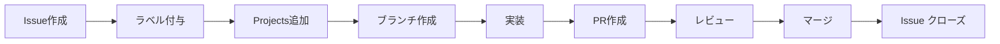

# 🎯 Personal Task Manager - GitHub機能実践プロジェクト

> GitHub機能を体系的に学習するための実践プロジェクト

## 🎯 プロジェクト概要

シンプルなタスク管理アプリケーションを通じて、GitHub のすべての主要機能を実際に体験・習得します。

## 🏗️ プロジェクト構成

```
personal-task-manager/
├── index.html          # メインページ
├── style.css           # スタイルシート
├── script.js           # JavaScript ロジック
├── package.json        # Node.js設定（Actions用）
├── .github/
│   ├── workflows/      # GitHub Actions
│   ├── ISSUE_TEMPLATE/ # Issueテンプレート
│   └── pull_request_template.md
├── docs/               # GitHub Pages用
└── tests/              # テストファイル
```

## 🎓 学習目標と体験する機能

### Phase 1: 基本機能の体験
- [x] **リポジトリ作成** - 設定とクローン
- [ ] **Issues管理** - バグ報告、機能要望、タスク作成
- [ ] **Projects** - かんばんボードでタスク進行管理
- [ ] **ブランチ管理** - feature ブランチでの開発

### Phase 2: コラボレーション機能
- [ ] **Pull Request** - コードレビューフロー体験
- [ ] **テンプレート** - Issue/PR テンプレートの活用
- [ ] **ラベル・マイルストーン** - プロジェクト管理の体系化
- [ ] **レビュー機能** - サジェスト機能の活用

### Phase 3: 自動化・デプロイ
- [ ] **GitHub Actions** - CI/CDパイプライン構築
- [ ] **自動テスト** - コード品質の自動チェック
- [ ] **GitHub Pages** - 自動デプロイメント
- [ ] **セキュリティ** - Dependabot、Code scanning

## 🚀 実装予定機能

### 基本機能
- ✅ タスクの追加・編集・削除
- ✅ タスクの完了状態管理
- ✅ カテゴリ別フィルタリング
- ✅ ローカルストレージでの永続化

### 発展機能（GitHub機能習得用）
- ⏳ タスクの優先度設定
- ⏳ 期限管理機能
- ⏳ 進捗レポート表示
- ⏳ データエクスポート機能

## 📋 開発フロー（GitHub機能実践）

### 1. Issue駆動開発


### 2. ブランチ戦略
```
main           : プロダクションコード
develop        : 開発版（統合テスト）
feature/*      : 機能開発用
hotfix/*       : 緊急修正用
```

### 3. 自動化フロー
```yaml
# CI/CD パイプライン
1. コミット → 自動テスト実行
2. PR作成 → コードスキャン + レビュー
3. mainマージ → 自動デプロイ（GitHub Pages）
4. リリース → 自動タグ作成 + チェンジログ生成
```

## 🎯 GitHub機能習得チェックリスト

### 基本操作
- [ ] リポジトリ作成・クローン
- [ ] ブランチ作成・切り替え
- [ ] コミット・プッシュ
- [ ] Issue作成・管理

### プロジェクト管理
- [ ] GitHub Projects セットアップ
- [ ] Issue テンプレート作成
- [ ] ラベル体系の構築
- [ ] マイルストーン設定

### コラボレーション
- [ ] Pull Request作成
- [ ] コードレビュー
- [ ] サジェスト機能使用
- [ ] コンフリクト解決

### 自動化
- [ ] GitHub Actions セットアップ
- [ ] CI/CD パイプライン構築
- [ ] 自動テスト実装
- [ ] 自動デプロイ設定

### セキュリティ・品質
- [ ] Dependabot 有効化
- [ ] Code scanning 設定
- [ ] Branch protection 設定
- [ ] Secret管理

### 公開・ドキュメント
- [ ] GitHub Pages デプロイ
- [ ] README 充実
- [ ] Wiki 作成
- [ ] Release 作成

## 🎮 次のアクション

1. **今すぐ試せること**:
   ```bash
   # このプロジェクトをクローン
   git clone https://github.com/your-username/personal-task-manager
   cd personal-task-manager
   
   # 最初のIssueを作成
   gh issue create --title "タスク追加機能の実装" --body "ユーザーが新しいタスクを追加できる機能を実装する"
   ```

2. **最初の1週間で体験する機能**:
   - Issues でタスク管理
   - Projects でかんばん作成
   - 基本的なHTML/CSS/JS開発
   - Pull Request フロー

3. **2週間目で学ぶ高度な機能**:
   - GitHub Actions 設定
   - 自動テスト・デプロイ
   - セキュリティ機能
   - パフォーマンス最適化

## 💡 学習のコツ

1. **小さく始める** - 最初は基本機能のみ実装
2. **実際に使う** - 本物のタスク管理に活用
3. **記録する** - 体験したことを都度ドキュメント化
4. **実験する** - 新しい機能を積極的に試す

---

このプロジェクトを通じて、理論だけでなく実践的なGitHub活用スキルを身につけましょう！